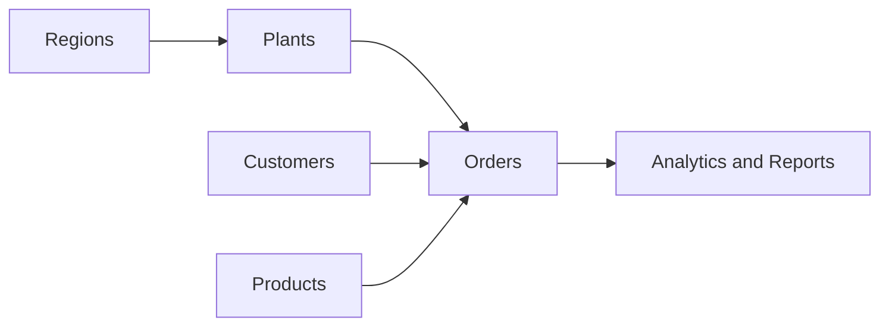
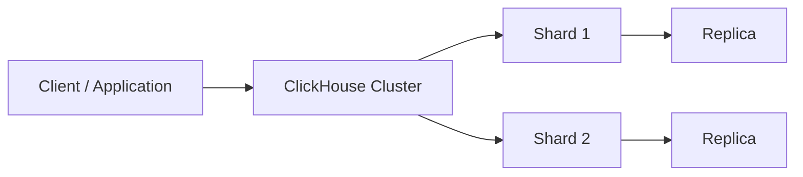

# Session 1 — ClickHouse Architecture and Data Modeling

**Duration:** 4 Hours

## Connect (do this first)

| Item | Value |
|------|--------|
| CloudBeaver | https://vmclickhouse.canadacentral.cloudapp.azure.com/cloudbeaver/ |
| Connection | **Session 01–05 — ClickHouse training (LAN RO)** |
| User | `training_ro` (read-only) |

Open CloudBeaver, pick that connection, and run `SELECT version();` to confirm you are in.

> **DDL / CREATE / INSERT:** the default student path is read-only. To practice creating tables you need `training_rw` plus your own database `training_student_<yourname>`. The instructor will provide write access when needed.

## Session Overview

This session introduces ClickHouse and how it is designed for analytical workloads.

You will learn the basics of designing ClickHouse tables for reporting, then either **explore the lab data** or **build a small sandbox model** of your own.

The examples use a simple **manufacturing and sales** scenario that continues through the course.

## Two paths in this session

| Path | Who | What you do |
|------|-----|-------------|
| **Explore (lab data)** | With `training_ro` | `SHOW` / `DESCRIBE` on `training.*`, analytics on **`training.v_lab_orders`** |
| **Sandbox (DDL practice)** | Students with write access | Create tables in **`training_student_<yourname>`** — never recreate or DROP the `training` database |

The shared `training` database is already seeded. You do **not** create it.

## Learning Objectives

By the end of this session, participants will be able to:

* Explain what ClickHouse is and where it is useful
* Explain the difference between OLTP and OLAP workloads
* Describe the main differences between SQL Server and ClickHouse
* Explain columnar storage and why it helps analytics
* Understand basic ClickHouse architecture
* Create databases and tables (sandbox path)
* Explain MergeTree, `ORDER BY`, and partitioning
* Select suitable basic data types and use `Nullable` thoughtfully
* Run basic analytical queries on the lab reporting view
* Understand shards and replicas at a high level

## Business Scenario

A manufacturing company runs plants across several regions. Customers place orders for products. Management wants to analyze:

* Sales by region, plant, and product
* Order quantities and values
* Trends over time



## Session Topics

### 1. ClickHouse Introduction

* What ClickHouse is and where it fits
* Typical reporting and analytical workloads

### 2. OLTP and OLAP

* Transaction vs analysis workloads
* Why analytical databases store and query data differently

### 3. SQL Server and ClickHouse

* Storage, indexing, and table-design differences
* Why copying an SQL Server design into ClickHouse often fails

### 4. Columnar Storage

* Row vs column layout, compression, reading only needed columns

### 5. ClickHouse Architecture

* Server, query processing, storage, and data parts (high level)

### 6. Databases, Tables and Table Engines

* Creating databases/tables (sandbox)
* MergeTree family and why the engine matters

### 7. Sorting Keys and `ORDER BY`

* What `ORDER BY` means in MergeTree
* Live seed vs sandbox teaching examples (see lab/notes)

### 8. Partitioning

* Partition keys, when they help, partitioning vs sorting

### 9. Data Types and Nullable Data

* Common types for identifiers, dates, money, and optional fields

### 10. Storage Considerations

* Size, compression, types, partitions, and sorting

### 11. Distributed ClickHouse Overview

* Shards and replicas at a high level only



## Hands-on Work

1. Connect via CloudBeaver (see connect block above).
2. **Explore path:** list and describe `training` tables; query **`training.v_lab_orders`**.
3. **Sandbox path (if write access):** create `training_student_<yourname>`, build small MergeTree tables, insert sample rows, inspect parts and definitions.
4. Relate table design (`ORDER BY`, `PARTITION BY`) to simple analytical filters.

> **Trainer tip:** Most of the class can stay on the explore path. Use sandbox DDL for students who have `training_rw`, or as an instructor demo.

## Expected Outcome

You can explain how ClickHouse stores and queries analytical data, and you can either explore the lab data safely or build a small personal sandbox model.

Design loop to remember:

```text
Business Data
     |
     v
Choose Data Types
     |
     v
Choose Table Engine
     |
     v
Choose Partitioning
     |
     v
Choose ORDER BY / Sorting Key
     |
     v
Load Data
     |
     v
Run Analytical Queries
```

The same lab dataset is reused in later sessions (SQL, migration, optimization, Grafana, OData, and more).

## Files in This Session

| File | Purpose |
|------|---------|
| `README.md` | Session overview and navigation |
| `notes.md` | Theory and teaching examples |
| `lab.md` | Guided hands-on lab |
| `assets/` | Diagrams or files when required |
