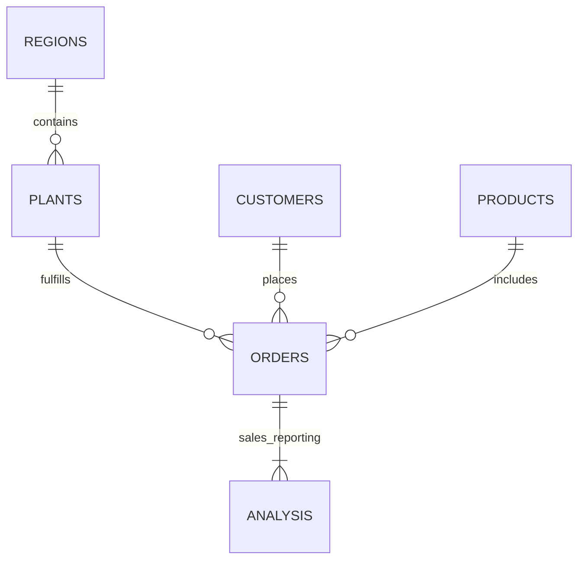
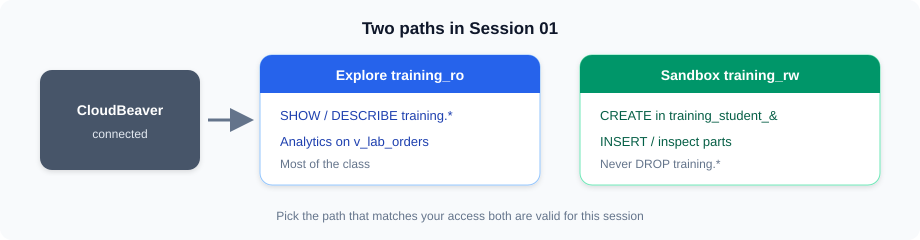
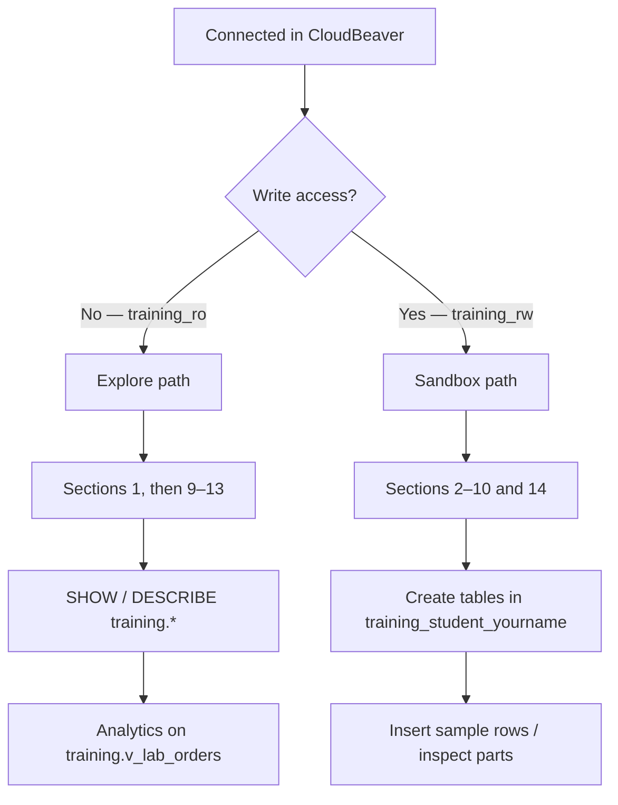

# Lab — ClickHouse Architecture and Data Modeling

## Connect (do this first)

| Item | Value |
|------|--------|
| CloudBeaver | https://vmclickhouse.canadacentral.cloudapp.azure.com/cloudbeaver/ |
| Connection | **Session 01–05 — ClickHouse training (LAN RO)** |
| User | `training_ro` (read-only) |

Confirm with:

```sql
SELECT version();
SELECT currentDatabase();
```

> **Need CREATE / INSERT?** Default access is read-only. For DDL practice you receive `training_rw` and you will use your own database `training_student_<yourname>`. Do **not** write into the `training` database.

---

## Business Scenario

A manufacturing company operates plants across several regions. Customers place orders for products. The reporting team wants analytical reporting on ClickHouse.

You will work with:



Focus for this lab:

* Databases and tables
* Data types and `Nullable`
* MergeTree, `ORDER BY`, `PARTITION BY`
* Loading data (sandbox) or exploring the seed
* Basic analytical queries

### Two paths





| Path | Access | What to do |
|------|--------|------------|
| **Explore** | `training_ro` | Sections **1**, then jump to **9–13** style work on the lab data: `SHOW` / `DESCRIBE` + analytics on **`training.v_lab_orders`** |
| **Sandbox** | `training_rw` + own DB | Sections **2–10** and **14**: create tables in **`training_student_<yourname>`** |

The lab already has a normalized `training` schema (`orders`, `order_items`, `plants`, …) plus the reporting view **`training.v_lab_orders`**.

* Seed dates: **2023-01-01** through **2025-06-18**
* For analytics on the lab data, use **`training.v_lab_orders`** (`sales_amount`, `quantity`, `region_id`, `status = 'Completed'`)
* The normalized fact table `training.orders` does **not** have `quantity`, `sales_amount`, or `region_id` as columns — those come from the view (and joins)

> **Tip:** Start with the explore path.

---

## 1. Connect and look around

You should already be connected (see the block at the top).

Explore what exists on the lab data:

```sql
SHOW DATABASES;

SHOW TABLES FROM training;

DESCRIBE TABLE training.orders;

SHOW CREATE TABLE training.orders;
```

> **Expected result:** `training.orders` is a normalized fact table. Its `ORDER BY` on the live seed is `(order_date, plant_id, order_id)` — not a region-first key. Reporting columns such as `sales_amount` and `region_id` are on **`training.v_lab_orders`**.

If you are on the **explore-only** path, skip sections 2–8 and continue from **section 11** (analytical queries). Come back to sections 2–10 when you have sandbox write access.

---

## 2. Create your sandbox database

Replace `<yourname>` with your short name (letters/numbers only), for example `training_student_alex`.

```sql
CREATE DATABASE IF NOT EXISTS training_student_<yourname>;
```

Check:

```sql
SHOW DATABASES;
```

Use fully qualified names for the rest of the sandbox lab:

```text
training_student_<yourname>.table_name
```

> Do **not** create or recreate the `training` database. It is already provisioned for class.

---

## 3. Create the Regions table (sandbox)

```sql
CREATE TABLE IF NOT EXISTS training_student_<yourname>.regions
(
 region_id UInt32,
 region_name String
)
ENGINE = MergeTree
ORDER BY region_id;
```

```sql
INSERT INTO training_student_<yourname>.regions
(
 region_id,
 region_name
)
VALUES
 (1, 'North'),
 (2, 'South'),
 (3, 'East'),
 (4, 'West'),
 (5, 'Central');
```

```sql
SELECT *
FROM training_student_<yourname>.regions
ORDER BY region_id;
```

---

## 4. Create the Plants table (sandbox)

```sql
CREATE TABLE IF NOT EXISTS training_student_<yourname>.plants
(
 plant_id UInt32,
 plant_name String,
 region_id UInt32
)
ENGINE = MergeTree
ORDER BY (region_id, plant_id);
```

```sql
INSERT INTO training_student_<yourname>.plants
(
 plant_id,
 plant_name,
 region_id
)
VALUES
 (101, 'North Plant A', 1),
 (102, 'North Plant B', 1),
 (201, 'South Plant A', 2),
 (202, 'South Plant B', 2),
 (301, 'East Plant A', 3),
 (401, 'West Plant A', 4),
 (402, 'West Plant B', 4),
 (501, 'Central Plant A', 5);
```

```sql
SELECT *
FROM training_student_<yourname>.plants
ORDER BY region_id, plant_id;
```

---

## 5. Create the Products table (sandbox)

```sql
CREATE TABLE IF NOT EXISTS training_student_<yourname>.products
(
 product_id UInt32,
 product_name String,
 category_id UInt32,
 price Decimal(12, 2)
)
ENGINE = MergeTree
ORDER BY product_id;
```

```sql
INSERT INTO training_student_<yourname>.products
(
 product_id,
 product_name,
 category_id,
 price
)
VALUES
 (1001, 'Industrial Pump', 10, 45000.00),
 (1002, 'Control Panel', 20, 32000.00),
 (1003, 'Electric Motor', 10, 28000.00),
 (1004, 'Pressure Valve', 30, 12500.00),
 (1005, 'Temperature Sensor', 40, 8500.00),
 (1006, 'Flow Meter', 40, 15000.00);
```

```sql
SELECT *
FROM training_student_<yourname>.products
ORDER BY product_id;
```

---

## 6. Create the Customers table (sandbox)

```sql
CREATE TABLE IF NOT EXISTS training_student_<yourname>.customers
(
 customer_id UInt32,
 customer_name String,
 region_id UInt32,
 email Nullable(String)
)
ENGINE = MergeTree
ORDER BY customer_id;
```

Notice:

```sql
email Nullable(String)
```

That allows a missing email (`NULL`).

```sql
INSERT INTO training_student_<yourname>.customers
(
 customer_id,
 customer_name,
 region_id,
 email
)
VALUES
 (10001, 'Customer Alpha', 1, 'alpha@example.com'),
 (10002, 'Customer Beta', 2, 'beta@example.com'),
 (10003, 'Customer Gamma', 3, NULL),
 (10004, 'Customer Delta', 4, 'delta@example.com'),
 (10005, 'Customer Epsilon', 5, NULL),
 (10006, 'Customer Zeta', 1, 'zeta@example.com');
```

```sql
SELECT *
FROM training_student_<yourname>.customers
ORDER BY customer_id;
```

---

## 7. Create the Orders table (sandbox)

This is a **denormalized teaching table** in *your* sandbox — useful for learning MergeTree design. It is **not** the same shape as the `training.orders` fact table.

```sql
CREATE TABLE IF NOT EXISTS training_student_<yourname>.orders
(
 order_id UInt64,
 order_date Date,
 region_id UInt32,
 plant_id UInt32,
 customer_id UInt32,
 product_id UInt32,
 quantity UInt32,
 sales_amount Decimal(12, 2),
 status String
)
ENGINE = MergeTree
PARTITION BY toYYYYMM(order_date)
ORDER BY (region_id, order_date, order_id);
```

Design choices for **your sandbox table**:

```text
Engine
 -> MergeTree

Partition
 -> Month based on order_date

Sorting key (sandbox teaching example)
 -> region_id
 -> order_date
 -> order_id
```

> **Sort key reminder**
>
> * **Your sandbox `orders`:** `(region_id, order_date, order_id)` — good for “filter by region + date” teaching queries.
> * **Shared live seed `training.orders`:** `(order_date, plant_id, order_id)` — inspect with `SHOW CREATE TABLE training.orders`. Do not assume the seed matches the sandbox key.

---

## 8. Load sample orders (sandbox)

```sql
INSERT INTO training_student_<yourname>.orders
(
 order_id,
 order_date,
 region_id,
 plant_id,
 customer_id,
 product_id,
 quantity,
 sales_amount,
 status
)
VALUES
 (100001, '2023-01-05', 1, 101, 10001, 1001, 10, 450000.00, 'Completed'),
 (100002, '2023-01-08', 2, 201, 10002, 1003, 8, 224000.00, 'Completed'),
 (100003, '2023-01-12', 3, 301, 10003, 1002, 5, 160000.00, 'Open'),
 (100004, '2023-01-18', 4, 401, 10004, 1004, 6, 75000.00, 'Completed'),
 (100005, '2023-02-02', 5, 501, 10005, 1005, 12, 102000.00, 'Completed'),
 (100006, '2023-02-06', 1, 102, 10006, 1006, 7, 105000.00, 'Completed'),
 (100007, '2023-02-15', 2, 202, 10002, 1001, 4, 180000.00, 'Open'),
 (100008, '2023-02-20', 4, 402, 10004, 1003, 9, 252000.00, 'Completed'),
 (100009, '2023-03-03', 3, 301, 10003, 1004, 10, 125000.00, 'Completed'),
 (100010, '2023-03-10', 5, 501, 10005, 1002, 6, 192000.00, 'Completed');
```

```sql
SELECT *
FROM training_student_<yourname>.orders
ORDER BY order_date, order_id;
```

> **Expected result:** 10 rows in your sandbox table.

---

## 9. Inspect table structure

### Lab data (everyone)

```sql
DESCRIBE TABLE training.orders;
SHOW CREATE TABLE training.orders;
```

Confirm the live sorting key includes `order_date` and `plant_id`.

### Your sandbox table (if you created one)

```sql
DESCRIBE TABLE training_student_<yourname>.orders;
SHOW CREATE TABLE training_student_<yourname>.orders;
```

You should see:

```text
ENGINE = MergeTree
PARTITION BY toYYYYMM(order_date)
ORDER BY (region_id, order_date, order_id)
```

---

## 10. Inspect data parts (sandbox)

MergeTree stores data in parts. For **your** sandbox table:

```sql
SELECT
 database,
 table,
 partition,
 name,
 rows
FROM system.parts
WHERE database = 'training_student_<yourname>'
 AND table = 'orders'
 AND active
ORDER BY partition, name;
```

Because of `PARTITION BY toYYYYMM(order_date)`, January / February / March land in different partitions.

Discuss:

* Why are January and February in different partitions?
* What happens when March data is inserted?
* When are monthly partitions useful?

> **Explore path:** you can run a similar query with `database = 'training'` and `table = 'orders'` to see real seed parts — read-only is enough.

---

## 11. Run basic analytical queries (lab data)

On the lab data, use **`training.v_lab_orders`**. That view exposes `sales_amount`, `quantity`, `region_id`, and lab-friendly `status` values (including `'Completed'`).

If you built a denormalized sandbox `orders` table, you may query that instead for the same patterns — just swap the table name.

### Row count

```sql
SELECT count()
FROM training.v_lab_orders;
```

### Total sales

```sql
SELECT
 sum(sales_amount) AS total_sales
FROM training.v_lab_orders;
```

### Total quantity

```sql
SELECT
 sum(quantity) AS total_quantity
FROM training.v_lab_orders;
```

### Sales by region

```sql
SELECT
 region_id,
 sum(sales_amount) AS total_sales
FROM training.v_lab_orders
GROUP BY region_id
ORDER BY total_sales DESC;
```

### Sales by month

```sql
SELECT
 toYYYYMM(order_date) AS month,
 sum(sales_amount) AS total_sales
FROM training.v_lab_orders
GROUP BY month
ORDER BY month;
```

Keep these simple — the goal is to confirm analytical access works.

> **Tip:** Completed rows on the view are about **300000**. Unique completed *orders* are about **125000**. Both can be “right” depending on whether you count view rows or distinct `order_id`.

---

## 12. Sorting key and filters

### Lab data

Inspect the live key, then filter on the view:

```sql
SHOW CREATE TABLE training.orders;

SELECT
 sum(sales_amount)
FROM training.v_lab_orders
WHERE region_id = 1
 AND order_date >= '2023-01-01'
 AND order_date < '2023-02-01';
```

Discuss:

* Which columns are used for filtering?
* Which columns appear first in the sorting key on `training.orders`?
* Why might that ordering still help date-heavy reports?

### Sandbox teaching example

If you created `training_student_<yourname>.orders` with `ORDER BY (region_id, order_date, order_id)`, the same filter shape maps cleanly onto that teaching key. Say clearly: this is **your sandbox table**, not the lab data.

Do not benchmark yet — optimization comes later.

---

## 13. Observe Nullable data

### Lab data

```sql
SELECT
 customer_id,
 customer_name,
 email
FROM training.customers
LIMIT 20;

SELECT
 customer_id,
 customer_name
FROM training.customers
WHERE email IS NULL
LIMIT 20;
```

### Sandbox

If you created customers in your database, use `training_student_<yourname>.customers` the same way.

This is why a column may be declared as `Nullable(String)`.

---

## 14. Optional — categories table (sandbox only)

```sql
CREATE TABLE IF NOT EXISTS training_student_<yourname>.categories
(
 category_id UInt32,
 category_name String
)
ENGINE = MergeTree
ORDER BY category_id;
```

```sql
INSERT INTO training_student_<yourname>.categories
(
 category_id,
 category_name
)
VALUES
 (10, 'Pumps and Motors'),
 (20, 'Control Systems'),
 (30, 'Valves'),
 (40, 'Sensors');
```

```sql
SELECT *
FROM training_student_<yourname>.categories
ORDER BY category_id;
```

No joins yet — that comes later.

---

## 15. Cleanup — sandbox only

```text
╔══════════════════════════════════════════════════════════════════╗
║ NEVER run DROP on the `training` database. ║
║ That database is used by the whole class. ║
║ ║
║ Cleanup applies ONLY to tables you created in ║
║ training_student_<yourname>. ║
╚══════════════════════════════════════════════════════════════════╝
```

If you need to repeat the sandbox lab, drop **only your own** tables:

```sql
DROP TABLE IF EXISTS training_student_<yourname>.orders;
DROP TABLE IF EXISTS training_student_<yourname>.customers;
DROP TABLE IF EXISTS training_student_<yourname>.products;
DROP TABLE IF EXISTS training_student_<yourname>.plants;
DROP TABLE IF EXISTS training_student_<yourname>.regions;
DROP TABLE IF EXISTS training_student_<yourname>.categories;
```

You usually do **not** need to drop the database itself.

---

## Lab check

Before finishing, confirm you can:

* Connect via CloudBeaver and run a simple `SELECT`
* Explain explore vs sandbox paths
* (Sandbox) Create a MergeTree table with types, `Nullable`, `PARTITION BY`, and `ORDER BY`
* Inspect a table definition and (optionally) data parts
* Query **`training.v_lab_orders`** for simple analytics
* Explain partitioning vs sorting
* Explain that the `training.orders` sort key is `(order_date, plant_id, order_id)`, while a **sandbox** teaching table may use `(region_id, order_date, order_id)`
