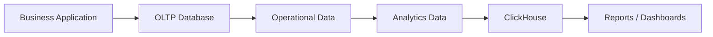
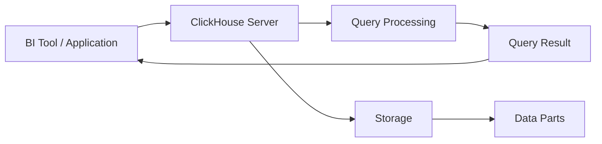
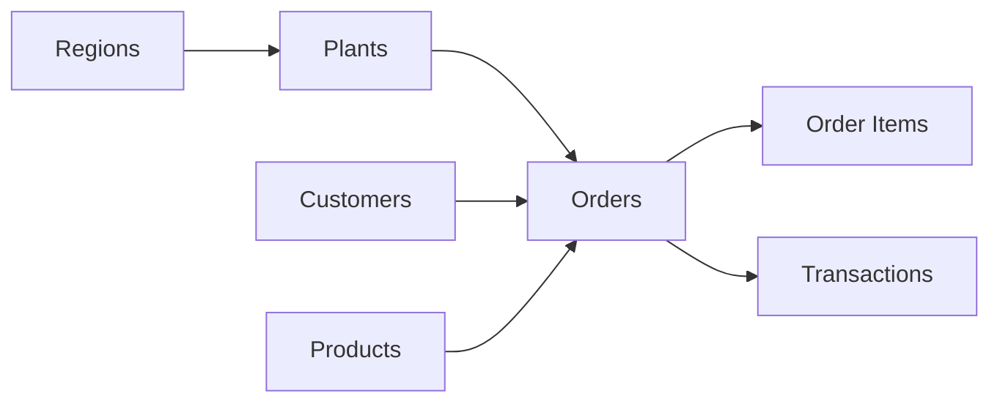
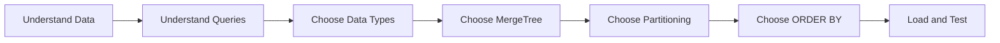
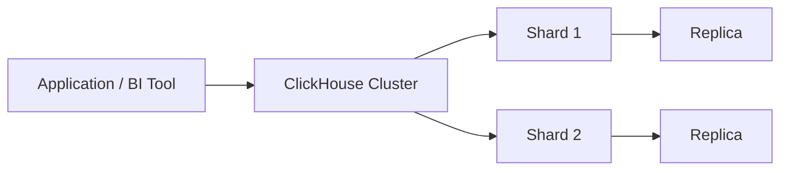

# ClickHouse Architecture and Data Modeling

## Connect (classroom)

| Item | Value |
|------|--------|
| CloudBeaver | https://vmclickhouse.canadacentral.cloudapp.azure.com/cloudbeaver/ |
| Connection | **Session 01–05 — ClickHouse training (LAN RO)** |
| User | `training_ro` (read-only) |

Shared analytics use **`training.v_lab_orders`**. DDL practice uses **`training_student_<yourname>`** with `training_rw` when the instructor provides it.

---

## 1. What is ClickHouse?

ClickHouse is a column-oriented database built mainly for analytical workloads.

Typical uses:

* Business reporting and dashboards
* KPI analysis and large aggregations
* Time-based and operational analytics

A typical ClickHouse query may read millions of rows but return only a few.

**Illustrative denormalized example** (teaching shape — not identical to the live normalized seed):

```sql
-- Teaching example: denormalized “wide” orders table
SELECT
    region_id,
    sum(sales_amount) AS total_sales
FROM training_student_<yourname>.orders   -- your sandbox table, if you created one
GROUP BY region_id;
```

**On the live lab data**, run the same idea against the reporting view:

```sql
SELECT
    region_id,
    sum(sales_amount) AS total_sales
FROM training.v_lab_orders
GROUP BY region_id
ORDER BY total_sales DESC;
```

This kind of workload is different from a day-to-day application transaction.

---

## 2. OLTP and OLAP

**OLTP (Online Transaction Processing)** — day-to-day transactions:

* Create an order
* Update customer information
* Record a payment
* Update inventory

**OLAP (Online Analytical Processing)** — analysis:

* Sales by region
* Monthly revenue
* Top products
* Average order value
* Trends

| OLTP | OLAP |
| ---- | ---- |
| Transaction focused | Analysis focused |
| Usually touches few rows | Often reads many rows |
| Frequent INSERT/UPDATE/DELETE | Mostly analytical SELECT |
| Application workloads | Reporting and analytics |
| Example: create an order | Example: sales by region |

ClickHouse is primarily an OLAP database.



---

## 3. SQL Server and ClickHouse

SQL looks familiar; design thinking does not always transfer.

| SQL Server | ClickHouse |
| ---------- | ---------- |
| Commonly OLTP and OLAP | Mainly optimized for OLAP |
| Row-oriented storage | Column-oriented storage |
| Traditional indexes matter a lot | Sorting keys and data skipping matter a lot |
| Primary key usually identifies rows | MergeTree sorting key is mainly about order and skipping |
| Updates are common | Insert-heavy analytical loads are common |
| Design often starts from transactions | Design should start from analytical query patterns |

> Do not copy an SQL Server table design into ClickHouse and expect the same performance.

---

## 4. Columnar storage

Row-oriented (conceptual):

```text
Row 1 -> OrderID | Date | Region | Product | Quantity | Amount
Row 2 -> OrderID | Date | Region | Product | Quantity | Amount
```

Column-oriented (conceptual):

```text
OrderID     OrderDate      SalesAmount
-------     ---------      -----------
1001        2023-01-01     1200
1002        2023-01-02     4500
1003        2023-01-02     800
```

Live seed example — only `sales_amount` is needed:

```sql
SELECT sum(sales_amount)
FROM training.v_lab_orders;
```

That is a big reason columnar storage works well for analytics.

### Compression

Similar values in one column compress well (many repeated region names, statuses, and so on). **Columnar storage + compression** helps large analytical datasets stay efficient.

---

## 5. Basic ClickHouse architecture



In short, ClickHouse:

1. Receives the query
2. Finds the needed data
3. Reads the needed columns
4. Filters and calculates
5. Aggregates when required
6. Returns the result

That level is enough for this session.

---

## 6. Databases, tables and table engines

This course’s **lab data** lives in a database called `training` (already created for you).

```text
ClickHouse
    |
    +-- training                    (lab data — explore)
          |
          +-- regions, plants, products, customers
          +-- orders, order_items, transactions
          +-- v_lab_orders          (reporting view)
    |
    +-- training_student_<name>     (your sandbox — if write access)
```

**Do not** run `CREATE DATABASE training` on the lab. For DDL practice:

```sql
CREATE DATABASE IF NOT EXISTS training_student_<yourname>;
```

**Illustrative sandbox CREATE** (your database, not the lab data):

```sql
CREATE TABLE training_student_<yourname>.regions
(
    region_id UInt32,
    region_name String
)
ENGINE = MergeTree
ORDER BY region_id;
```

The `ENGINE` clause matters. For analytical tables in this course, the **MergeTree family** is the main family.

---

## 7. MergeTree

**Illustrative denormalized sandbox table** — teaching shape with `region_id` / `sales_amount` on the fact row. This is **not** the live `training.orders` schema.

```sql
CREATE TABLE training_student_<yourname>.orders
(
    order_id UInt64,
    order_date Date,
    region_id UInt32,
    plant_id UInt32,
    customer_id UInt32,
    product_id UInt32,
    quantity UInt32,
    sales_amount Decimal(12, 2),
    status String
)
ENGINE = MergeTree
PARTITION BY toYYYYMM(order_date)
ORDER BY (region_id, order_date, order_id);
```

This `ORDER BY` is for a **sandbox teaching table** in `training_student_<yourname>`. It is **not** the live lab data key.

Notice:

```text
Columns + data types
MergeTree
PARTITION BY
ORDER BY
```

MergeTree stores inserts in **data parts** and merges them in the background.

> MergeTree is built for efficient storage and processing of large analytical datasets.

**Live seed check** (read-only is enough):

```sql
SHOW CREATE TABLE training.orders;
```

You should see a **normalized** fact table whose sorting key is `(order_date, plant_id, order_id)`.

---

## 8. ORDER BY and sorting key

In MergeTree, `ORDER BY` defines the sorting key. Column order matters.

### Sandbox teaching example

For a denormalized table you design yourself:

```sql
ORDER BY (region_id, order_date, order_id)
```

Filters like “this region + this month” line up well with that key:

```sql
-- Against your sandbox table OR the lab view (both have these columns)
SELECT
    sum(sales_amount)
FROM training.v_lab_orders
WHERE region_id = 3
  AND order_date >= '2023-01-01'
  AND order_date < '2023-02-01';
```

> Use region **3** (or 1 / 5) for Completed examples on the seed. Region **2** + Completed is empty.

### Live lab data

Shared `training.orders` uses:

```text
ORDER BY (order_date, plant_id, order_id)
```

Say this clearly in class: **sandbox teaching keys** and **live seed keys** can differ. Always inspect with `SHOW CREATE TABLE`.

### Important distinction

```text
ORDER BY
    |
    +-- Controls data ordering
    +-- Supports the sparse primary index
    +-- Helps data skipping
```

It does **not** mean “`order_id` must be unique” the way a SQL Server primary key does.

Deeper sorting-key choice and optimization come in a later session.

---

## 9. Partitioning

Example:

```sql
PARTITION BY toYYYYMM(order_date)
```

```text
orders
  |
  +-- 202301
  +-- 202302
  +-- 202303
```

A date-limited query may skip unrelated partitions:

```sql
SELECT sum(sales_amount)
FROM training.v_lab_orders
WHERE order_date >= '2023-02-01'
  AND order_date < '2023-03-01';
```

### Partitioning vs ORDER BY

```text
PARTITION BY  -> divides data into partitions
ORDER BY      -> sorts data within stored parts
```

Do not add partitions “just because.” Consider growth, query patterns, lifecycle, and partition count/size.

For this training dataset, monthly partitions fit time-based reporting.

---

## 10. Basic data types

| Requirement | Example type |
| ----------- | ------------ |
| Integer identifier | `UInt32` |
| Large identifier | `UInt64` |
| Text | `String` |
| Date | `Date` |
| Date and time | `DateTime` |
| Exact numeric value | `Decimal` |

Sandbox example:

```sql
CREATE TABLE training_student_<yourname>.products
(
    product_id UInt32,
    product_name String,
    category_id UInt32,
    price Decimal(12, 2)
)
ENGINE = MergeTree
ORDER BY product_id;
```

Choose types that match the data: numeric IDs as integers, dates as date types, money as `Decimal` when exact precision matters.

---

## 11. Nullable data

```sql
Nullable(Type)
```

Example: `customer_email Nullable(String)`.

Use `Nullable` when missing data has a real meaning. Do not make every column nullable.

```text
order_id       -> normally required
order_date     -> normally required
sales_amount   -> normally required
customer_email -> may be optional
```

---

## 12. Basic data model



Lab data tables include regions, plants, products, customers, orders, order_items, and transactions. For reporting columns in one place, use **`training.v_lab_orders`**.

---

## 13. Example table design

**Illustrative denormalized sandbox design** (your database — not a claim about `training.orders`):

```sql
CREATE TABLE training_student_<yourname>.orders
(
    order_id UInt64,
    order_date Date,
    region_id UInt32,
    plant_id UInt32,
    customer_id UInt32,
    product_id UInt32,
    quantity UInt32,
    sales_amount Decimal(12, 2),
    status String
)
ENGINE = MergeTree
PARTITION BY toYYYYMM(order_date)
ORDER BY (region_id, order_date, order_id);
```

```text
Types        -> UInt / Date / Decimal / String as above
Engine       -> MergeTree
Partition    -> month of order_date
Sorting key  -> region_id, order_date, order_id   (sandbox teaching example)
```

**Live seed contrast:** `training.orders` is normalized and sorted by `(order_date, plant_id, order_id)`. Query `sales_amount` / `region_id` via **`training.v_lab_orders`**.

---

## 14. Basic storage design thinking

Ask four questions:

1. **What data are we storing?**
2. **How will it be queried?** (by region, date, plant, product, …)
3. **How will it grow?**
4. **What should be sorted and partitioned?**



> In ClickHouse, table design should be driven by the analytical workload.

---

## 15. Distributed ClickHouse

One server is enough for many small workloads and for this training environment.

Larger deployments use a cluster:

* **Shard** — a portion of the data
* **Replica** — another copy for availability



Detailed cluster setup is outside this session — know the terms.

---

## Key points to remember

* ClickHouse is mainly an analytical, column-oriented database
* MergeTree is the main engine family in this course
* `ORDER BY` is a design decision; it is not a SQL Server-style unique key
* Lab data `training.orders` sorts by `(order_date, plant_id, order_id)`; sandbox teaching tables may use `(region_id, order_date, order_id)`
* Use **`training.v_lab_orders`** for lab analytics with `sales_amount` / `region_id` / `quantity`
* `PARTITION BY` and `ORDER BY` do different jobs
* Use `Nullable` only where missing values matter
* Never DROP the `training` database — clean up only your `training_student_<yourname>` tables
* Shards and replicas matter for larger deployments
