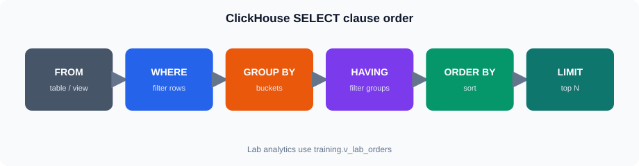
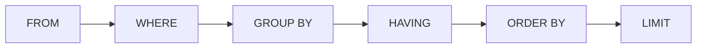
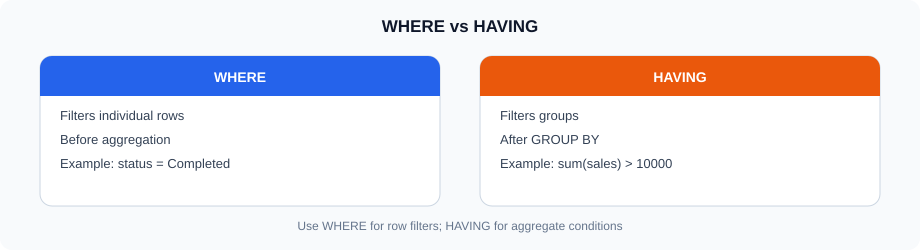
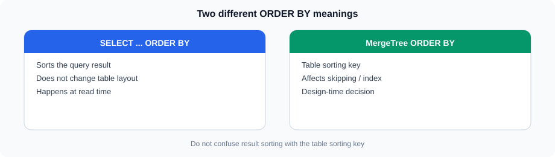
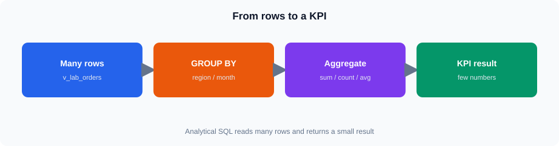
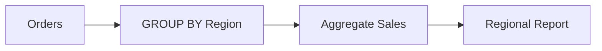
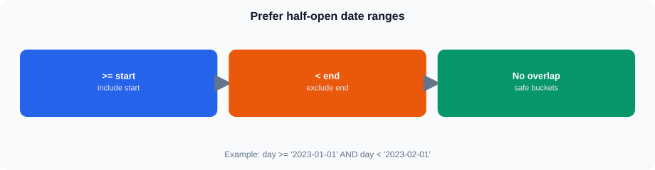
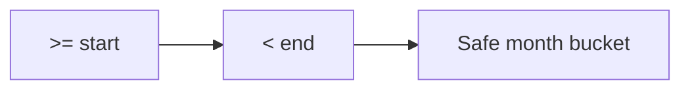
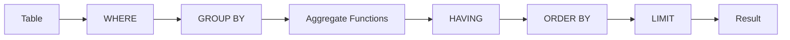

# ClickHouse SQL for Analytics and Reporting

## 1. SELECT

<!-- training-diagrams:v1 -->


Same idea in Mermaid (GitHub theme colors):




`SELECT` is used to retrieve data from a ClickHouse table.

```sql
SELECT *
FROM training.v_lab_orders
LIMIT 100;
```

For reporting, it is usually better to select only the columns that are required.

```sql
SELECT
    order_id,
    order_date,
    region_id,
    quantity,
    sales_amount
FROM training.v_lab_orders
LIMIT 100;
```

Selecting only required columns is especially useful in a column-oriented database because it reduces the amount of data that needs to be read.

---

## 2. WHERE

<!-- training-diagrams:v1 -->



`WHERE` filters rows before the result is produced.

For example, find orders from region 1:

```sql
SELECT
    order_id,
    order_date,
    sales_amount
FROM training.v_lab_orders
WHERE region_id = 1
LIMIT 100;
```

Multiple conditions can be combined:

```sql
SELECT
    order_id,
    order_date,
    sales_amount
FROM training.v_lab_orders
WHERE region_id = 1
  AND status = 'Completed'
LIMIT 100;
```

Common operators include:

```text
=
!=
>
<
>=
<=
IN
BETWEEN
LIKE
```

For example:

```sql
SELECT *
FROM training.v_lab_orders
WHERE sales_amount > 2000
LIMIT 100;
```

---

## 3. ORDER BY

<!-- training-diagrams:v2 -->



`ORDER BY` controls the order of rows returned by a query.

```sql
SELECT
    order_id,
    sales_amount
FROM training.v_lab_orders
ORDER BY sales_amount DESC
LIMIT 100;
```

Use `ASC` for ascending order and `DESC` for descending order.

Multiple columns can be specified:

```sql
SELECT
    region_id,
    order_date,
    sales_amount
FROM training.v_lab_orders
ORDER BY region_id, order_date
LIMIT 100;
```

Do not confuse query-level `ORDER BY` with the `ORDER BY` used when defining a MergeTree table.

In the live lab table definition (`SHOW CREATE TABLE training.orders`):

```sql
ORDER BY (order_date, plant_id, order_id)
```

defines the table's sorting key. Date- and plant-aligned filters benefit from this organization.

In a query:

```sql
ORDER BY sales_amount DESC
```

controls the order of the returned result.

---

## 4. LIMIT

`LIMIT` restricts the number of rows returned.

```sql
SELECT *
FROM training.v_lab_orders
LIMIT 10;
```

It is useful when inspecting data or displaying a limited result.

For example, the top five highest-value orders:

```sql
SELECT
    order_id,
    sales_amount
FROM training.v_lab_orders
ORDER BY sales_amount DESC
LIMIT 5;
```

---

## 5. DISTINCT

`DISTINCT` returns unique values.

For example, find the regions represented in the orders table:

```sql
SELECT DISTINCT region_id
FROM training.v_lab_orders;
```

Multiple columns can also be used:

```sql
SELECT DISTINCT
    region_id,
    plant_id
FROM training.v_lab_orders;
```

`DISTINCT` is useful when building lists of unique values for reporting or analysis.

---

## 6. Aggregate Functions

<!-- training-diagrams:v1 -->



Aggregate functions calculate a result from multiple rows.

Common functions include:

```text
count()
sum()
avg()
min()
max()
```

### Count orders

```sql
SELECT count()
FROM training.v_lab_orders;
```

### Total sales

```sql
SELECT sum(sales_amount)
FROM training.v_lab_orders;
```

### Average order value

```sql
SELECT avg(sales_amount)
FROM training.v_lab_orders;
```

### Highest order value

```sql
SELECT max(sales_amount)
FROM training.v_lab_orders;
```

### Lowest order value

```sql
SELECT min(sales_amount)
FROM training.v_lab_orders;
```

Aliases make report results easier to understand:

```sql
SELECT
    count() AS total_orders,
    sum(sales_amount) AS total_sales,
    avg(sales_amount) AS average_order_value
FROM training.v_lab_orders;
```

---

## 7. GROUP BY

`GROUP BY` is used to calculate aggregates for different groups.

For example, total sales by region:

```sql
SELECT
    region_id,
    sum(sales_amount) AS total_sales
FROM training.v_lab_orders
GROUP BY region_id
ORDER BY total_sales DESC;
```

The query first groups the orders by `region_id` and then calculates the sales for each group.

### Multiple grouping columns

Sales by region and plant:

```sql
SELECT
    region_id,
    plant_id,
    sum(sales_amount) AS total_sales
FROM training.v_lab_orders
GROUP BY
    region_id,
    plant_id
ORDER BY
    region_id,
    plant_id;
```

This is one of the most common patterns in reporting queries.



---

## 8. HAVING

`WHERE` filters rows before grouping.

`HAVING` filters groups after aggregation.

For example, find regions with sales greater than 500,000:

```sql
SELECT
    region_id,
    sum(sales_amount) AS total_sales
FROM training.v_lab_orders
GROUP BY region_id
HAVING total_sales > 500000;
```

A useful way to remember the difference is:

```text
WHERE
  -> filters rows

GROUP BY
  -> creates groups

HAVING
  -> filters groups
```

Example:

```sql
SELECT
    region_id,
    count() AS order_count,
    sum(sales_amount) AS total_sales
FROM training.v_lab_orders
WHERE status = 'Completed'
GROUP BY region_id
HAVING total_sales > 300000
ORDER BY total_sales DESC;
```

Here:

1. `WHERE` keeps completed orders.
2. `GROUP BY` creates regional groups.
3. `sum()` calculates sales.
4. `HAVING` keeps regions above the threshold.
5. `ORDER BY` sorts the result.

---

## 9. String Functions

String functions are commonly required when preparing reporting data.

### Convert case

```sql
SELECT
    upper(status) AS status
FROM training.v_lab_orders;
```

```sql
SELECT
    lower(status) AS status
FROM training.v_lab_orders;
```

### String length

```sql
SELECT
    status,
    length(status) AS status_length
FROM training.v_lab_orders;
```

### Search within a string

For example:

```sql
SELECT *
FROM training.customers
WHERE customer_name LIKE '%Industrial%';
```

String functions are useful for filtering, formatting and preparing values for reports.

---

## 10. Date and Time Functions

<!-- training-diagrams:v2 -->


Same idea in Mermaid (GitHub theme colors):




Reporting frequently groups data by date or time period.

The `orders` table contains:

```text
order_date
```

### Extract year

```sql
SELECT
    toYear(order_date) AS year,
    count() AS orders
FROM training.v_lab_orders
GROUP BY year
ORDER BY year;
```

### Extract month

```sql
SELECT
    toMonth(order_date) AS month,
    count() AS orders
FROM training.v_lab_orders
GROUP BY month
ORDER BY month;
```

For reporting, it is often better to group by a year-month value:

```sql
SELECT
    toYYYYMM(order_date) AS month,
    count() AS orders,
    sum(sales_amount) AS total_sales
FROM training.v_lab_orders
GROUP BY month
ORDER BY month;
```

### Filter by date range

```sql
SELECT
    count() AS orders,
    sum(sales_amount) AS total_sales
FROM training.v_lab_orders
WHERE order_date >= '2023-01-01'
  AND order_date < '2023-02-01';
```

Using a start date and an exclusive end date is a useful pattern for date-range reporting.

---

## 11. Conditional Expressions

Conditional expressions allow a query to classify or calculate values based on conditions.

A common option is `CASE`.

For example, classify orders by value:

```sql
SELECT
    order_id,
    sales_amount,
    CASE
        WHEN sales_amount >= 2000 THEN 'High'
        WHEN sales_amount >= 1000 THEN 'Medium'
        ELSE 'Low'
    END AS order_category
FROM training.v_lab_orders
LIMIT 100;
```

The result can be used directly in a report.

Another useful function is `if()`:

```sql
SELECT
    order_id,
    if(status = 'Completed', sales_amount, 0) AS completed_sales
FROM training.v_lab_orders
LIMIT 100;
```

---

## 12. NULL Handling

A `NULL` value means that a value is missing or unknown.

For example, the `customers` table contains:

```sql
email Nullable(String)
```

Find customers without an email:

```sql
SELECT
    customer_id,
    customer_name
FROM training.customers
WHERE email IS NULL;
```

Find customers with an email:

```sql
SELECT
    customer_id,
    customer_name,
    email
FROM training.customers
WHERE email IS NOT NULL;
```

`COALESCE` can be used to provide an alternative value.

```sql
SELECT
    customer_id,
    customer_name,
    coalesce(email, 'Not Available') AS email
FROM training.customers;
```

This is useful when preparing data for reports where displaying `NULL` directly may not be desirable.

---

## 13. KPI Calculations

Analytical reports commonly calculate KPIs from raw data.

For example:

```sql
SELECT
    count() AS total_orders,
    sum(quantity) AS total_quantity,
    sum(sales_amount) AS total_sales,
    avg(sales_amount) AS average_order_value
FROM training.v_lab_orders;
```

These values can form the basis of a management report.

### Completed sales

A common requirement is to calculate sales only for a particular status.

ClickHouse provides conditional aggregate functions such as `sumIf()`.

```sql
SELECT
    sumIf(sales_amount, status = 'Completed') AS completed_sales
FROM training.v_lab_orders;
```

Similarly:

```sql
SELECT
    countIf(status = 'Completed') AS completed_orders
FROM training.v_lab_orders;
```

This is useful for KPI queries because the condition and aggregation can be expressed together.

---

## 14. Daily Reporting

A daily sales report can be created using:

```sql
SELECT
    order_date,
    count() AS order_count,
    sum(quantity) AS total_quantity,
    sum(sales_amount) AS total_sales
FROM training.v_lab_orders
GROUP BY order_date
ORDER BY order_date;
```

The result can be used to identify daily changes in:

* Order volume
* Quantity
* Sales

This type of query will later become the basis for Grafana visualizations.

---

## 15. Monthly Reporting

Monthly reporting can use `toYYYYMM()`:

```sql
SELECT
    toYYYYMM(order_date) AS month,
    count() AS order_count,
    sum(quantity) AS total_quantity,
    sum(sales_amount) AS total_sales
FROM training.v_lab_orders
GROUP BY month
ORDER BY month;
```

This produces a compact monthly reporting dataset.

For example:

```text
Month     Orders     Quantity     Sales
202601      ...         ...        ...
202602      ...         ...        ...
202603      ...         ...        ...
```

---

## 16. Putting the Concepts Together

A typical reporting query may combine several concepts.

For example, completed sales by region:

```sql
SELECT
    region_id,
    count() AS completed_orders,
    sum(quantity) AS completed_quantity,
    sum(sales_amount) AS completed_sales
FROM training.v_lab_orders
WHERE status = 'Completed'
GROUP BY region_id
HAVING completed_sales > 100000
ORDER BY completed_sales DESC
LIMIT 10;
```

This query uses:

```text
SELECT
WHERE
GROUP BY
Aggregate Functions
HAVING
ORDER BY
LIMIT
```

This is the type of SQL pattern commonly used to prepare data for reports and dashboards.

---

## 17. Query Structure to Remember

For the SQL covered in this session, a useful mental model is:



Not every query needs every clause.

For example:

```sql
SELECT *
FROM training.v_lab_orders
LIMIT 10;
```

needs only `SELECT`, `FROM` and `LIMIT`.

---

## Key Points

* Use `SELECT` to retrieve required columns.
* Use `WHERE` to filter rows.
* Use `ORDER BY` to sort query results.
* Use `LIMIT` to restrict the result size.
* Use `DISTINCT` to return unique values.
* Use aggregate functions to calculate metrics.
* Use `GROUP BY` for grouped reports.
* Use `HAVING` to filter aggregated groups.
* Use date functions for daily and monthly reporting.
* Use string functions when filtering or formatting text.
* Use conditional expressions for classification and calculations.
* Handle `NULL` explicitly when required.
* Use conditional aggregates such as `sumIf()` and `countIf()` for KPI calculations.

The main goal is to be able to turn raw order data into simple reporting datasets using ClickHouse SQL.
