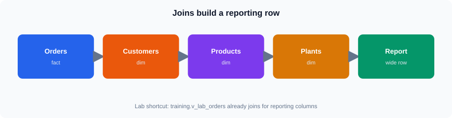

# Session 3 — Advanced ClickHouse SQL

**Duration:** 4 hours

## Connect

| Item | Value |
|------|--------|
| CloudBeaver | https://vmclickhouse.canadacentral.cloudapp.azure.com/cloudbeaver/ |
| Connection | **ClickHouse training** |
| User | `training_ro` |

## Overview

Joins, CTEs, window functions, and reporting-shaped queries on the lab seed.

## Topics

* `JOIN` types, CTEs vs subqueries
* Window functions and running totals
* Building multi-step analytical queries

## Hands-on

**Core:** joins + CTE + one window pattern with `LIMIT` for responsiveness 

**Stretch:** richer window frames and multi-CTE reports

**Seed:** Completed regions **1 / 3 / 5**; dates **2023-01-01** … **2025-06-18**

## Checkpoint quizzes

After each topic block in `notes.md`, open the matching quiz and submit once. Class login is shared in class. Prefer **Login**. One attempt.

| After topic | Quiz |
|-------------|------|
| Joins | [ch-grafana-s03-joins](https://vmreact.eastus2.cloudapp.azure.com:18094/a/ch-grafana-s03-joins) |
| CTEs and subqueries | [ch-grafana-s03-cte-subquery](https://vmreact.eastus2.cloudapp.azure.com:18094/a/ch-grafana-s03-cte-subquery) |
| Window functions and ranking | [ch-grafana-s03-windows](https://vmreact.eastus2.cloudapp.azure.com:18094/a/ch-grafana-s03-windows) |
| Conditional aggregation and arrays | [ch-grafana-s03-conditional-arrays](https://vmreact.eastus2.cloudapp.azure.com:18094/a/ch-grafana-s03-conditional-arrays) |

## Files

| File | Purpose |
|------|---------|
| `notes.md` | Concepts |
| `lab.md` | Guided lab |
| `assets/` | Diagrams |
