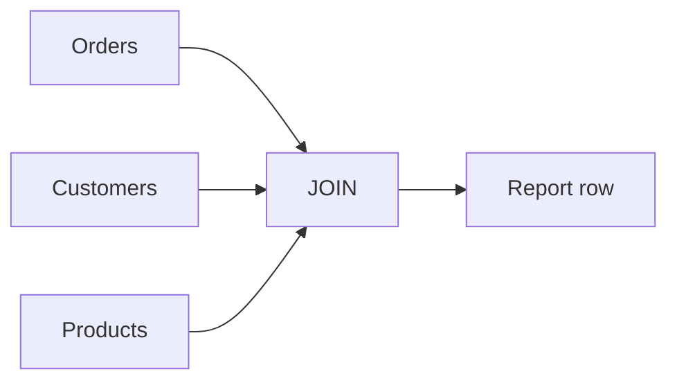
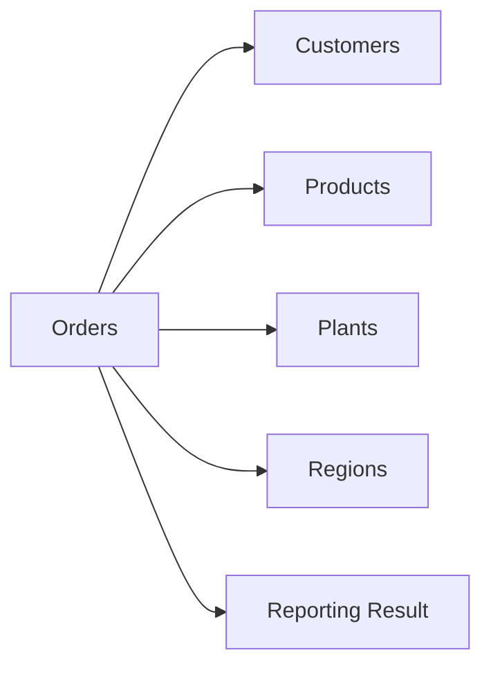
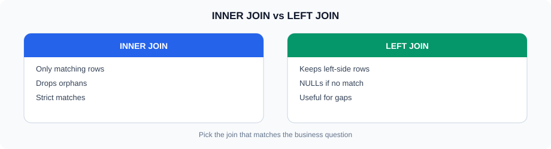
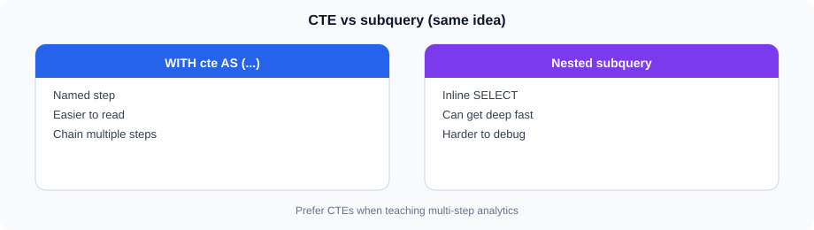
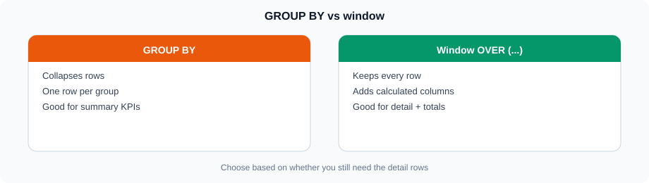
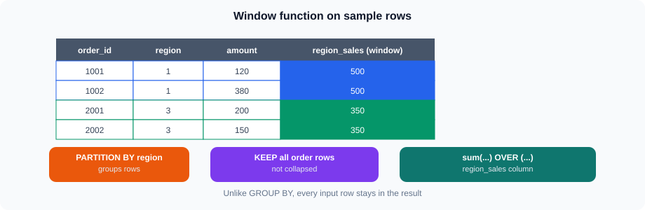
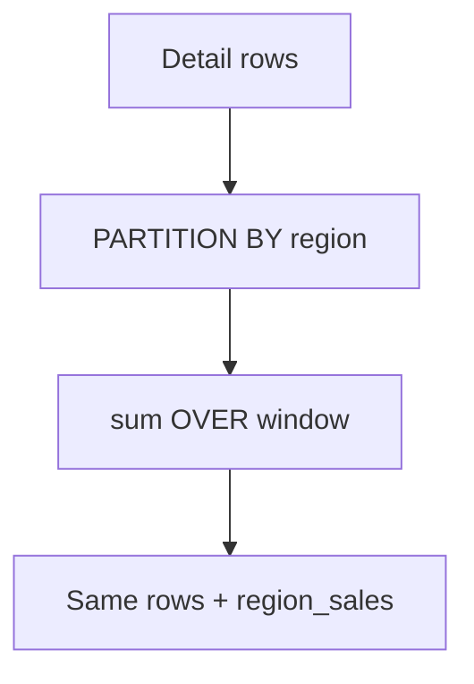
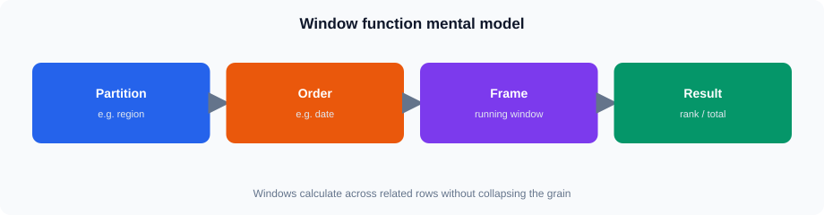
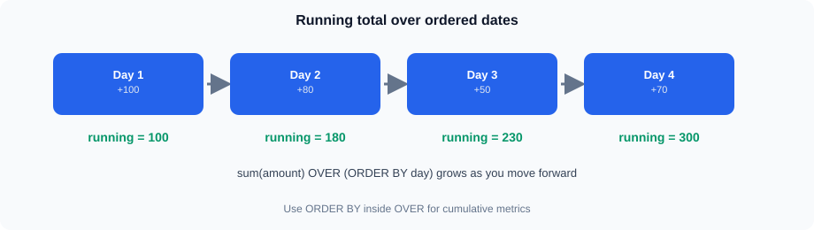

# Advanced ClickHouse SQL

## 1. Working with Multiple Tables


Same idea in Mermaid (GitHub theme colors):




Reporting usually requires information from more than one table.

For example, the `orders` table contains IDs:

```text
region_id
plant_id
customer_id
product_id
```

The actual names and descriptions are stored in other tables.



For example, to display the region name with sales:

```sql
SELECT
    r.region_name,
    sum(o.sales_amount) AS total_sales
FROM training.v_lab_orders AS o
INNER JOIN training.regions AS r
    ON o.region_id = r.region_id
GROUP BY r.region_name
ORDER BY total_sales DESC;
```

---

## 2. INNER JOIN




`INNER JOIN` returns rows where matching data exists in both tables.

```sql
SELECT
    o.order_id,
    c.customer_name,
    o.sales_amount
FROM training.v_lab_orders AS o
INNER JOIN training.customers AS c
    ON o.customer_id = c.customer_id;
```

Only orders with a matching customer are returned.

A join consists of:

```text
Orders
   |
   | customer_id = customer_id
   |
Customers
   |
   v
Combined Result
```

### Example: Product sales

```sql
SELECT
    p.product_name,
    sum(o.sales_amount) AS total_sales
FROM training.v_lab_orders AS o
INNER JOIN training.products AS p
    ON o.product_id = p.product_id
GROUP BY p.product_name
ORDER BY total_sales DESC;
```

---

## 3. LEFT JOIN

`LEFT JOIN` keeps all rows from the left table, even when a matching row does not exist on the right.

```sql
SELECT
    c.customer_id,
    c.customer_name,
    o.order_id
FROM training.customers AS c
LEFT JOIN training.v_lab_orders AS o
    ON c.customer_id = o.customer_id
LIMIT 100;
```

This keeps all customers and attaches matching order rows where available.

**Lab note:** On the lab data every customer has orders, so “customers with zero orders” returns empty. Prefer a workable LEFT JOIN exercise such as customers with Cancelled only (no Completed), or plants with few orders — see the lab.

A simple difference is:

```text
INNER JOIN
-> Only matching rows

LEFT JOIN
-> All left-side rows
-> Matching right-side rows where available
```

---

## 4. Join Considerations

Joins are powerful, but analytical queries should use them carefully.

Before joining tables, understand:

* Which columns identify the relationship?
* Is the relationship one-to-one or one-to-many?
* Can the join increase the number of rows?
* How much data is being joined?
* Is the join required for the report?

For example, joining `orders` to `customers` using `customer_id` is different from joining `orders` to `order_items`.

One order may have multiple order items.

```text
One Order
   |
   +-- Item 1
   +-- Item 2
   +-- Item 3
```

The result may therefore contain multiple rows for one order.

This should be understood before calculating aggregates.

Detailed join performance optimization is outside this session.

---

**Joins**
https://vmreact.eastus2.cloudapp.azure.com:18094/a/ch-grafana-s03-joins

Use the login ID your trainer provided.

## 5. CTEs




A Common Table Expression (CTE) allows a query to define a temporary named result that can then be used by the main query.

The syntax is:

```sql
WITH...
SELECT...
```

Example:

```sql
WITH regional_sales AS
(
    SELECT
        region_id,
        sum(sales_amount) AS total_sales
    FROM training.v_lab_orders
    GROUP BY region_id
)
SELECT *
FROM regional_sales
ORDER BY total_sales DESC;
```

CTEs can make complex reporting queries easier to read.

### Multiple steps

For example:

```sql
WITH regional_sales AS
(
    SELECT
        region_id,
        sum(sales_amount) AS total_sales
    FROM training.v_lab_orders
    GROUP BY region_id
),
large_regions AS
(
    SELECT
        region_id,
        total_sales
    FROM regional_sales
    WHERE total_sales > 300000
)
SELECT *
FROM large_regions
ORDER BY total_sales DESC;
```

The query is divided into logical steps instead of putting everything into one large expression.

---

## 6. Subqueries

A subquery is a query used inside another query.

For example, find orders whose value is greater than the average order value:

```sql
SELECT
    order_id,
    sales_amount
FROM training.v_lab_orders
WHERE sales_amount >
(
    SELECT avg(sales_amount)
    FROM training.v_lab_orders
);
```

The inner query calculates the average.

The outer query uses that value to filter orders.

```text
Inner Query
    |
    v
Average Sales
    |
    v
Outer Query
    |
    v
Orders Above Average
```

Subqueries are useful when one calculation is required before another calculation can be performed.

---

**CTEs and subqueries**
https://vmreact.eastus2.cloudapp.azure.com:18094/a/ch-grafana-s03-cte-subquery

Use the login ID your trainer provided.

## 7. Window Functions






Same idea in Mermaid (GitHub theme colors):







A window function performs a calculation across related rows while keeping the individual rows in the result.

This is different from `GROUP BY`.

For example:

```sql
SELECT
    order_id,
    region_id,
    sales_amount,
    sum(sales_amount) OVER (
        PARTITION BY region_id
    ) AS region_sales
FROM training.v_lab_orders
LIMIT 100;
```

Each order remains in the result, but the total sales for its region is also shown.

### GROUP BY vs Window Function

`GROUP BY` reduces multiple rows into grouped results.

```text
Orders
  |
GROUP BY region
  |
One row per region
```

A window function keeps the original rows.

```text
Orders
  |
Window Function
  |
All orders remain
+
Regional calculation
```

This distinction is important when building detailed reports.

---

## 8. Ranking

Window functions can be used for ranking.

For example, rank orders by sales:

```sql
SELECT
    order_id,
    region_id,
    sales_amount,
    row_number() OVER (
        ORDER BY sales_amount DESC
    ) AS sales_rank
FROM training.v_lab_orders
LIMIT 100;
```

This produces a ranking based on sales amount.

### Rank within each region

```sql
SELECT
    order_id,
    region_id,
    sales_amount,
    row_number() OVER (
        PARTITION BY region_id
        ORDER BY sales_amount DESC
    ) AS region_rank
FROM training.v_lab_orders
LIMIT 100;
```

The ranking starts again for each region.

Other ranking functions include:

```text
row_number()
rank()
dense_rank()
```

They differ mainly in how they handle ties.

---

## 9. Running Totals




A running total calculates a cumulative value as rows progress.

For example:

```sql
SELECT
    order_date,
    sales_amount,
    sum(sales_amount) OVER (
        ORDER BY order_date
        ROWS BETWEEN UNBOUNDED PRECEDING AND CURRENT ROW
    ) AS running_sales
FROM training.v_lab_orders
ORDER BY order_date;
```

Conceptually:

```text
Day 1 -> Sales 100 -> Running 100
Day 2 -> Sales 200 -> Running 300
Day 3 -> Sales 150 -> Running 450
```

Running totals are commonly used in:

* Cumulative sales
* Cumulative quantity
* Account balances
* Progress reports

---

## 10. Period Calculations

Date-based reporting often requires comparing one period with another.

For example, first create monthly sales:

```sql
WITH monthly_sales AS
(
    SELECT
        toStartOfMonth(order_date) AS month,
        sum(sales_amount) AS total_sales
    FROM training.v_lab_orders
    GROUP BY month
)
SELECT
    month,
    total_sales
FROM monthly_sales
ORDER BY month;
```

Window functions can then be used to access values from another row.

For example, `lagInFrame()` can be used to access a previous value:

```sql
WITH monthly_sales AS
(
    SELECT
        toStartOfMonth(order_date) AS month,
        sum(sales_amount) AS total_sales
    FROM training.v_lab_orders
    GROUP BY month
)
SELECT
    month,
    total_sales,
    lagInFrame(total_sales) OVER (
        ORDER BY month
    ) AS previous_month_sales
FROM monthly_sales
ORDER BY month;
```

This allows a report to compare the current period with the previous period.

---

**Window functions and ranking**
https://vmreact.eastus2.cloudapp.azure.com:18094/a/ch-grafana-s03-windows

Use the login ID your trainer provided.

## 11. Conditional Aggregation

Conditional aggregation can calculate multiple business measures in one query.

For example:

```sql
SELECT
    region_id,
    count() AS total_orders,
    countIf(status = 'Completed') AS completed_orders,
    countIf(status = 'Open') AS open_orders,
    countIf(status = 'Cancelled') AS cancelled_orders,
    sum(sales_amount) AS total_sales,
    sumIf(sales_amount, status = 'Completed') AS completed_sales
FROM training.v_lab_orders
GROUP BY region_id
ORDER BY total_sales DESC;
```

This is useful for KPI reports because several related metrics can be calculated together.

Statuses in the seed are `Open`, `Shipped`, `Completed`, and `Cancelled` — not `Pending`.

---

## 12. Arrays

ClickHouse supports array data types and array functions.

A simple array can be created as:

```sql
SELECT
    [10, 20, 30, 40] AS values;
```

An array can contain multiple values in one field.

For example:

```sql
SELECT
    arrayJoin([10, 20, 30]) AS value;
```

`arrayJoin` expands array elements into separate rows.

Result:

```text
value
-----
10
20
30
```

Arrays are useful when data naturally contains multiple values, such as:

* Tags
* Categories
* Event attributes

Only basic array concepts are needed in this course.

---

## 13. Combining Advanced SQL Techniques

The concepts can be combined to create practical analytical reports.

For example, calculate customer sales and rank customers:

```sql
WITH customer_sales AS
(
    SELECT
        customer_id,
        sum(sales_amount) AS total_sales
    FROM training.v_lab_orders
    GROUP BY customer_id
)
SELECT
    c.customer_name,
    cs.total_sales,
    row_number() OVER (
        ORDER BY cs.total_sales DESC
    ) AS sales_rank
FROM customer_sales AS cs
INNER JOIN training.customers AS c
    ON cs.customer_id = c.customer_id
ORDER BY sales_rank;
```

The query uses:

```text
CTE
 |
 +-- Aggregate customer sales
 |
JOIN
 |
 +-- Add customer name
 |
Window Function
 |
 +-- Rank customers
```

This is the type of query that becomes useful when basic reporting queries are no longer sufficient.

---

**Conditional aggregation and arrays**
https://vmreact.eastus2.cloudapp.azure.com:18094/a/ch-grafana-s03-conditional-arrays

Use the login ID your trainer provided.

## Summary

* Use `INNER JOIN` when matching rows are required.
* Use `LEFT JOIN` when all rows from the left table must be retained.
* Understand the relationship between tables before joining them.
* CTEs divide complex queries into logical steps.
* Subqueries allow one query to provide input to another.
* `GROUP BY` reduces rows into groups.
* Window functions calculate across related rows while keeping individual rows.
* Ranking functions can rank rows globally or within groups.
* Running totals use window functions over an ordered set of rows.
* Period calculations can compare current and previous values.
* Conditional aggregation can produce multiple KPIs in one query.
* Arrays are useful when a column naturally contains multiple values.
