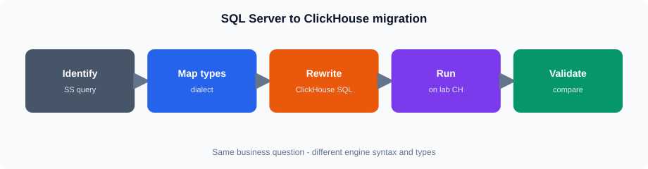

# Session 4 — SQL Server to ClickHouse Migration

**Duration:** 4 hours

## Overview

Rewrite common SQL Server reporting patterns for ClickHouse and compare results on both engines.

## Connect

| Item | Value |
|------|--------|
| CloudBeaver | https://vmclickhouse.canadacentral.cloudapp.azure.com/cloudbeaver/ |
| ClickHouse | **ClickHouse training** (`training_ro`) |
| SQL Server | Lab SQL Server connection (as provided in class) |

Compare **logic and shape**, not identical row counts (SQL Server sample is smaller than the ClickHouse seed).

## Topics

* `TOP` → `LIMIT`, `ISNULL` → `COALESCE`, `CASE`, dates, aggregates
* Dialect differences that affect reporting SQL

## Hands-on

**Core:** rewrite and run TOP→LIMIT, ISNULL/COALESCE, CASE, one date pattern, one aggregate on both engines 

**Stretch:** window functions, fuller migration set

## Checkpoint quizzes

After each topic block in `notes.md`, open the matching quiz and submit once. Class login is shared in class. Prefer **Login**. One attempt.

| After topic | Quiz |
|-------------|------|
| TOP vs LIMIT and dialect basics | [ch-grafana-s04-dialect-top-limit](https://vmreact.eastus2.cloudapp.azure.com:18094/a/ch-grafana-s04-dialect-top-limit) |
| Types, NULL, CAST | [ch-grafana-s04-types-null-cast](https://vmreact.eastus2.cloudapp.azure.com:18094/a/ch-grafana-s04-types-null-cast) |
| Functions, JOINs, windows migration | [ch-grafana-s04-functions-joins](https://vmreact.eastus2.cloudapp.azure.com:18094/a/ch-grafana-s04-functions-joins) |
| Migration lab checkpoint | [ch-grafana-s04-migration-lab](https://vmreact.eastus2.cloudapp.azure.com:18094/a/ch-grafana-s04-migration-lab) |

## Files

| File | Purpose |
|------|---------|
| `notes.md` | Concepts |
| `lab.md` | Guided lab |
| `assets/` | Diagrams |
