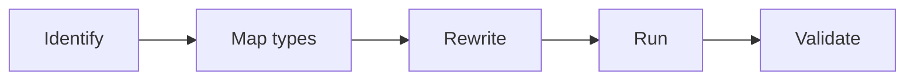
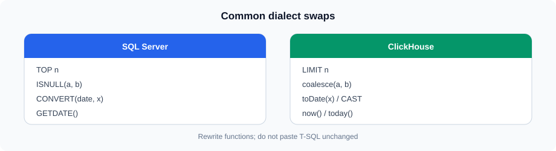
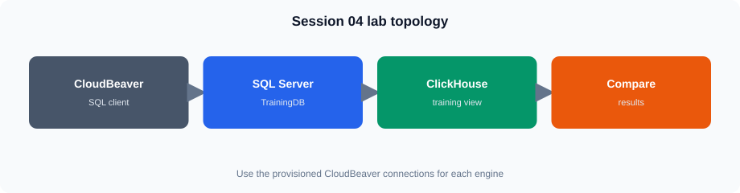

# SQL Server to ClickHouse Query Migration

## 1. SQL Server and ClickHouse

<!-- training-diagrams:v1 -->


Same idea in Mermaid (GitHub theme colors):




SQL Server and ClickHouse both support SQL, but they are designed for different workloads.

SQL Server is commonly used for transactional systems and general-purpose relational workloads. ClickHouse is designed primarily for high-volume analytical queries.

A SQL Server query should therefore be treated as something to **translate and validate**, not simply copied into ClickHouse.

Common migration areas include:

* SQL syntax
* Data types
* Built-in functions
* Date and time handling
* String handling
* `NULL` behavior
* Query result limiting
* Joins and subqueries
* Window functions

---

## 2. Common Syntax Differences

<!-- training-diagrams:v1 -->



### TOP vs LIMIT

SQL Server:

```sql
SELECT TOP 10
    order_id,
    sales_amount
FROM orders
ORDER BY sales_amount DESC;
```

ClickHouse:

```sql
SELECT
    order_id,
    sales_amount
FROM training.v_lab_orders
ORDER BY sales_amount DESC
LIMIT 10;
```

The important difference is that `TOP` is replaced by `LIMIT`.

---

## 3. Data Type Mapping

Typical mappings include:

| SQL Server         | ClickHouse                      |
| ------------------ | ------------------------------- |
| `int`              | `Int32` / `UInt32`              |
| `bigint`           | `Int64` / `UInt64`              |
| `decimal(p,s)`     | `Decimal(p,s)`                  |
| `varchar`          | `String`                        |
| `nvarchar`         | `String`                        |
| `date`             | `Date`                          |
| `datetime`         | `DateTime`                      |
| `datetime2`        | `DateTime64`                    |
| `uniqueidentifier` | `UUID`                          |
| `bit`              | `Bool` or suitable integer type |

The exact ClickHouse type should be selected based on the data and reporting requirements.

For example:

```sql
-- SQL Server
sales_amount decimal(12,2)

-- ClickHouse
sales_amount Decimal(12,2)
```

Unsigned types such as `UInt32` should only be used when negative values are not valid for the column.

---

## 4. NULL Handling

SQL Server commonly uses `ISNULL` and `COALESCE`.

SQL Server:

```sql
SELECT
    ISNULL(email, 'Not Available') AS email
FROM customers;
```

ClickHouse:

```sql
SELECT
    ifNull(email, 'Not Available') AS email
FROM training.customers;
```

`COALESCE` can also be used in ClickHouse:

```sql
SELECT
    coalesce(email, 'Not Available') AS email
FROM training.customers;
```

When migrating a query, check whether the source column is nullable and whether the replacement expression has a compatible type.

---

## 5. CAST and CONVERT

SQL Server supports both `CAST` and `CONVERT`.

SQL Server:

```sql
SELECT CAST(sales_amount AS decimal(12,2))
FROM orders;
```

ClickHouse:

```sql
SELECT CAST(sales_amount, 'Decimal(12,2)')
FROM training.v_lab_orders;
```

ClickHouse also provides type-specific conversion functions.

```sql
SELECT
    toDate(order_date),
    toDateTime(order_date)
FROM training.v_lab_orders;
```

For reporting queries, use the ClickHouse conversion function that best matches the required target type.

---

## 6. CASE Expressions

Basic `CASE` expressions can usually be migrated with little change.

SQL Server:

```sql
SELECT
    order_id,
    CASE
        WHEN sales_amount >= 2000 THEN 'High'
        WHEN sales_amount >= 1000 THEN 'Medium'
        ELSE 'Low'
    END AS sales_class
FROM orders;
```

ClickHouse:

```sql
SELECT
    order_id,
    CASE
        WHEN sales_amount >= 2000 THEN 'High'
        WHEN sales_amount >= 1000 THEN 'Medium'
        ELSE 'Low'
    END AS sales_class
FROM training.v_lab_orders;
```

ClickHouse also supports conditional functions such as `if` and `multiIf`.

For example:

```sql
SELECT
    order_id,
    multiIf(
        sales_amount >= 2000, 'High',
        sales_amount >= 1000, 'Medium',
        'Low'
    ) AS sales_class
FROM training.v_lab_orders;
```

---

## 7. Date and Time Functions

Date functions are one of the areas that commonly require rewriting.

Examples:

| Requirement     | SQL Server                           | ClickHouse                 |
| --------------- | ------------------------------------ | -------------------------- |
| Current date    | `GETDATE()`                          | `now()`                    |
| Extract year    | `YEAR(order_date)`                   | `toYear(order_date)`       |
| Extract month   | `MONTH(order_date)`                  | `toMonth(order_date)`      |
| Extract day     | `DAY(order_date)`                    | `toDayOfMonth(order_date)` |
| Start of month  | `DATEFROMPARTS(...)` / related logic | `toStartOfMonth(...)`      |
| Start of day    | related date logic                   | `toStartOfDay(...)`        |
| Date difference | `DATEDIFF(...)`                      | `dateDiff(...)`            |

Example:

SQL Server:

```sql
SELECT
    YEAR(order_date) AS order_year,
    MONTH(order_date) AS order_month,
    SUM(sales_amount) AS total_sales
FROM orders
GROUP BY
    YEAR(order_date),
    MONTH(order_date);
```

ClickHouse:

```sql
SELECT
    toYear(order_date) AS order_year,
    toMonth(order_date) AS order_month,
    sum(sales_amount) AS total_sales
FROM training.v_lab_orders
GROUP BY
    order_year,
    order_month;
```

Date functions should be checked individually during migration rather than assuming that SQL Server function names will work unchanged.

---

## 8. String Functions

String operations also have different function names and syntax.

Common examples:

| SQL Server    | ClickHouse    |
| ------------- | ------------- |
| `LEN()`       | `length()`    |
| `LOWER()`     | `lower()`     |
| `UPPER()`     | `upper()`     |
| `CONCAT()`    | `concat()`    |
| `LEFT()`      | `left()`      |
| `RIGHT()`     | `right()`     |
| `SUBSTRING()` | `substring()` |

Example:

SQL Server:

```sql
SELECT
    customer_name,
    UPPER(customer_name) AS customer_name_upper
FROM customers;
```

ClickHouse:

```sql
SELECT
    customer_name,
    upper(customer_name) AS customer_name_upper
FROM training.customers;
```

Function behavior and argument order should still be validated when migrating more complex expressions.

---

## 9. JOINs

Most standard joins can be rewritten with similar SQL structure.

SQL Server:

```sql
SELECT
    o.order_id,
    c.customer_name,
    o.sales_amount
FROM orders o
INNER JOIN customers c
    ON o.customer_id = c.customer_id;
```

ClickHouse:

```sql
SELECT
    o.order_id,
    c.customer_name,
    o.sales_amount
FROM training.v_lab_orders AS o
INNER JOIN training.customers AS c
    ON o.customer_id = c.customer_id;
```

The migration should verify:

* Join type
* Join condition
* Column names
* Duplicate column names
* `NULL` behavior
* Expected number of rows
* Result values

---

## 10. CTEs and Subqueries

CTE-based queries can generally be expressed using ClickHouse CTE syntax.

```sql
WITH regional_sales AS
(
    SELECT
        region_id,
        sum(sales_amount) AS total_sales
    FROM training.v_lab_orders
    GROUP BY region_id
)
SELECT
    region_id,
    total_sales
FROM regional_sales
WHERE total_sales > 500000;
```

Subqueries can also be used when migrating reporting logic.

```sql
SELECT
    order_id,
    sales_amount
FROM training.v_lab_orders
WHERE sales_amount >
(
    SELECT avg(sales_amount)
    FROM training.v_lab_orders
);
```

The migration focus is to preserve the intended business logic while adapting the syntax to ClickHouse.

---

## 11. Window Functions

Window functions often have similar concepts in both systems.

SQL Server:

```sql
SELECT
    order_id,
    order_date,
    sales_amount,
    SUM(sales_amount) OVER (
        ORDER BY order_date, order_id
    ) AS running_sales
FROM orders;
```

ClickHouse:

```sql
SELECT
    order_id,
    order_date,
    sales_amount,
    sum(sales_amount) OVER (
        ORDER BY order_date, order_id
    ) AS running_sales
FROM training.v_lab_orders;
```

During migration, check the window definition carefully:

* `PARTITION BY`
* `ORDER BY`
* Frame specification
* Ranking function
* Aggregate function

---

## 12. Common Migration Issues

Typical problems include:

### SQL Server-specific functions

```text
GETDATE()
ISNULL()
CONVERT()
TOP
```

These normally require ClickHouse equivalents.

### Data type differences

A source `int`, `decimal`, or `datetime2` may require a deliberate ClickHouse type selection.

### Function behavior

Two functions with similar names may not have identical behavior.

### NULL handling

Nullable columns must be handled deliberately.

### Date and time behavior

Check date extraction, formatting, time zones, and date arithmetic.

### Identifier and syntax differences

SQL Server-specific syntax should not be assumed to work in ClickHouse.

### Result differences

A query that executes successfully can still produce different results because of data types, `NULL` handling, joins, or function behavior.

---

## 13. Query Validation

<!-- training-diagrams:v1 -->



A migrated query should be validated at more than the syntax level.

A simple validation process is:

```text
SQL Server Query
       |
       v
Understand business logic
       |
       v
Identify SQL Server-specific elements
       |
       v
Map functions and data types
       |
       v
Rewrite in ClickHouse
       |
       v
Execute
       |
       v
Compare results
       |
       v
Validate business meaning
```

Useful validation checks include:

* Row count
* Aggregated totals
* Minimum and maximum values
* `NULL` counts
* Date ranges
* Grouped results
* Sample records
* Ranking/order
* Business KPI values

For example:

```sql
SELECT
    count() AS row_count,
    sum(sales_amount) AS total_sales
FROM training.v_lab_orders;
```

Compare the corresponding SQL Server result with the ClickHouse result.

---

## 14. Migration Example

Original SQL Server query:

```sql
SELECT TOP 5
    c.customer_name,
    SUM(o.sales_amount) AS total_sales
FROM orders o
INNER JOIN customers c
    ON o.customer_id = c.customer_id
WHERE o.status = 'Completed'
GROUP BY c.customer_name
ORDER BY SUM(o.sales_amount) DESC;
```

ClickHouse version:

```sql
SELECT
    c.customer_name,
    sum(o.sales_amount) AS total_sales
FROM training.v_lab_orders AS o
INNER JOIN training.customers AS c
    ON o.customer_id = c.customer_id
WHERE o.status = 'Completed'
GROUP BY c.customer_name
ORDER BY total_sales DESC
LIMIT 5;
```

The business logic remains the same:

1. Select completed orders
2. Join customer information
3. Aggregate sales by customer
4. Sort by sales
5. Return the top five customers

The SQL syntax is adapted for ClickHouse.

## Key Points

* SQL Server queries often require changes before running in ClickHouse.
* Map data types deliberately.
* Replace SQL Server-specific syntax and functions.
* `TOP` commonly becomes `LIMIT`.
* `ISNULL` can be mapped to `ifNull`; `COALESCE` is also available.
* `CAST` and `CONVERT` may require ClickHouse casting or type-conversion functions.
* Date and string functions frequently need rewriting.
* Joins, CTEs, subqueries, and window functions can usually be expressed in ClickHouse but should be validated.
* Always compare migrated results, not just whether the query executes.
