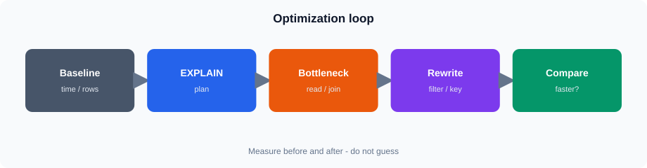

# Session 5 — ClickHouse Query Optimization

**Duration:** 4 hours

## Connect

| Item | Value |
|------|--------|
| CloudBeaver | https://vmclickhouse.canadacentral.cloudapp.azure.com/cloudbeaver/ |
| Connection | **Session 01–05 — ClickHouse training (LAN RO)** |
| User | `training_ro` |

## Overview

Improve analytical query performance using sort keys, partitions, skipping indexes, filters, and `EXPLAIN`.



**Live sort key** (confirm with `SHOW CREATE TABLE training.orders`):

```text
ORDER BY (order_date, plant_id, order_id)
```

## Topics

* Sort keys, partitions, data skipping
* Filter/aggregate/join habits
* `EXPLAIN` and basic profiling

## What you will do

**Core:** compare filter alignment to the sort key → `EXPLAIN` → rewrite one slow pattern 

**Stretch:** deeper `system.query_log` / skipping demos

**Seed:** Completed regions **1 / 3 / 5**; dates **2023-01-01** … **2025-06-18**

## Files

| File | Purpose |
|------|---------|
| `notes.md` | Concepts |
| `lab.md` | Guided lab |
| `assets/` | Diagrams |
