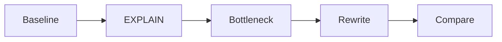
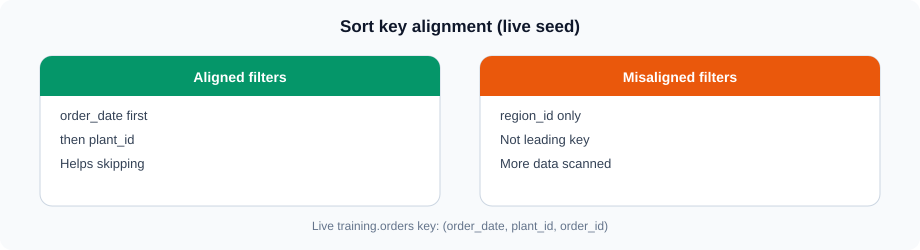
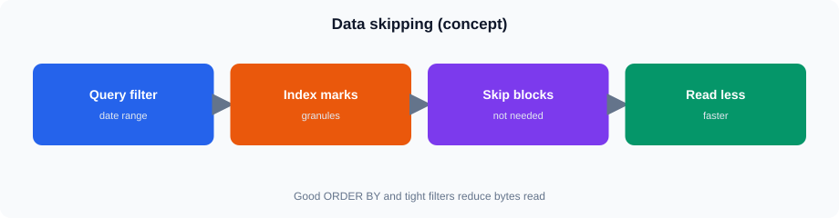

# ClickHouse Query Optimization

## 1. Why Query Performance Matters

<!-- training-diagrams:v1 -->


Same idea in Mermaid (GitHub theme colors):




Analytical queries may process millions or billions of rows. A query can return the correct result but still use excessive:

* CPU
* Memory
* Disk I/O
* Network resources

Optimization starts by measuring the query and identifying where the work is happening.

A useful approach is:

```text
Run Query
   |
   v
Measure
   |
   v
Understand Execution
   |
   v
Find Bottleneck
   |
   v
Change Query or Table Design
   |
   v
Measure Again
```

Do not optimize based only on assumptions.

---

## 2. Query Execution

A simplified analytical query flow is:

```text
SQL Query
   |
   v
Read Required Parts
   |
   v
Read Required Columns
   |
   v
Filter Rows
   |
   v
Join / Aggregate
   |
   v
Return Result
```

The amount of data read is an important factor in analytical query performance.

For example, selecting only required columns is preferable to:

```sql
SELECT *
FROM training.v_lab_orders
LIMIT 100;
```

when only a few columns are required:

```sql
SELECT
    order_date,
    region_id,
    sales_amount
FROM training.v_lab_orders
LIMIT 100;
```

---

## 3. Sorting Keys

<!-- training-diagrams:v1 -->



The `ORDER BY` definition of a MergeTree table determines its sorting key.

On the live lab table (`SHOW CREATE TABLE training.orders`):

```sql
ORDER BY (order_date, plant_id, order_id)
```

Queries that filter or group using columns aligned with the sorting key can benefit from ClickHouse's data organization.

Consider:

```sql
SELECT
    sum(sales_amount)
FROM training.v_lab_orders
WHERE order_date >= '2023-01-01'
  AND order_date < '2023-04-01'
  AND plant_id = 1;
```

The table is organized by `order_date` then `plant_id`, which aligns well with these filters.

A region filter still returns correct results, but because `region_id` is **not** in the sorting key, ClickHouse cannot use primary-key order the same way for region-only predicates.

**Region tip:** Prefer `region_id = 3` (or 1 / 5) when combining with `status = 'Completed'`. Region 2 has non-Completed data; for Completed use 1 / 3 / 5.

The sorting key should therefore be designed according to important query patterns.

---

## 4. Partitioning

The training `orders` table uses:

```sql
PARTITION BY toYYYYMM(order_date)
```

This creates monthly partitions.

Partitioning can help queries that restrict data to particular partition ranges.

For example:

```sql
SELECT
    sum(sales_amount)
FROM training.v_lab_orders
WHERE order_date >= '2023-02-01'
  AND order_date < '2023-03-01';
```

Partitioning should not be treated as a replacement for a good sorting key.

Use partitioning primarily for sensible data management and useful partition-level pruning.

Avoid creating excessive numbers of partitions.

---

## 5. Data Skipping

<!-- training-diagrams:v1 -->



ClickHouse stores data in parts and uses indexes and metadata to avoid reading data that cannot satisfy a query.

The sorting key is particularly important for this behavior.

For example:

```sql
SELECT
    count()
FROM training.v_lab_orders
WHERE order_date >= '2023-01-01'
  AND order_date < '2023-02-01'
  AND plant_id = 1;
```

Because the table is sorted by `order_date` then `plant_id`, ClickHouse can often eliminate data ranges that cannot contain the requested date/plant combination.

A filter on `region_id` alone does **not** match the leading sort-key columns the same way — still correct, but less primary-key pruning.

This reduces unnecessary reading.

---

## 6. Select Only Required Columns

ClickHouse uses columnar storage, so a query can read only the columns required by the query.

Prefer:

```sql
SELECT
    order_date,
    region_id,
    sales_amount
FROM training.v_lab_orders
WHERE region_id = 3
LIMIT 100;
```

instead of:

```sql
SELECT *
FROM training.v_lab_orders
WHERE region_id = 3
LIMIT 100;
```

**Note:** Region 2 has non-Completed data; for Completed filters use region 1 / 3 / 5.

This is particularly important for wide tables containing many columns.

---

## 7. Filtering

Apply selective filters when they are part of the business requirement.

For example:

```sql
SELECT
    region_id,
    sum(sales_amount) AS total_sales
FROM training.v_lab_orders
WHERE order_date >= '2023-01-01'
  AND order_date < '2023-04-01'
GROUP BY region_id;
```

Filtering before aggregation reduces the amount of data that must participate in later processing.

---

## 8. Aggregation

Aggregations can become expensive when large amounts of data are processed.

Example:

```sql
SELECT
    region_id,
    sum(sales_amount) AS total_sales,
    count() AS order_count
FROM training.v_lab_orders
GROUP BY region_id;
```

When investigating an aggregation query, consider:

* How much data is being read?
* How many groups are being created?
* Are unnecessary columns being selected?
* Can the required data be filtered earlier?

Do not remove filters or change business logic simply to make a query faster.

---

## 9. Data Types and Storage

Data types affect storage size and processing.

For example, if an identifier can never be negative, an unsigned integer may be appropriate:

```sql
region_id UInt32
```

For monetary values:

```sql
sales_amount Decimal(12, 2)
```

Use a type that represents the actual data domain rather than selecting an unnecessarily large type.

For strings, consider whether the column really needs to be stored as a general `String` or whether another suitable type is available.

The objective is to balance correctness, storage, and query processing.

---

## 10. JOIN Performance

JOINs can require significant processing, especially with large datasets.

Example:

```sql
SELECT
    c.customer_name,
    sum(o.sales_amount) AS total_sales
FROM training.v_lab_orders AS o
INNER JOIN training.customers AS c
    ON o.customer_id = c.customer_id
GROUP BY c.customer_name;
```

When reviewing a JOIN query, consider:

* Which tables are being joined?
* How many rows are involved?
* Is the join condition correct?
* Are unnecessary columns being selected?
* Can filtering reduce the input data?
* Is the join producing the expected cardinality?

Filter data when the business requirement allows it:

```sql
SELECT
    c.customer_name,
    sum(o.sales_amount) AS total_sales
FROM training.v_lab_orders AS o
INNER JOIN training.customers AS c
    ON o.customer_id = c.customer_id
WHERE o.status = 'Completed'
GROUP BY c.customer_name;
```

Do not change join semantics merely for performance.

---

## 11. EXPLAIN

`EXPLAIN` helps inspect how ClickHouse plans or executes a query.

For example:

```sql
EXPLAIN
SELECT
    region_id,
    sum(sales_amount)
FROM training.v_lab_orders
WHERE region_id = 3
GROUP BY region_id;
```

Depending on the `EXPLAIN` variant, ClickHouse can expose information about the query plan, indexes, or execution pipeline.

**Region tip:** Prefer `region_id = 3`. Region 2 has non-Completed data; for Completed use 1 / 3 / 5.

The purpose is to understand what ClickHouse is expected to do rather than treating the query as a black box.

---

## 12. Query Profiling

For performance analysis, measure the query rather than relying only on the visible result.

Useful information includes:

* Execution time
* Rows read
* Bytes read
* Result rows
* Memory usage

A simple query can be used as a baseline:

```sql
SELECT
    region_id,
    sum(sales_amount) AS total_sales
FROM training.v_lab_orders
GROUP BY region_id;
```

Record the execution characteristics before making a change.

Then run the modified query and compare the measurements.

---

## 13. system.query_log

ClickHouse records query information in system tables.

`system.query_log` can be used to investigate completed queries.

For example:

```sql
SELECT
    query_duration_ms,
    read_rows,
    read_bytes,
    result_rows,
    memory_usage,
    query
FROM system.query_log
WHERE type = 'QueryFinish'
ORDER BY event_time DESC
LIMIT 10;
```

This can help identify:

* Slow queries
* High row counts
* High data volume
* High memory usage

When investigating a particular query, narrow the search rather than reviewing the entire log.

---

## 14. Identifying Bottlenecks

Common bottlenecks include:

### Too much data read

The query processes far more data than necessary.

### Poor filtering

A query reads a large dataset before applying useful restrictions.

### Inefficient table design

The sorting key does not support important query patterns.

### Expensive joins

Large inputs or inappropriate join logic increase processing.

### Large aggregations

The query creates many groups or processes excessive input data.

### Unnecessary columns

The query reads data that is not required.

### Excessive memory use

Large joins, aggregations, or intermediate results may consume significant memory.

---

## 15. Query Rewriting

Optimization often starts with a logically equivalent query rewrite.

For example:

```sql
SELECT
    *
FROM training.v_lab_orders
WHERE order_date >= '2023-01-01'
  AND order_date < '2023-04-01'
LIMIT 100;
```

If the report needs only three columns, rewrite it as:

```sql
SELECT
    order_date,
    region_id,
    sales_amount
FROM training.v_lab_orders
WHERE order_date >= '2023-01-01'
  AND order_date < '2023-04-01'
LIMIT 100;
```

The business result required by the report remains the same, while unnecessary data is not requested.

Another example is filtering before a join when the filter is part of the reporting requirement:

```sql
SELECT
    c.customer_name,
    sum(o.sales_amount) AS total_sales
FROM
(
    SELECT
        customer_id,
        sales_amount
    FROM training.v_lab_orders
    WHERE status = 'Completed'
) AS o
INNER JOIN training.customers AS c
    ON o.customer_id = c.customer_id
GROUP BY c.customer_name;
```

The rewrite should always be validated to ensure that the business meaning has not changed.

---

## 16. Table Design and Query Patterns

Query performance begins with table design.

Consider these questions when designing a MergeTree table:

* Which columns are commonly filtered?
* Which columns are commonly used for date ranges?
* Which columns are used for ordering?
* What are the major reporting queries?
* How should data be partitioned?
* Which data types are appropriate?

For the training `orders` table:

```sql
ENGINE = MergeTree
PARTITION BY toYYYYMM(order_date)
ORDER BY (order_date, plant_id, order_id)
```

The design reflects common reporting access by **date range** and **plant**, with `order_id` for uniqueness. Region filters are still valid for reporting, but `region_id` is not a leading sort-key column on this seed.

Table design should be driven by actual query patterns rather than a generic rule.

---

## 17. Before-and-After Measurement

A useful optimization exercise follows this pattern:

### Before

```text
Execution time: ______
Rows read:       ______
Bytes read:      ______
Memory:          ______
```

### Change

Document exactly what was changed.

```text
Change:
________________________________
```

### After

```text
Execution time: ______
Rows read:       ______
Bytes read:      ______
Memory:          ______
```

Then verify that the result is still correct.

Performance improvement without result validation is not sufficient.

---

## Key Points

* Measure before optimizing.
* Read only the columns required by the report.
* Use appropriate filters.
* Design sorting keys around important query patterns.
* Use partitioning appropriately.
* Understand data skipping.
* Review JOIN and aggregation behavior.
* Use `EXPLAIN` and query statistics to investigate performance.
* `system.query_log` provides useful historical query information.
* Optimize queries without changing their business meaning.
* Validate both **performance and correctness** after every significant change.
