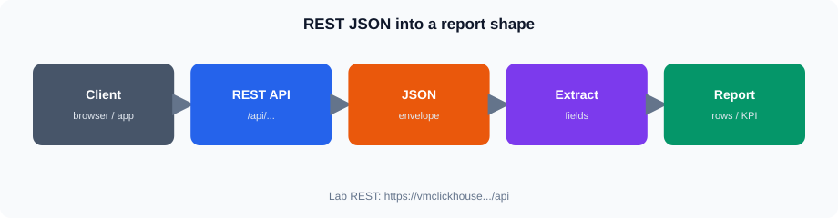

# Session 6 — JSON and REST API Data

**Duration:** 4 hours

## Overview

Work with JSON structures and REST APIs as inputs for analytics and reporting.

## Topics

* JSON objects, arrays, nested fields
* REST requests, parameters, pagination, status codes
* Transforming API JSON for reporting

## Hands-on

* Call training REST endpoints in the browser
* Inspect JSON envelopes (`data` / `count`)
* Apply `page` / `page_size` and date filters
* Extract fields into a reporting-friendly shape

**Core:** call `/api/sales` → inspect JSON → filter + paginate → extract fields 

**Stretch:** nested examples, error cases, extra endpoints

**Seed:** Completed regions **1 / 3 / 5**; dates **2023-01-01** … **2025-06-18**

## Files

| File | Purpose |
|------|---------|
| `notes.md` | Concepts |
| `lab.md` | Guided lab |
| `assets/` | Diagrams |
