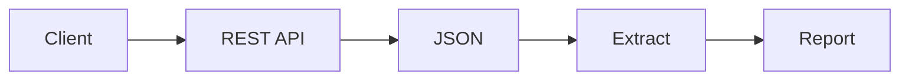
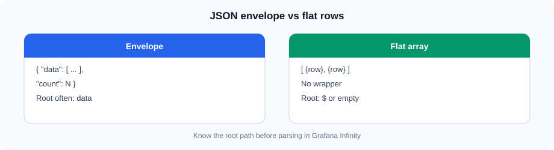
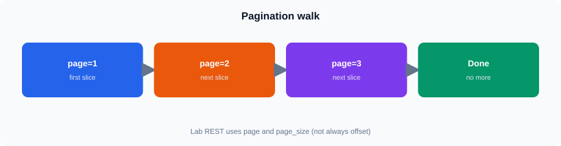

# JSON and REST API Data

## 1. JSON


Same idea in Mermaid (GitHub theme colors):




JSON (JavaScript Object Notation) is a common format for exchanging data between applications.

A JSON object contains key-value pairs:

```json
{
  "order_id": 100001,
  "customer_name": "Customer-1",
  "sales_amount": 1250.50
}
```

A JSON value can be:

* String
* Number
* Boolean
* `null`
* Object
* Array

---

## 2. JSON Objects




Objects contain named properties.

```json
{
  "customer_id": 1,
  "customer_name": "Customer-1",
  "email": "customer1@example.com"
}
```

A reporting application may need only selected fields from the response.

For example:

```text
customer_id
customer_name
email
```

---

## 3. JSON Arrays

An array contains multiple values.

The **live training REST API** wraps list results in a flat envelope:

```json
{
  "data": [
    {
      "order_id": 100001,
      "sales_amount": 1250.50
    },
    {
      "order_id": 100002,
      "sales_amount": 890.00
    }
  ],
  "count": 2
}
```

When consuming API data, identify:

* The response object
* The array containing records (`data`)
* The fields inside each record
* The `count` of rows in this page

---

**JSON objects and arrays**
https://vmreact.eastus2.cloudapp.azure.com:18094/a/ch-grafana-s06-json-basics

Use the login ID your trainer provided.

## 4. Nested JSON (theory)

JSON objects can contain other objects. That pattern appears in many real APIs.

**Important for this lab:** live `/api/orders` and `/api/sales` return **flat** rows (no nested `customer` / `plant` objects). Nested examples below are for learning the idea only.

```json
{
  "order_id": 100001,
  "customer": {
    "customer_id": 1,
    "name": "Customer-1"
  },
  "plant": {
    "plant_id": 1,
    "name": "Plant-1"
  }
}
```

Nested paths look like:

```text
order_id
customer.customer_id
customer.name
plant.plant_id
plant.name
```

For live training calls, map the flat fields you actually see in the response.

---

## 5. JSON Field Extraction (no CREATE needed)

You use **`training_ro`**, which cannot `CREATE` or `INSERT`. Practice extraction with an **inline** JSON string — no table required.

```sql
SELECT
    JSONExtractUInt(j, 'customer_id') AS customer_id,
    JSONExtractString(j, 'customer_name') AS customer_name,
    JSONExtractFloat(j, 'sales_amount') AS sales_amount
FROM
(
    SELECT '{"customer_id":1,"customer_name":"Customer-1","sales_amount":1250.50}' AS j
);
```

You can also parse with `JSONExtract` helpers on a string column expression. Match the function to the expected type (`JSONExtractString`, `JSONExtractUInt`, `JSONExtractFloat`, and so on).

> **Tip:** If a demo table is preloaded, you may `SELECT` from it — still no `CREATE`/`INSERT` on the `training` database.

---

## 6. Nested JSON Extraction (stretch / theory)

Consider:

```json
{
  "order_id": 100001,
  "customer": {
    "id": 1,
    "name": "Customer-1"
  }
}
```

Inline practice (still no table):

```sql
SELECT
    JSONExtractUInt(j, 'order_id') AS order_id,
    JSONExtractUInt(j, 'customer', 'id') AS customer_id,
    JSONExtractString(j, 'customer', 'name') AS customer_name
FROM
(
    SELECT '{"order_id":100001,"customer":{"id":1,"name":"Customer-1"}}' AS j
);
```

The important concept is:

```text
JSON document
     |
     v
Locate field
     |
     v
Extract value
     |
     v
Use in report
```

---

## 7. Missing Values and NULL

API responses may contain missing fields or explicit `null` values.

Example (seed-style names):

```json
{
  "customer_id": 3,
  "customer_name": "Customer-3",
  "email": null
}
```

Reporting logic should distinguish between:

* Field exists with a value
* Field exists with `null`
* Field is missing

For example, a missing email might be displayed as:

```text
Not Available
```

---

**JSON extraction**
https://vmreact.eastus2.cloudapp.azure.com:18094/a/ch-grafana-s06-json-extract

Use the login ID your trainer provided.

## 8. JSON Arrays in Reporting (stretch / theory)

Some APIs nest line items inside an order. The live `/api/orders` endpoint does **not** — it returns order-level `quantity` and `sales_amount` already aggregated.

Theory example of flattening:

```text
order_id | product_id | quantity
---------|------------|---------
100001   | 1001       | 5
100001   | 1003       | 2
```

For product-level data in this lab, call `/api/products` (or `/api/products/top`) separately — do not expect `product_id` on `/api/orders`.

---

## 9. REST APIs

A REST API allows applications to exchange data over HTTP.

```text
Client → REST API → JSON Response
```

Training base URL:

```text
https://vmclickhouse.canadacentral.cloudapp.azure.com
```

Example:

```text
GET /api/orders
```

Live envelope shape:

```json
{
  "data": [
    {
      "order_id": 100001,
      "customer_id": 1,
      "plant_id": 1,
      "region_id": 1,
      "order_date": "2023-01-05",
      "status": "Completed",
      "quantity": 12,
      "sales_amount": 1250.50
    }
  ],
  "count": 1
}
```

---

## 10. HTTP Methods

Common HTTP methods include:

| Method   | Typical purpose       |
| -------- | --------------------- |
| `GET`    | Retrieve data         |
| `POST`   | Submit/create data    |
| `PUT`    | Replace/update data   |
| `PATCH`  | Partially update data |
| `DELETE` | Delete data           |

For analytics and reporting, `GET` is the most common method. The training API is read-only `GET`.

---

## 11. Query Parameters

APIs often support parameters to control the response.

**Core filters on `/api/orders` and `/api/sales`:**

```text
GET /api/orders?region_id=3
GET /api/orders?status=Completed&page=1&page_size=100
```

**Pagination (this lab):** use `page` and `page_size` — **not** `limit` / `top` / `skip`.

**Date range:** both name pairs work:

```text
from_date / to_date
date_from / date_to
```

Examples:

```text
GET /api/orders?from_date=2023-01-01&to_date=2023-03-31
GET /api/orders?date_from=2023-01-01&date_to=2023-03-31
```

Seed order dates span **2023-01-01** … **2025-06-18**. Completed orders exist for regions **1, 3, and 5** only (region 2 + Completed returns empty).

---

## 12. HTTP Headers

Headers provide additional information with an HTTP request.

Examples include:

```text
Accept: application/json
Content-Type: application/json
```

```text
GET /api/orders
Accept: application/json
```

---

## 13. Authentication Concepts

**Not applicable for the live training REST API** — `/api` has **no authentication**. Successful calls return `200` without tokens or Basic auth.

In production you may see API keys, Basic auth, Bearer tokens, or OAuth. Treat that as general knowledge only in this session; 

---

## 14. HTTP Status Codes

| Status | Meaning                        |
| ------ | ------------------------------ |
| `200`  | Successful request             |
| `201`  | Resource created               |
| `400`  | Invalid request                |
| `401`  | Authentication required/failed |
| `403`  | Access denied                  |
| `404`  | Resource not found             |
| `429`  | Too many requests              |
| `500`  | Server error                   |
| `503`  | Service unavailable            |

When an API integration fails, check the status code before investigating the JSON body. Expect **404** for unknown paths and **400** for bad dates — not **401** on this training API.

---

**REST and HTTP**
https://vmreact.eastus2.cloudapp.azure.com:18094/a/ch-grafana-s06-rest-http

Use the login ID your trainer provided.

## 15. Request and Response

```text
Request
  |
  | GET /api/orders?status=Completed&page=1&page_size=10
  | Headers (Accept)
  v
REST API
  |
  v
Response
  |
  | Status code
  | Headers
  | JSON body { data, count }
  v
Reporting Application
```

---

## 16. Pagination




This training API paginates with:

```text
GET /api/orders?page=1&page_size=100
GET /api/orders?page=2&page_size=100
GET /api/orders?page=3&page_size=100
```

OData uses `$top` / `$skip` (Session 07). Do not mix those with `/api/...` query names.

A reporting integration should understand:

* Page size
* Current page
* Next page
* End of data (`count` < `page_size`, or empty `data`)
* Duplicate/missing records
* API limits (`page_size` max is capped by the service)

---

## 17. JSON Response Handling

```json
{
  "data": [
    {
      "order_id": 100001,
      "order_date": "2023-01-05",
      "sales_amount": 1250.50
    }
  ],
  "count": 1
}
```

Records live under:

```text
data
```

---

**Pagination and JSON responses**
https://vmreact.eastus2.cloudapp.azure.com:18094/a/ch-grafana-s06-pagination

Use the login ID your trainer provided.

## 18. Error Handling

API failures can occur because of:

* Invalid parameters (for example bad date format)
* Incorrect endpoint
* Rate limits
* Server errors
* Network problems

Practical troubleshooting:

```text
Check URL
   |
   v
Check HTTP method
   |
   v
Check parameters (page / page_size / date_from / date_to)
   |
   v
Check status code
   |
   v
Inspect response body
```

Skip “check authentication” for this training API — it has none.

---

## 19. Preparing API Data for Reporting

```text
REST API
   |
   v
JSON { data, count }
   |
   v
Extract fields from each row in data
   |
   v
Handle missing values
   |
   v
Reporting dataset
```

Live `/api/orders` fields useful for reports:

```text
order_id
order_date
customer_id
region_id
plant_id
quantity
sales_amount
status
```

There is **no** `product_id` on `/api/orders`. Use `/api/sales` for a leaner sales grain, or `/api/products` when you need product fields.

---

## 20. Practical Example

```text
GET /api/orders?region_id=3&status=Completed&date_from=2023-01-01&date_to=2023-03-31&page=1&page_size=50
```

Response shape (flat):

```json
{
  "data": [
    {
      "order_id": 100002,
      "order_date": "2023-01-08",
      "customer_id": 2,
      "region_id": 3,
      "plant_id": 5,
      "status": "Completed",
      "quantity": 8,
      "sales_amount": 890.00
    }
  ],
  "count": 1
}
```

Steps:

1. Call the endpoint with filters + pagination.
2. Check HTTP `200`.
3. Locate the `data` array.
4. Map flat fields to the report columns.
5. Page until done.

## Summary

* JSON can contain objects, arrays, nested structures, and `null` values.
* Live training lists use `{ "data": [...], "count": N }` — flat rows.
* You extract JSON with inline `SELECT` — **no** `CREATE`/`INSERT` as `training_ro`.
* Pagination uses **`page` / `page_size`**.
* Date filters: **`from_date`/`to_date`** or aliases **`date_from`/`date_to`**.
* Training `/api` has **no auth**.
* `/api/orders` has **no** `product_id`.
* Completed regions: **1, 3, 5**. Dates: **2023-01-01** … **2025-06-18**.
