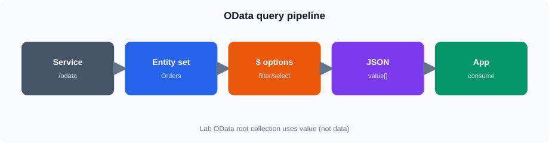
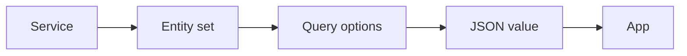
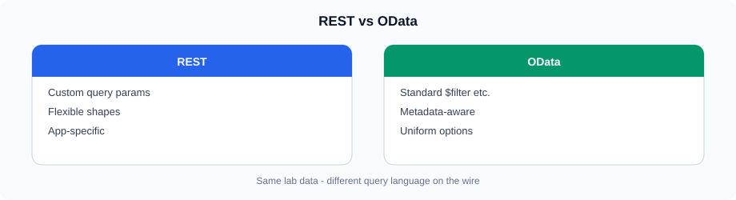
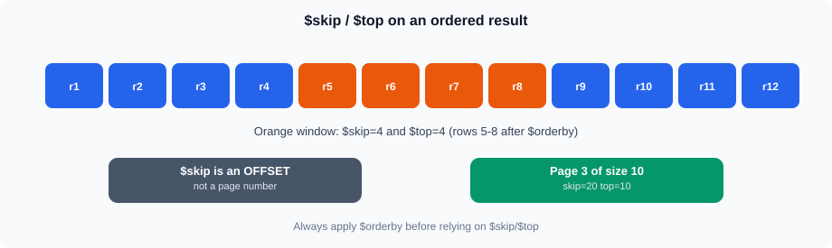
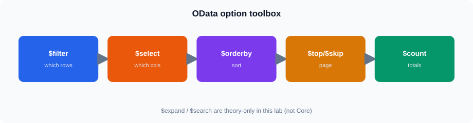

# OData Fundamentals and Querying

## 1. What is OData?



Same idea in Mermaid (GitHub theme colors):




OData (Open Data Protocol) is a standard for exposing and querying structured data over HTTP.

It builds on REST concepts and defines a standard query syntax.

A typical OData request looks like:

```text
https://example.com/odata/Orders
```

Query options can then be added to control the result:

```text
https://example.com/odata/Orders?$filter=Status eq 'Completed'
```

---

## 2. OData and REST




REST describes an architectural approach for working with resources over HTTP.

OData provides additional standards for:

* Data entities
* Metadata
* Relationships
* Query options
* Standardized filtering
* Selecting properties
* Sorting
* Pagination

A simple comparison:

| REST API                                  | OData                                        |
| ----------------------------------------- | -------------------------------------------- |
| API design is application-specific        | Standardized data/query conventions          |
| Query parameters depend on API            | Standard query options                       |
| Response structure depends on API         | OData defines common conventions             |
| Relationships are application-specific    | Supports standardized navigation/expansion   |
| Metadata is optional/application-specific | Metadata is a defined part of OData services |

OData is therefore a type of HTTP-based API approach with standardized data and query conventions.

---

## 3. OData Service Structure

An OData service commonly exposes entity sets such as:

```text
/odata/Orders
/odata/Customers
/odata/Products
/odata/Plants
```

An entity set represents a collection of entities.

For example:

```text
/odata/Orders
```

may represent a collection of order records.

Some OData services support key lookup for a single entity:

```text
/odata/Orders(100001)
```

**Not

---

## 4. Entities and Properties

An entity represents a business object.

Example:

```text
Order
----------------
OrderId
OrderDate
CustomerId
RegionId
Quantity
SalesAmount
Status
```

The individual fields are properties of the entity.

A customer might contain:

```text
Customer
----------------
customer_id
customer_name
region_id
email
```

---

## 5. Metadata

OData services commonly expose metadata through:

```text
/odata/$metadata
```

Metadata describes the structure of the service.

It can provide information about:

* Entity types
* Entity sets
* Properties
* Data types
* Keys
* Relationships

Before creating complex queries, inspect the metadata.

It helps answer questions such as:

```text
What entities exist?
What properties are available?
What is the key?
What data type does a property use?
What relationships exist?
```

---

## 6. `$filter`

`$filter` restricts the returned records.

Example:

```text
/odata/Orders?$filter=RegionId eq 2
```

String values normally use quotes:

```text
/odata/Orders?$filter=Status eq 'Completed'
```

Numeric values do not require quotes:

```text
/odata/Orders?$filter=Quantity gt 10
```

Common comparison operators include:

```text
eq    equal
ne    not equal
gt    greater than
ge    greater than or equal
lt    less than
le    less than or equal
```

---

## 7. String Filters

String functions can be used where supported by the OData service.

For example:

```text
/odata/Customers?$filter=startswith(CustomerName,'Industrial')
```

Other commonly supported functions include:

```text
contains(...)
endswith(...)
startswith(...)
```

Support can vary by OData implementation, so validate the service behavior.

---

## 8. Numeric Filters

Numeric conditions can be combined with comparison operators.

Example:

```text
/odata/Orders?$filter=SalesAmount gt 2000
```

Multiple conditions:

```text
/odata/Orders?$filter=SalesAmount gt 2000 and Quantity ge 5
```

---

## 9. Date and Date-Time Filters

Date filtering is commonly required for reporting.

A service may support expressions such as:

```text
/odata/Orders?$filter=OrderDate ge 2023-01-01
```

For date-time properties, the exact literal format depends on the OData version and service implementation.

Always check the metadata and service documentation when working with date-time values.

For a reporting period, prefer a clearly defined range.

Conceptually:

```text
OrderDate >= start date
AND
OrderDate < next-period boundary
```

This avoids ambiguity around time components.

---

## 10. AND and OR

Conditions can be combined.

Example:

```text
/odata/Orders?$filter=RegionId eq 3 and Status eq 'Completed'
```

`OR` can be used for alternatives:

```text
/odata/Orders?$filter=RegionId eq 1 or RegionId eq 2
```

Parentheses help make more complex logic explicit:

```text
/odata/Orders?$filter=(RegionId eq 1 or RegionId eq 3) and Status eq 'Completed'
```

---

## 11. `$select`

`$select` specifies which properties should be returned.

Without `$select`:

```text
/odata/Orders
```

A query can request only required properties:

```text
/odata/Orders?$select=OrderId,OrderDate,SalesAmount
```

This is useful for reporting because the client receives only the required fields.

---

## 12. `$orderby`

`$orderby` controls result ordering.

Ascending order:

```text
/odata/Orders?$orderby=SalesAmount
```

Descending order:

```text
/odata/Orders?$orderby=SalesAmount desc
```

Multiple sort fields can be specified:

```text
/odata/Orders?$orderby=OrderDate desc,SalesAmount desc
```

---

## 13. `$top`

`$top` limits the number of returned records.

Example:

```text
/odata/Orders?$top=10
```

Combined with ordering:

```text
/odata/Orders?$orderby=SalesAmount desc&$top=10
```

This can be used to retrieve the highest-value orders.

---

## 14. `$skip`




`$skip` skips a specified number of records.

Example:

```text
/odata/Orders?$skip=10&$top=10
```

This can be used for simple offset-based pagination.

For example:

```text
Page 1 → $skip=0  &$top=10
Page 2 → $skip=10 &$top=10
Page 3 → $skip=20 &$top=10
```

The service should have a stable ordering when using offset pagination.

---

## 15. `$count`

`$count` can request the count of matching records where supported.

**Query option:**

```text
/odata/Orders?$count=true
```

Combined with filtering:

```text
/odata/Orders?$filter=Status eq 'Completed'&$count=true
```

**Count path** (try when exposed by the service):

```text
/odata/Orders/$count
```

The

---

## 16. `$search` (stretch / theory only)

**Not supported by this lab OData service** for real results. Do not require `$search` in Core work.

Some OData services support `$search` for text-based searching:

```text
/odata/Customers?$search="Industrial"
```

If

---

## 17. Combining Query Options




OData becomes particularly useful when query options are combined.

Example:

```text
/odata/Orders?
$filter=RegionId eq 3 and Status eq 'Completed'
&$select=OrderId,OrderDate,CustomerId,SalesAmount
&$orderby=SalesAmount desc
&$top=10
```

In an actual URL, the query is normally written without line breaks.

Conceptually:

```text
Entity Set
   |
   +-- Filter
   |
   +-- Select fields
   |
   +-- Sort
   |
   +-- Limit
   |
   v
JSON Response
```

---

## 18. Relationships

OData can describe relationships between entities.

For example:

```text
Customer
   |
   +---- Orders
```

or:

```text
Order
   |
   +---- Customer
   |
   +---- Product
```

These relationships are commonly represented through navigation properties.

The available relationships should be checked in `$metadata`.

---

## 19. `$expand` (stretch / theory only)

**Not supported by this lab OData service** for real nested entities. Demote to stretch theory.

In full OData, `$expand` can retrieve related entities:

```text
/odata/Orders?$expand=Customer
```

For this lab, select `CustomerId` (and join conceptually) instead of `$expand`. If you call `$expand`, expect an unsupported-option response — useful only as a troubleshooting demo.

---

## 20. Pagination

A reporting application may need to retrieve a large number of records.

A simple offset approach is:

```text
$top=100&$skip=0
$top=100&$skip=100
$top=100&$skip=200
```

Some OData services instead provide a continuation URL such as `@odata.nextLink`.

The client must follow the pagination mechanism defined by the service.

Do not assume that every client or Grafana datasource automatically follows `@odata.nextLink`.

---

## 21. URL Encoding

OData queries are transmitted as URLs, so special characters may need URL encoding.

For example, spaces and certain reserved characters should be encoded when constructing a URL programmatically.

Conceptually:

```text
OData expression
      |
      v
URL encoding
      |
      v
HTTP request
```

When troubleshooting a query, first verify the decoded OData expression and then verify its URL representation.

---

## 22. JSON Response

An OData service commonly returns JSON.

A response may look like:

```json
{
  "@odata.context": "...",
  "value": [
    {
      "OrderId": 100001,
      "OrderDate": "2023-01-05",
      "SalesAmount": 450000
    }
  ]
}
```

The records are commonly contained in the `value` array.

The response may also contain metadata or pagination information.

The exact response structure depends on the OData implementation.

---

## 23. Troubleshooting OData Queries

When a query fails, check:

```text
Endpoint
   |
   v
Entity set
   |
   v
Property names
   |
   v
Query option syntax
   |
   v
Data types
   |
   v
Filter expression
   |
   v
URL encoding
   |
   v
HTTP response
```

Common problems include:

* Incorrect entity-set name
* Incorrect property name
* Invalid filter syntax
* Incorrect date literal
* Unsupported query option
* Invalid relationship name
* Incorrect URL encoding
* Authentication or authorization failure

---

## 24. Practical Reporting Query

Suppose the reporting requirement is:

> Show the ten highest-value Completed orders from Region 3.

A possible OData query is:

```text
/odata/Orders?$filter=RegionId eq 3 and Status eq 'Completed'&$select=OrderId,OrderDate,CustomerId,SalesAmount&$orderby=SalesAmount desc&$top=10
```

The query performs four operations:

1. Filters Region **3**.
2. Filters completed orders.
3. Selects required properties.
4. Sorts and limits the result.

The actual property names must match the service metadata.

---

## 25. OData Query Construction

A useful approach is to build complex queries incrementally.

Start with:

```text
/odata/Orders
```

Then add:

```text
$filter
```

Then:

```text
$select
```

Then:

```text
$orderby
```

Then:

```text
$top / $skip
```

Finally (stretch / theory only — **not** supported by this lab service):

```text
$expand
```

This makes troubleshooting easier than creating a complex query in one step.

## Summary

* OData provides standardized conventions for querying data over HTTP.
* `$metadata` describes entities, properties, keys, types, and relationships.
* `$filter` restricts records. Completed seed data exists for regions **1, 3, 5** only — do not combine Region **2** with `Status eq 'Completed'` expecting rows.
* `$select` chooses returned properties.
* `$orderby` controls sorting.
* `$top` and `$skip` support offset-based retrieval.
* Show `?$count=true`; also mention the `/$count` path.
* `$search` and `$expand` are **not supported** by this lab OData service — stretch theory only.
* Key lookup `Orders(id)` is **not implemented** — use `$filter` instead.
* Customer names in the seed look like `Customer-N` / `Industrial-N`.
* Always verify query options and property names against the actual OData service.
* Validate both the HTTP response and the JSON response structure when troubleshooting.
