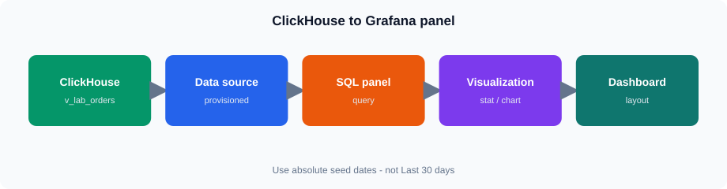
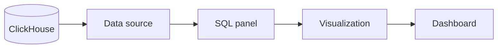
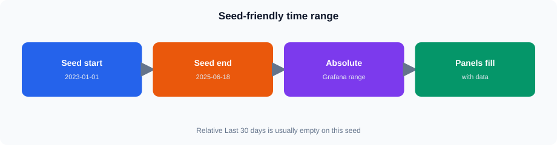
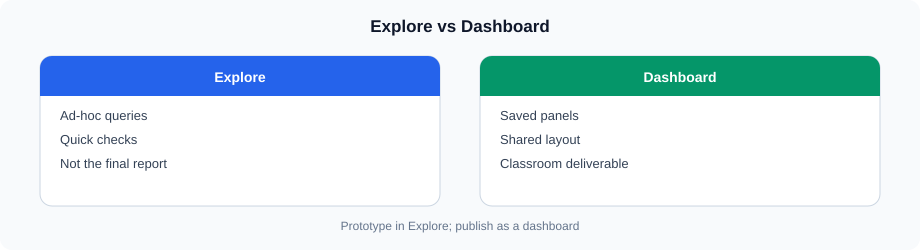
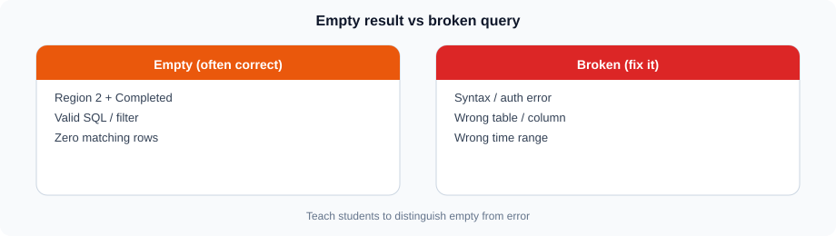

# Grafana Fundamentals and ClickHouse Integration

## 1. What is Grafana?



Same idea in Mermaid (GitHub theme colors):




Grafana is a visualization and observability platform that can connect to different data sources and display the data through dashboards.

For this course, Grafana is used as the reporting layer over ClickHouse.

The basic flow is:

```text
ClickHouse
    |
    v
Grafana Data Source
    |
    v
SQL Query
    |
    v
Panel
    |
    v
Dashboard
```

---

## 2. Grafana Interface

The main areas used in this session include:

* Dashboards
* Explore
* Data sources
* Panels
* Query editor
* Time range
* Refresh controls

A dashboard contains one or more panels.

Each panel normally has:

```text
Data Source
     +
Query
     +
Visualization
     |
     v
Panel
```

---

## 3. Data Sources

A Grafana data source defines where the panel obtains its data.

For this course, the primary data source is ClickHouse.

The connection configuration typically includes:

* Server address
* Port
* Protocol
* Database
* Authentication
* Connection settings

The exact settings depend on how ClickHouse is exposed in the training environment.

---

## 4. ClickHouse Data Source 

Select the **ClickHouse** data source in Explore and panels. **Stretch (optional):** “Add data source” / connection form can be shown once on a shared screen. Skip adding a second ClickHouse source.

Typical connection fields (for understanding, not student setup):

```text
Grafana
   |
   v
ClickHouse data source
   |
   +-- Server
   +-- Port
   +-- Database
   +-- Authentication
   |
   v
Test Connection
```

Use a dedicated reporting account where appropriate.

Do not place administrator credentials in dashboards or queries.

---

## 5. Test the Connection

Confirm the ClickHouse data source works (Explore query or the data-source Test button if visible).

If the connection fails, ask for help before changing any settings.

A successful connection confirms that Grafana can communicate with ClickHouse using the configured settings.

If the connection fails, check:

1. Server address
2. Port
3. Protocol
4. Database
5. Credentials
6. Network accessibility
7. ClickHouse availability

---

<table><tr><td bgcolor="#FEF3C7">

### Quiz — Grafana UI and data sources

https://vmreact.eastus2.cloudapp.azure.com:18094/a/ch-grafana-s08-grafana-basics

Each student must attempt this quiz. Use the login ID your trainer provided.

</td></tr></table>


## 6. ClickHouse SQL in Grafana

Once the data source is configured, a panel can execute ClickHouse SQL.

Example:

```sql
SELECT
    region_id,
    sum(sales_amount) AS total_sales
FROM training.v_lab_orders
GROUP BY region_id
ORDER BY region_id;
```

The query result becomes the input for the panel visualization.

---

## 7. Query Editor

The query editor is where the panel query is created and tested.

A typical workflow is:

```text
Select Data Source
       |
       v
Write Query
       |
       v
Run Query
       |
       v
Inspect Result
       |
       v
Configure Visualization
```

Start with a simple query before creating a more complex panel.

---

## 8. Time Ranges




Grafana dashboards commonly use a time range to control the reporting period.

**For this training dataset, always start with an absolute range:**

```text
From: 2023-01-01
To:   2025-06-18
```

Relative presets such as “Last 30 days” are fine to *demonstrate* the picker, but they often show **no data** when class runs after the seed end date (2025-06-18).

Other examples you may see in Grafana:

```text
Last 6 hours
Last 7 days
Last 30 days
This month
Custom / absolute range
```

For manufacturing sales reporting, a panel may use `order_date` as its time field.

A query can use Grafana's time-range macros supported by the ClickHouse data source.

For example, the exact macro syntax depends on the installed ClickHouse datasource/plugin version.

Always verify the generated query in the Grafana query editor.

---

## 9. Time-Based Reporting Query

A simple time-series query can be structured as:

```sql
SELECT
    order_date,
    sum(sales_amount) AS total_sales
FROM training.v_lab_orders
WHERE order_date >= '2023-01-01'
  AND order_date < '2023-04-01'
GROUP BY order_date
ORDER BY order_date;
```

This result can be displayed as a time-series visualization.

The query should return a time field and one or more values that can be plotted.

---

## 10. Explore




Grafana Explore provides a way to work with queries and inspect data without first building a complete dashboard.

Typical workflow:

```text
Explore
   |
   v
Select ClickHouse
   |
   v
Write Query
   |
   v
Run
   |
   v
Inspect Result
```

Explore is useful for:

* Testing queries
* Investigating data
* Checking filters
* Validating results
* Troubleshooting panels

---

<table><tr><td bgcolor="#FEF3C7">

### Quiz — ClickHouse queries and time ranges

https://vmreact.eastus2.cloudapp.azure.com:18094/a/ch-grafana-s08-ch-query-time

Each student must attempt this quiz. Use the login ID your trainer provided.

</td></tr></table>


## 11. Create a Panel

A panel combines a query with a visualization.

For example:

```sql
SELECT
    sum(sales_amount) AS total_sales
FROM training.v_lab_orders;
```

This can be displayed as a **Stat** panel.

Another query:

```sql
SELECT
    region_id,
    sum(sales_amount) AS total_sales
FROM training.v_lab_orders
GROUP BY region_id
ORDER BY region_id;
```

can be displayed as a bar chart or table depending on the reporting requirement.

---

## 12. Choosing a Visualization

Select the visualization based on the type of information.

| Requirement               | Suitable visualization              |
| ------------------------- | ----------------------------------- |
| Single KPI                | Stat                                |
| Trend over time           | Time series                         |
| Detailed records          | Table                               |
| Compare categories        | Bar chart                           |
| Status/value distribution | Appropriate chart based on the data |

The visualization should make the reporting question easy to answer.

---

## 13. KPI Panel

Create a KPI query:

```sql
SELECT
    sum(sales_amount) AS total_sales
FROM training.v_lab_orders
WHERE status = 'Completed';
```

A Stat panel can display the resulting value.

Other useful KPIs include:

```sql
SELECT
    count() AS total_orders,
    sum(quantity) AS total_quantity,
    sum(sales_amount) AS total_sales,
    avg(sales_amount) AS average_order_value
FROM training.v_lab_orders
WHERE status = 'Completed';
```

The fields can be used to create separate KPI panels.

---

## 14. Regional Sales Panel

Use:

```sql
SELECT
    region_id,
    sum(sales_amount) AS total_sales
FROM training.v_lab_orders
WHERE status = 'Completed'
GROUP BY region_id
ORDER BY total_sales DESC;
```

This can be displayed as a bar chart or table.

The query should provide a clear category field and a numeric measure.

---

<table><tr><td bgcolor="#FEF3C7">

### Quiz — Panels and KPIs

https://vmreact.eastus2.cloudapp.azure.com:18094/a/ch-grafana-s08-panels-kpi

Each student must attempt this quiz. Use the login ID your trainer provided.

</td></tr></table>


## 15. Dashboard

A dashboard combines multiple panels into a single reporting view.

For example:

```text
+----------------+----------------+
| Total Sales    | Total Orders   |
+----------------+----------------+
| Sales by       | Sales Trend    |
| Region         |                |
+----------------+----------------+
|        Detailed Orders          |
+---------------------------------+
```

A useful dashboard should present related information together without unnecessary visual elements.

---

## 16. Dashboard Refresh

Grafana can periodically refresh dashboard data.

Common refresh options include:

```text
Off
5s
10s
30s
1m
5m
```

The appropriate refresh interval depends on how frequently the underlying data changes and how much query load is acceptable.

For a reporting dashboard, continuous refresh is not always necessary.

---

## 17. Time Range and Refresh

Time range and refresh serve different purposes.

**Time range** determines which period is queried.

**Refresh** determines how frequently Grafana executes the query again.

For example:

```text
Time range: 2023-01-01 → 2025-06-18 (absolute)
Refresh:    Every 5 minutes
```

means that Grafana repeatedly retrieves data for that seed window.

---

<table><tr><td bgcolor="#FEF3C7">

### Quiz — Dashboard refresh

https://vmreact.eastus2.cloudapp.azure.com:18094/a/ch-grafana-s08-dashboard-refresh

Each student must attempt this quiz. Use the login ID your trainer provided.

</td></tr></table>


## 18. Query Validation




Before saving a panel, verify:

```text
[ ] Query executes successfully
[ ] Required fields are returned
[ ] Time field is correct
[ ] Values are correct
[ ] Filters are correct
[ ] Aggregation is correct
[ ] Visualization represents the data correctly
```

If the panel shows unexpected data, first inspect the query result before changing visualization settings.

---

## 19. Basic Reporting Dashboard

A simple manufacturing reporting dashboard can contain:

### Total Sales

```sql
SELECT
    sum(sales_amount) AS total_sales
FROM training.v_lab_orders
WHERE status = 'Completed';
```

### Total Orders

```sql
SELECT
    count() AS total_orders
FROM training.v_lab_orders
WHERE status = 'Completed';
```

### Sales by Region

```sql
SELECT
    region_id,
    sum(sales_amount) AS total_sales
FROM training.v_lab_orders
WHERE status = 'Completed'
GROUP BY region_id
ORDER BY region_id;
```

### Daily Sales

```sql
SELECT
    order_date,
    sum(sales_amount) AS total_sales
FROM training.v_lab_orders
WHERE status = 'Completed'
GROUP BY order_date
ORDER BY order_date;
```

These panels provide a basic reporting view without introducing variables or advanced dashboard features.

---

## 20. Troubleshooting

### Data source connection fails

Check:

* Server
* Port
* Protocol
* Credentials
* Network connectivity

### Query fails

Check:

* Database name
* Table name
* Column names
* SQL syntax
* Data types

### Panel is empty

Check:

* Query result
* Time range
* Filters
* Returned field types

### Time series does not display correctly

Check:

* Time field
* Date/time type
* Query ordering
* Grafana time-range configuration

### Data appears incorrect

Validate the query directly against ClickHouse before changing the panel configuration.

---

## Summary

* Grafana provides the visualization and reporting layer.
* Use the **ClickHouse** data source.
* Panels contain queries and visualizations.
* Explore is useful for testing and investigating queries.
* Use ClickHouse SQL on `training.v_lab_orders`.
* Primary dashboard time range: absolute **2023-01-01** → **2025-06-18**.
* Completed orders exist for regions **1, 3, 5** only.
* Refresh controls how often the data is queried again.
* Validate the query result before configuring the visualization.
* Optional verify dashboard: `/grafana/d/lab-s08-clickhouse-kpis/...`
