# Grafana and REST/OData Integration

## 1. API-Based Reporting

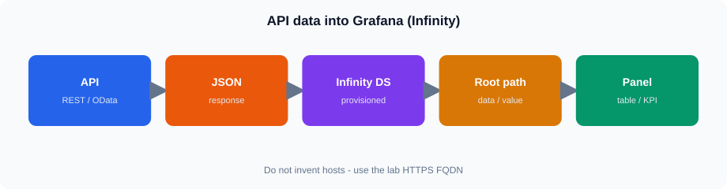

Same idea in Mermaid (GitHub theme colors):

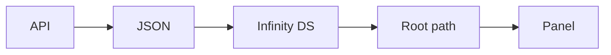


Grafana can use data returned by APIs in addition to databases such as ClickHouse.

For this session, the reporting flow is:

```text
CMF Application
      |
      v
 REST / OData API
      |
      v
 JSON Response
      |
      v
 Grafana Data Source
      |
      v
 Query / Request
      |
      v
 Reporting Panel
```

This approach is useful when reporting data is exposed by an application rather than directly from the reporting database.

---

## 2. REST API and OData

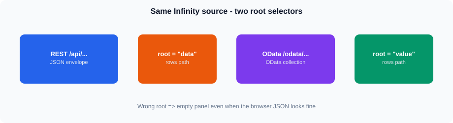

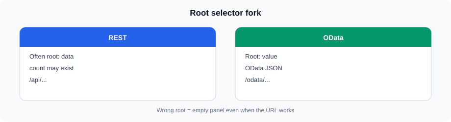


REST and OData are both commonly used for exposing application data over HTTP.

A REST endpoint might look like:

```text
/api/sales
```

An OData endpoint might look like:

```text
/odata/Orders
```

OData provides standardized query options such as `$filter`, `$select`, `$orderby`, `$top`, and `$skip`.

The detailed OData query syntax was covered in Session 7.

---

## 3. Grafana API data sources — Infinity

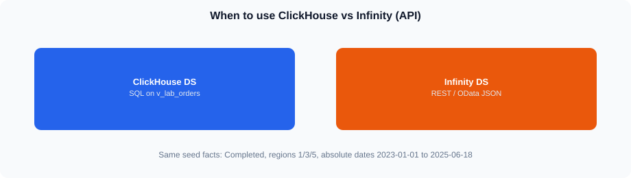

This lab uses the **Infinity** data source (uid **`infinity`**). 

**REST panels**

* Full HTTPS URL, e.g. `https://vmclickhouse.canadacentral.cloudapp.azure.com/api/sales?...`
* Parser: **JSON**
* Root / rows selector: **`data`**

**OData panels**

* Full HTTPS URL under `/odata/...`
* Parser: **JSON**
* Root / rows selector: **`value`**

Grafana login: `student` / `StudentLab!2026` at  
`https://vmclickhouse.canadacentral.cloudapp.azure.com/grafana/`

Optional verify dashboard: `/grafana/d/lab-s09-rest-odata/...`

Typical Infinity fields: URL, method GET, parser JSON, root selector, optional headers. Training APIs need **no** auth headers.

---

## 4. API Request

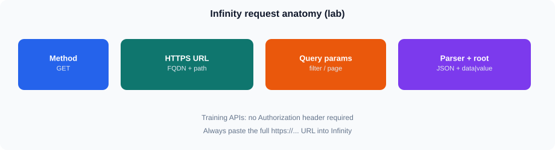

A basic REST request can be represented as:

```text
GET /api/sales
```

A request may also contain query parameters:

```text
/api/sales?region_id=3
```

Example response:

```json
{
  "data": [
    {
      "region_id": 3,
      "sales_amount": 1250.50
    }
  ],
  "count": 1
}
```

Grafana (Infinity) must use root selector **`data`** for this envelope.

---

## 5. HTTP Methods

Reporting integrations most commonly use:

* `GET` — retrieve data
* `POST` — submit data or execute a request where the API requires a request body

For read-only reporting, `GET` is generally the primary method.

---

## 6. Headers

An API request can contain HTTP headers.

Common examples include:

```text
Accept: application/json
```

Training APIs do **not** require `Authorization`. 

---

## 7. Authentication

**Not applicable for the live training REST/OData APIs** — no tokens and no expected `401`.

In production you may see API keys, Basic auth, Bearer tokens, or app-specific schemes. Treat that as general knowledge only in this session.

---

## 8. Query Parameters

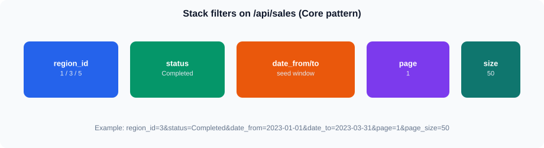

Query parameters allow a Grafana request to retrieve a specific subset of data.

Example:

```text
/api/sales?region_id=3
```

Also useful:

```text
/api/sales?status=Completed&date_from=2023-01-01&date_to=2023-03-31&page=1&page_size=50
/api/sales/by-region
```

REST pagination uses **`page`** and **`page_size`** (not `top`/`skip`/`limit`). Date aliases: `from_date`/`to_date` or `date_from`/`date_to`.
Multiple parameters can be combined:

```text
/api/sales?region_id=3&status=Completed
```

Parameters are useful for reporting because the same API endpoint can support different reporting requirements.

---

## 9. Filtering

An API may support filtering through query parameters.

For example:

```text
/api/orders?status=Completed
```

or:

```text
/api/orders?region_id=3&status=Completed
```

The exact parameter names and filtering syntax are defined by the API.

Do not assume that every REST API supports the same query syntax.

---

## 10. Date and Time Parameters

Reporting APIs commonly provide date filters.

For example:

```text
/api/sales?from_date=2023-01-01&to_date=2023-03-31
```

Date parameters should be validated against the API documentation.

Pay attention to:

* Date format
* Date-time format
* Time zone
* Inclusive/exclusive boundaries

Incorrect date parameters are a common reason for empty results.

---

## 11. OData Query Parameters

An OData endpoint can use standardized query options.

Example:

```text
/odata/Orders?$filter=Status eq 'Completed'
```

Another example:

```text
/odata/Orders?$select=OrderId,OrderDate,SalesAmount
```

Multiple options can be combined:

```text
/odata/Orders?$filter=Status eq 'Completed'&$select=OrderId,OrderDate,SalesAmount
```

The API must support the options being used.

---

## 12. JSON Response

Grafana needs the API response in a structure that the selected data source can interpret.

A simple response might be:

```json
{
  "data": [
    {
      "order_date": "2023-01-05",
      "sales_amount": 450000
    },
    {
      "order_date": "2023-01-08",
      "sales_amount": 224000
    }
  ]
}
```

The important reporting fields are:

* A time/date field where required
* Dimensions such as region or product
* Numeric measures such as sales or quantity

---

## 13. JSON Response Structure

Not every API returns data in the same structure.

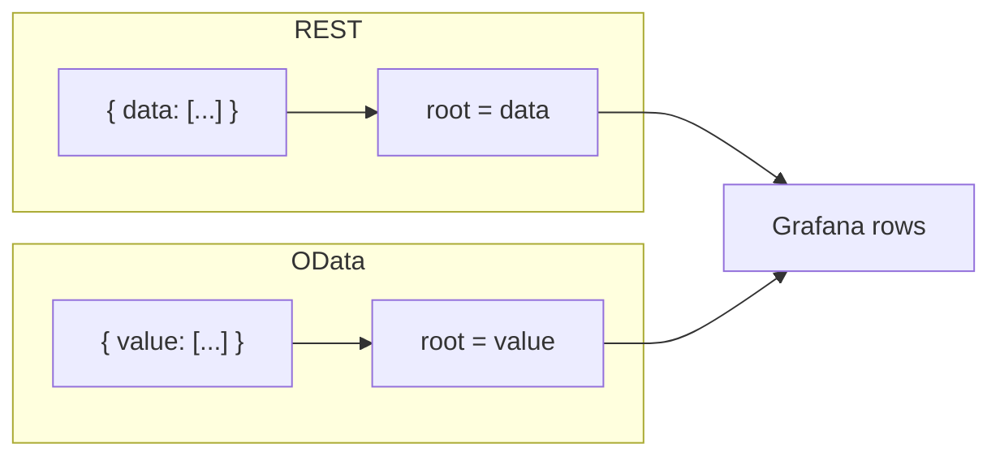

For example:

```json
{
  "data": [...]
}
```

or:

```json
{
  "results": [...]
}
```

or an OData response may contain a collection such as:

```json
{
  "value": [...]
}
```

The Grafana data-source configuration must identify the relevant collection:

* REST training API → root selector **`data`**
* OData → root selector **`value`**

---

## 14. Pagination

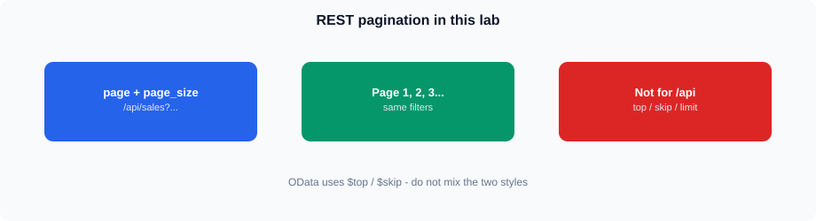

**REST (this lab):**

```text
/api/orders?page=1&page_size=100
/api/orders?page=2&page_size=100
/api/orders?page=3&page_size=100
```

Do **not** use `top` / `skip` / `limit` on `/api/...`.

**OData:**

```text
$top
$skip
```

An OData service may also return `@odata.nextLink`. Do not assume Infinity automatically follows it.

---

## 15. Empty Responses

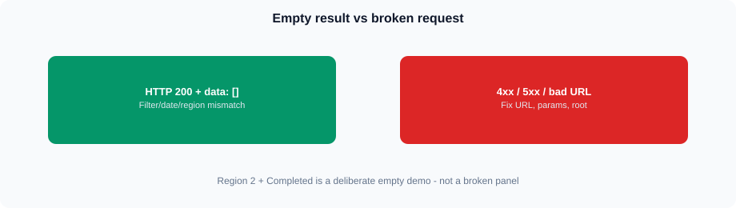

An API can successfully respond but return no records.

Example:

```json
{
  "data": []
}
```

Possible causes include:

* No matching records
* Incorrect filter
* Incorrect date range
* Invalid parameter value
* Data not available for the selected period

An empty result is different from an API connection failure.

---

## 16. Invalid Responses

A request may fail because of:

* Invalid URL
* Invalid parameter
* Authentication failure
* Server error
* Incorrect request format

HTTP status codes provide useful information.

Examples:

| Status | Meaning                        |
| ------ | ------------------------------ |
| 200    | Successful request             |
| 400    | Invalid request                |
| 401    | Authentication required/failed |
| 403    | Access forbidden               |
| 404    | Resource not found             |
| 500    | Server-side error              |

The exact response body and behavior depend on the API.

---

## 17. Connecting Grafana to an API

A typical setup is:

```text
Grafana
   |
   v
API Data Source
   |
   +-- URL
   +-- Authentication
   +-- Headers
   +-- Request settings
   |
   v
REST / OData API
```

After configuration, test the connection or execute a simple request before creating complex panels.

---

## 18. API Query Workflow

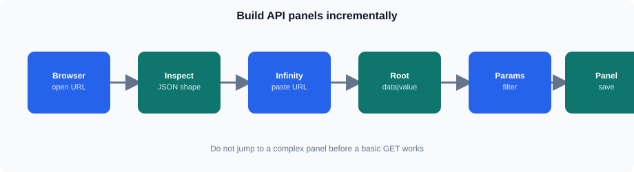

Use an incremental approach:

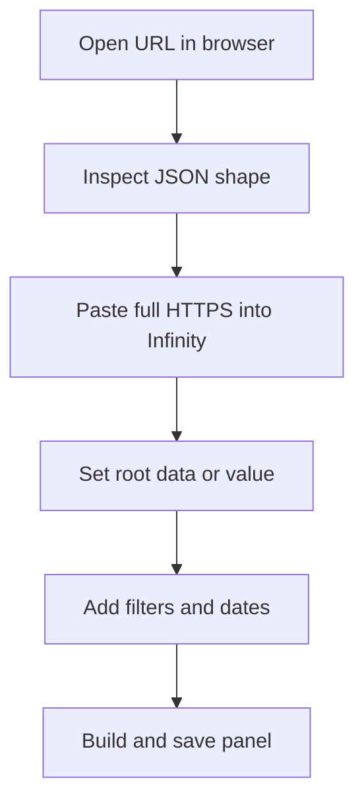

Text checklist:

```text
1. Verify endpoint
       |
2. Execute basic request
       |
3. Inspect response
       |
4. Add parameters
       |
5. Add filters
       |
6. Add date conditions
       |
7. Validate JSON structure
       |
8. Build Grafana panel
```

This makes troubleshooting easier.

---

## 19. Example — Sales API

Suppose the training API provides:

```text
GET /api/sales
```

A filtered request might be:

```text
/api/sales?region_id=3&status=Completed
```

The returned data could contain:

```json
{
  "data": [
    {
      "order_date": "2023-01-08",
      "region_id": 2,
      "sales_amount": 224000
    }
  ]
}
```

Grafana can use the returned fields to create a reporting panel.

---

## 20. Example — OData Sales Query

An OData endpoint might expose orders:

```text
/odata/Orders
```

A filtered query could be:

```text
/odata/Orders?$filter=Status eq 'Completed'
```

A query returning selected fields could be:

```text
/odata/Orders?$filter=Status eq 'Completed'&$select=OrderId,OrderDate,SalesAmount
```

The response should be inspected before configuring the Grafana visualization.

---

## 21. Troubleshooting API Integration


### Cannot connect to API

Check:

* Full HTTPS URL
* Network accessibility
* Infinity root selector (`data` vs `value`)
* API availability

### 401 or 403 response

**Not expected** on this training API (no auth). If you see 401 elsewhere, treat as theory: credentials / token / headers / permissions.

### 404 response

Check:

* Endpoint path
* API version
* Entity or resource name

### Query returns no data

Check:

* Root selector (`data` for REST, `value` for OData)
* Filters (especially `region_id=2` + Completed = empty)
* Date range / seed window
* `page` / `page_size`
* Whether matching records exist for the filters you chose

### Grafana cannot display the response

Check:

* JSON structure
* Data-source configuration
* Field names
* Time field
* Numeric fields
* Array/object structure

---

## 22. End-to-End Reporting Flow

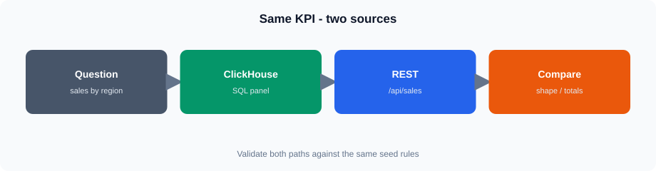


The complete integration for this session is:

```text
CMF Application
      |
      v
 REST / OData API
      |
      | HTTP Request
      v
 JSON Response
      |
      v
 Grafana API Data Source
      |
      v
 Query + Parameters
      |
      v
 Grafana Panel
      |
      v
 Reporting Dashboard
```

The key point is that Grafana is consuming application/API data rather than querying ClickHouse directly for that panel.

## Summary

* Use **Infinity** ; full HTTPS URLs; parser JSON.
* REST root selector **`data`**; OData root selector **`value`**.
* REST pagination: **`page` / `page_size`**. Date aliases: `date_from`/`date_to`.
* Training APIs have **no auth** — no 401 drill.
* Prefer `/api/sales/by-region` for regional aggregates (or ClickHouse).
* Completed regions **1 / 3 / 5**; Region 2 + Completed is empty.
* Optional stretch: `/cmf/plants`.
* Student Grafana: `student` / `StudentLab!2026`; verify dashboard `lab-s09-rest-odata`.
* Build and validate API requests incrementally.
