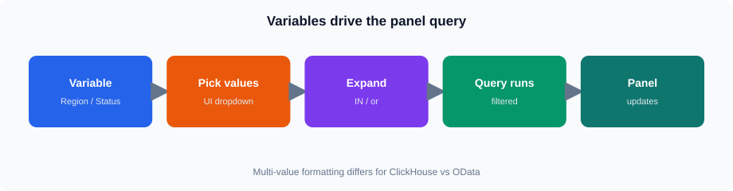
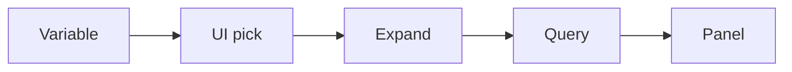
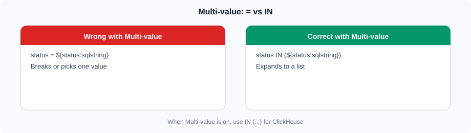
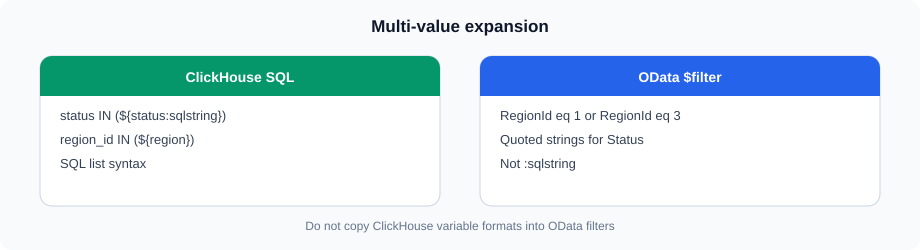
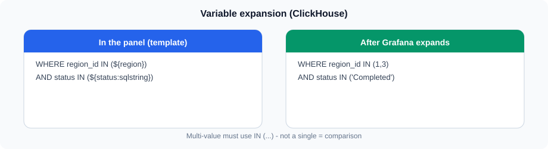
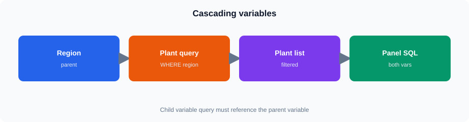

# Grafana Variables and Dynamic Queries

## 1. Why variables?



Same idea in Mermaid (GitHub theme colors):




Hard-coded filters force a new panel for every region or status. Variables put the filter in the dashboard header. One panel query serves many selections.

```text
User picks Region / Status / Plant
              |
              v
     Grafana substitutes ${var}
              |
              v
     ClickHouse SQL or API URL
              |
              v
           Panel updates
```

This session uses Grafana with the ClickHouse and Infinity data sources.

---

## 2. Where variables live

Open a dashboard → **Dashboard settings** (gear) → **Variables** → **Add variable**.

Each variable has:

* **Name** — used in queries as `${name}`
* **Label** — text shown above the dropdown
* **Type** — Query, Custom, Text box, Interval, Data source, Constant, …
* **Multi-value** — allow several selections
* **Include All option** — special “All” choice
* **Default** — initial selection when the dashboard opens

> **Tip:** Create variables before panels. Empty `${region}` in SQL is a common first-day failure.

---

## 3. Variable types used in this lab

| Type | Use in this session |
| ---- | ------------------- |
| **Query** | Region, Plant, Product, Category, Customer — values from ClickHouse |
| **Custom** | Status — fixed list `Open,Shipped,Completed,Cancelled` |
| **Built-in time** | `${__from}` / `${__to}` (and dashboard time picker) |

Text box / Interval are optional stretch topics.

---

## 4. Query variables

A query variable runs SQL (or another DS query) and fills the dropdown.

**Regions (preferred — dimension table):**

```sql
SELECT
    region_id,
    region_name
FROM training.regions
ORDER BY region_id
```

In the variable editor:

* Data source: **ClickHouse**
* Query: as above
* Typically **value** = `region_id`, **text** = `region_name` (set in the variable UI / Refresh options)

**Alternative from the reporting view:**

```sql
SELECT DISTINCT
    region_id,
    toString(region_id) AS region_label
FROM training.v_lab_orders
ORDER BY region_id
```

Prefer `training.regions` when you want friendly names.

> **Expected result:** Six regions (1–6). Completed seed data exists only for **1, 3, 5**.

---

## 5. Custom variables

Custom variables are a comma-separated list. No database round-trip.

**Status (Core):**

```text
Open,Shipped,Completed,Cancelled
```

* Name: `status`
* Multi-value: on (optional but useful)
* Include All: optional
* **Default:** `Completed`

That matches how labs filter `training.v_lab_orders` (view maps stored `Closed` → `Completed`).

---

## 6. Multi-value and the All option







**Multi-value** lets the user pick more than one item (e.g. regions 1 and 3).

**Include All option** adds an All entry. When All is selected, Grafana expands to every value from the variable’s option list (or a custom “all value” if you set one).

For SQL, multi-value almost always means an `IN (...)` list — not `=`.

```sql
-- numeric IDs (region, plant, product, …)
WHERE region_id IN (${region})

-- string status
WHERE status IN (${status:sqlstring})
```

> **Tip:** If you write `status = ${status}` with multi-value on, the panel breaks or returns wrong results. Teach `IN` + formatting early.

---

## 7. Variable formatting




Grafana formats multi-value expansions differently depending on the suffix:

| Format | Example expansion | Typical use |
| ------ | ----------------- | ----------- |
| `${region}` / `${region:csv}` | `1,3,5` | Numeric `IN (...)` in ClickHouse |
| `${status:sqlstring}` | `'Open','Completed'` | String `IN (...)` in ClickHouse |
| `${status:singlequote}` | `'Open','Completed'` | Same idea; pick one and stay consistent |
| `${region:pipe}` | `1\|3\|5` | Rare in this lab |
| `${region:regex}` | `(1\|3\|5)` | Regex filters (not used in Core SQL) |

**ClickHouse pattern (prefer simple):**

```sql
WHERE region_id IN (${region})
  AND status IN (${status:sqlstring})
```

This works with **grafana-clickhouse-datasource** for typical multi-value + All setups. Avoid inventing plugin-specific macros unless you have verified them on this lab Grafana build.

**Single-value shortcut** (when Multi is off):

```sql
WHERE region_id = ${region}
  AND status = '${status}'
```

---

## 8. Dynamic filtering on `training.v_lab_orders`

Reporting view columns used with filters:

* `region_id`, `plant_id`, `product_id`, `customer_id`
* `status` (`Completed`, …)
* `order_date` / `order_ts`
* Measures: `sales_amount`, `quantity`

Category is **not** on the view. Join `training.products` when filtering by category:

```sql
SELECT
    sum(v.sales_amount) AS total_sales
FROM training.v_lab_orders AS v
INNER JOIN training.products AS p ON p.product_id = v.product_id
WHERE v.region_id IN (${region})
  AND v.status IN (${status:sqlstring})
  AND p.category_id IN (${category})
```

---

## 9. Dependencies and cascading




A **cascading** (dependent) variable uses another variable in its query.

**Region → Plant (Core):**

```sql
SELECT
    plant_id,
    plant_name
FROM training.plants
WHERE region_id IN (${region})
ORDER BY plant_id
```

Variable settings:

* Name: `plant`
* Query: as above
* **Refresh:** On dashboard load **and** on time range change is fine; critically, the plant list must refresh when **region** changes (Grafana refreshes query variables when parent variables change if the query references them)

**Category → Product (Stretch):**

```sql
SELECT
    product_id,
    product_name
FROM training.products
WHERE category_id IN (${category})
ORDER BY product_id
LIMIT 500
```

`LIMIT` keeps the dropdown usable (5000 products in seed).

**Customer (Stretch):**

```sql
SELECT
    customer_id,
    customer_name
FROM training.customers
WHERE region_id IN (${region})
ORDER BY customer_id
LIMIT 200
```

50 000 customers — always limit variable queries.

```text
region  --->  plant
region  --->  customer   (stretch)
category ---> product    (stretch)
```

---

## 10. Time variables and the dashboard picker

### Dashboard time range (Core)

Set the dashboard to **absolute**:

* From: `2023-01-01 00:00:00`
* To: `2025-06-18 23:59:59`

**Do not** use Last 30 days in this lab. Class date is after the seed window; relative ranges often show empty panels.

### Built-in `${__from}` / `${__to}`

Useful when you must pass dates into REST query strings:

```text
date_from=${__from:date:YYYY-MM-DD}&date_to=${__to:date:YYYY-MM-DD}
```

In ClickHouse SQL you can also bind explicitly:

```sql
WHERE order_date >= toDate('${__from:date:YYYY-MM-DD}')
  AND order_date <= toDate('${__to:date:YYYY-MM-DD}')
```

Many ClickHouse panels simply rely on the dashboard time picker plus a time column in the query editor (plugin time filter). Either approach is fine — be consistent in class.

> **Expected result:** With absolute seed window and `status = Completed`, Completed regions **1 / 3 / 5** return rows. Region **2** + Completed returns **empty**.

---

## 11. Variables in ClickHouse SQL

Full Core-style panel query:

```sql
SELECT
    sum(sales_amount) AS total_sales,
    count() AS line_rows,
    uniqExact(order_id) AS orders
FROM training.v_lab_orders
WHERE region_id IN (${region})
  AND plant_id IN (${plant})
  AND status IN (${status:sqlstring})
```

Table panel example:

```sql
SELECT
    order_date,
    region_id,
    plant_id,
    order_id,
    product_id,
    quantity,
    sales_amount,
    status
FROM training.v_lab_orders
WHERE region_id IN (${region})
  AND plant_id IN (${plant})
  AND status IN (${status:sqlstring})
ORDER BY order_date DESC
LIMIT 100
```

Time-series style (optional):

```sql
SELECT
    order_date AS time,
    sum(sales_amount) AS sales
FROM training.v_lab_orders
WHERE region_id IN (${region})
  AND status IN (${status:sqlstring})
GROUP BY order_date
ORDER BY time
```

Use visualization **Time series** and map the `time` field.

---

## 12. Variables in REST (Infinity)

Data source: **Infinity**.

| Setting | Value |
| ------- | ----- |
| Parser | JSON |
| Root / rows selector | **`data`** for `/api/...` |
| Method | GET |
| Auth | none |

**Single-region REST (Core-friendly):**

```text
https://vmclickhouse.canadacentral.cloudapp.azure.com/api/sales?region_id=${region}&status=${status}&page=1&page_size=50&date_from=${__from:date:YYYY-MM-DD}&date_to=${__to:date:YYYY-MM-DD}
```

Live REST facts:

* Pagination: **`page` / `page_size`** — not `top` / `skip`
* Filters: `region_id`, `status`, `date_from` / `date_to` (aliases `from_date` / `to_date` also work)
* Multi-value `${region}` in a single `region_id=` parameter is **not** a full multi-select API — turn Multi off for that panel, or prefer ClickHouse for multi-region

> **Tip:** If the Infinity panel is empty but the same URL works in the browser, check root selector **`data`**.

---

## 13. Variables in OData (Infinity)

Root / rows selector: **`value`**.

```text
https://vmclickhouse.canadacentral.cloudapp.azure.com/odata/Orders?$filter=Status eq '${status}' and RegionId eq ${region}&$top=20
```

Notes for this lab API:

* Use `Status eq 'Completed'` and `RegionId eq 3` style filters
* `$select`, `$orderby`, `$top`, `$skip` are fine (Session 09)
* **`$expand` is not supported** on the training OData service — mention as stretch/unsupported only; do not build Core steps around it
* Multi-value OData `$filter` construction (`RegionId eq 1 or RegionId eq 3`) is Session **11** depth; keep Session 10 OData examples single-value or one simple filter

---

## 14. Dynamic query construction

Think in layers:

```text
1. Fixed skeleton
   SELECT … FROM training.v_lab_orders WHERE …

2. Plug in variables
   region_id IN (${region})
   status IN (${status:sqlstring})

3. Optional joins
   products for category
   plants already on the view via plant_id

4. Limits for tables
   LIMIT 100
```

Same idea for URLs: fixed base path + query string built from variables.

---

## 15. Defaults

Recommended dashboard defaults for Core:

| Variable | Default | Why |
| -------- | ------- | --- |
| `status` | `Completed` | Matches lab seed and Session 08/09 |
| `region` | `3` (Asia Pacific) or multi `1,3,5` | Known Completed data |
| `plant` | first plant(s) for selected region | Cascading list must not be empty |
| Time | Absolute **2023-01-01** → **2025-06-18** | Seed window |

Save the dashboard after setting defaults so reloads behave the same for every student.

---

## 16. Hands-on filter map

| Filter | Variable type | Source | Used in |
| ------ | ------------- | ------ | ------- |
| Region | Query | `training.regions` | CH `IN`, REST `region_id`, OData `RegionId` |
| Plant | Query (cascade) | `training.plants` WHERE region | CH `plant_id IN` |
| Product | Query | `training.products` | CH `product_id IN` |
| Category | Query | `training.categories` | CH via join to products |
| Customer | Query | `training.customers` (+ LIMIT) | CH `customer_id IN` |
| Status | Custom | Open,Shipped,Completed,Cancelled | CH / REST / OData |
| Date/time | Dashboard + `${__from}`/`${__to}` | Time picker | CH date predicates / REST dates |

---

## 17. Empty results vs broken queries

| Symptom | Likely cause |
| ------- | ------------ |
| Empty panel, query OK | Region **2** + Completed; or relative Last 30 days |
| SQL error near `IN ()` | Variable empty — no default / All misconfigured |
| Status syntax error | Missing `:sqlstring` / quotes for strings |
| Infinity empty | Wrong root selector (`data` vs `value`) |
| Plant list empty | Region not selected, or plant query missing `IN (${region})` |
| REST ignores multi region | API takes one `region_id` — expected |

---

## 18. End-to-end flow

```text
Dashboard variables (Region, Plant, Status, …)
        |
        +---> ClickHouse SQL on training.v_lab_orders
        |
        +---> Infinity REST /api/sales?...   (root: data)
        |
        +---> Infinity OData /odata/Orders?$filter=...  (root: value)
        |
        v
     Stat / Table / Time series panels
```

## Summary

* Variables belong on the dashboard; panels reference `${name}`.
* Query variables for dimensions; Custom for Status (default **Completed**).
* Multi-value → `IN (${region})` and `IN (${status:sqlstring})`.
* Cascade: `plants` filtered by `${region}`.
* Absolute time **2023-01-01→2025-06-18** — not Last 30 days.
* Infinity: root **`data`** (REST), **`value`** (OData); REST **`page`/`page_size`**.
* No `$expand` on lab OData.
* Region **2** + Completed is empty by seed design.
* Student login: `student` / `StudentLab!2026`.
