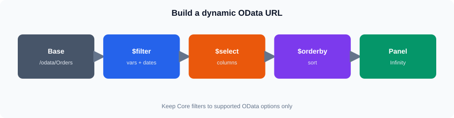
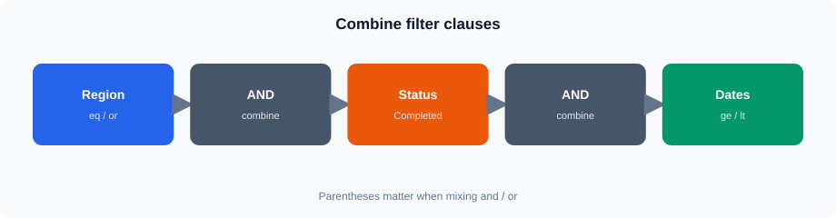
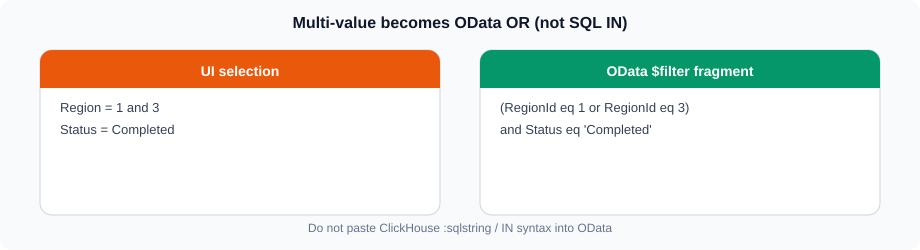
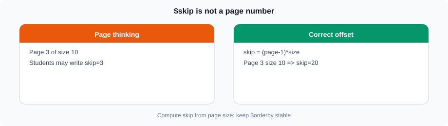
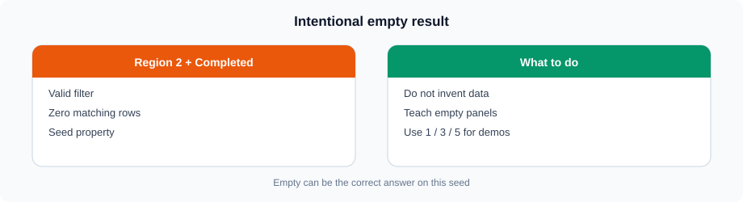

# Session 11 — Advanced OData Querying in Grafana

## 1. Session Flow




The practical pattern for this session is:

Grafana Dashboard
      ↓
Grafana Variable
      ↓
Dynamic OData URL
      ↓
Infinity datasource
      ↓
JSON response
      ↓
Grafana panel

The session assumes you already know the basic Grafana variable concepts from Session 10 and the basic OData concepts from Session 07.

The focus here is using those concepts together.

---

## 2. Dashboard and Datasource Setup

The session uses the existing Grafana installation:

```text
https://vmclickhouse.canadacentral.cloudapp.azure.com/grafana/
```

The suggested dashboard name is:

```text
Session 11 - Advanced OData Lab
```

Use the **Infinity** datasource.

Do not create another datasource as part of the Core lab.

For OData responses, the Infinity configuration is:

```text
Parser: JSON
Root selector: value
```

### Tip

If you can open an OData URL in the browser but the Grafana panel is empty, check the Infinity parser and root selector before changing the OData query.

---

## 3. Grafana Variables

A Grafana variable allows the dashboard user to change a controlled value without editing the panel query manually.

For example:

```text
Region variable
      ↓
selected value: 1
      ↓
OData filter
      ↓
RegionId eq 1
```

A variable can therefore replace a fixed value in an OData expression:

```text
$filter=RegionId eq ${region}
```

If the selected value is `1`, the effective expression is:

```text
$filter=RegionId eq 1
```

The same pattern can be used for a string field such as `Status`:

```text
$filter=Status eq '${status}'
```

If the selected value is `Completed`, the effective expression is:

```text
$filter=Status eq 'Completed'
```

### Tip

The quotes around a string value are part of the OData expression.

Numeric values such as `RegionId` do not need those quotes.

---

## 4. Controlled Variables

Use controlled variable values rather than unrestricted free-form input.

For the Core Region variable, the relevant Completed regions are:

```text
1
3
5
```

The normal Status value is:

```text
Completed
```

This keeps the generated OData expression predictable.

### Tip

When troubleshooting, first replace the variable with a fixed value.

For example:

```text
RegionId eq ${region}
```

can temporarily be changed to:

```text
RegionId eq 1
```

If the fixed query works, investigate the variable configuration rather than the OData endpoint.

---

<table><tr><td bgcolor="#FEF3C7">

### Quiz — OData setup and variables

https://vmreact.eastus2.cloudapp.azure.com:18094/a/ch-grafana-s11-setup-vars

Each student must attempt this quiz. Use the login ID your trainer provided.

</td></tr></table>


## 5. Multiple Filter Conditions




OData supports logical conditions using `and` and `or`.

Example:

```text
$filter=RegionId eq 1 and Status eq 'Completed'
```

Both conditions must be true.

For multiple regions:

```text
$filter=RegionId eq 1 or RegionId eq 3
```

Parentheses make combined logic clearer:

```text
$filter=(RegionId eq 1 or RegionId eq 3) and Status eq 'Completed'
```

This means:

```text
Region 1 OR Region 3
AND
Completed
```

### Tip

When combining `AND` and `OR`, use explicit parentheses. They make the intended business condition easier to understand and troubleshoot.

---

## 6. Multi-Value Variables




A multi-value Grafana variable can represent several selected regions.

For example, the user might select:

```text
1
3
```

The resulting OData condition needs to represent:

```text
RegionId eq 1 or RegionId eq 3
```

Selecting:

```text
1
3
5
```

needs to produce the logical equivalent of:

```text
RegionId eq 1 or RegionId eq 3 or RegionId eq 5
```

### Important

Do not assume that this is automatically valid:

```text
RegionId eq ${region}
```

when `${region}` contains several values (for example `1,3`).

The final substituted text must be valid OData syntax, such as:

```text
(RegionId eq 1 or RegionId eq 3) and Status eq 'Completed'
```

**Do not reuse Session 10 ClickHouse formats** (`IN (${region})`, `${status:sqlstring}`) inside OData `$filter`. Those formats are for SQL panels only. Verify the actual URL after Grafana substitution (query inspector).

### Tip

Use a small, controlled set of values. Prefer proving a fixed `or` filter before attempting multi-value format strings.

---

<table><tr><td bgcolor="#FEF3C7">

### Quiz — Multi-value OData filters

https://vmreact.eastus2.cloudapp.azure.com:18094/a/ch-grafana-s11-multifilter

Each student must attempt this quiz. Use the login ID your trainer provided.

</td></tr></table>


## 7. Date and Time Filtering

The training seed contains order dates from:

```text
2023-01-01
```

through:

```text
2025-06-18
```

Grafana exercises should therefore use the absolute training range:

```text
2023-01-01 → 2025-06-18
```

Do not use Last 30 days as the primary session range.

Use the same date literal style as Session 07:

```text
OrderDate ge 2023-01-01 and OrderDate lt 2023-04-01
```

Example (Region 3 + Completed + Q1 2023):

```text
/odata/Orders?$filter=RegionId eq 3 and Status eq 'Completed' and OrderDate ge 2023-01-01 and OrderDate lt 2023-04-01&$top=20
```

### Tip

Start with that fixed Q1 2023 filter, then introduce `${region}` / `${status}`. 

---

## 8. Dynamic `$select`

`$select` controls which fields are returned.

Example:

```text
$select=OrderId,RegionId,Status,SalesAmount,OrderDate
```

This is useful when a panel needs only a subset of the available fields.

The practical reason is simple:

**Retrieve only the data required by the panel.**

A controlled Grafana variable can also be used to select from predefined field sets.

### Tip

Keep dynamic `$select` values controlled. Do not allow arbitrary query expressions from free-form user input.

---

## 9. Dynamic `$orderby`

`$orderby` controls the result order.

Example:

```text
$orderby=SalesAmount desc
```

Another example:

```text
$orderby=OrderDate desc
```

A controlled Grafana variable can allow the dashboard user to choose from predefined sort fields.

### Tip

Start with a fixed `$orderby` expression. Introduce the variable only after the fixed query works.

---

<table><tr><td bgcolor="#FEF3C7">

### Quiz — Dates, $select, $orderby

https://vmreact.eastus2.cloudapp.azure.com:18094/a/ch-grafana-s11-dates-select

Each student must attempt this quiz. Use the login ID your trainer provided.

</td></tr></table>


## 10. `$top` and `$skip`




`$top` limits the number of records returned.

Example:

```text
$top=20
```

`$skip` skips records before returning the next set.

Example:

```text
$skip=20&$top=20
```

A simple pagination model is:

```text
Page 1 → $skip=0  & $top=20
Page 2 → $skip=20 & $top=20
Page 3 → $skip=40 & $top=20
```

`$skip` is an offset, not a page number.

### Tip

Keep the `$orderby` consistent when testing pagination. Otherwise, the relationship between pages can become difficult to explain.

---

## 11. Dynamic URL Construction

An OData URL can combine several query options:

```text
https://vmclickhouse.canadacentral.cloudapp.azure.com/odata/Orders?$select=OrderId,RegionId,Status,SalesAmount&$filter=RegionId eq 1 and Status eq 'Completed'&$orderby=SalesAmount desc&$top=20
```

The URL can be understood as several independent components:

```text
Entity
  ↓
$select
  ↓
$filter
  ↓
$orderby
  ↓
$top / $skip
```

Grafana variables can replace controlled values within those components.

### Tip

Build complex URLs incrementally:

1. Working entity URL
2. `$filter`
3. Variables
4. `$select`
5. `$orderby`
6. `$top` / `$skip`

This makes troubleshooting much easier.

---

## 12. JSON Response Handling

The training OData service returns the collection of records under:

```text
value
```

Therefore Infinity uses:

```text
Parser: JSON
Root selector: value
```

The important distinction is:

```text
OData response
      ↓
value
      ↓
individual records
```

The panel should operate on the records inside `value`.

### Tip

If the browser shows valid JSON but Grafana shows no rows, verify:

```text
Parser = JSON
Root selector = value
```

before changing the OData URL.

---

## 13. Empty Results




A successful query does not necessarily return records.

The training seed deliberately provides this example:

```text
RegionId eq 2 and Status eq 'Completed'
```

There are no Completed records for Region 2.

This demonstrates the difference between:

- Successful query with zero matching records
- Invalid OData query
- Failed HTTP request
- Incorrect Infinity configuration

### Tip

Use Region 2 + Completed deliberately as the empty-result test.

Do not present it as a normal successful Region filter.

---

<table><tr><td bgcolor="#FEF3C7">

### Quiz — Advanced OData lab checkpoint

https://vmreact.eastus2.cloudapp.azure.com:18094/a/ch-grafana-s11-lab-checkpoint

Each student must attempt this quiz. Use the login ID your trainer provided.

</td></tr></table>


## 14. Reducing Unnecessary API Data

A reporting panel should avoid retrieving data it does not need.

Three useful OData options are:

```text
$filter
$select
$top
```

For example:

```text
$filter=Status eq 'Completed'
```

reduces the matching records.

```text
$select=OrderId,RegionId,SalesAmount
```

reduces the fields returned.

```text
$top=20
```

limits the number of records.

Together, these make the request more targeted.

---

## 15. `$expand` and Related Entities

OData can use `$expand` to request related entities.

Conceptually:

```text
$expand=Customer
```

can ask an OData service to include related Customer data.

However, **`$expand` is not supported by the lab OData service.**

Therefore:

- Explain `$expand` as an OData capability.
- Explain why related entities are useful in reporting.
- Do not make `$expand` a Core lab requirement.
- Do not expect nested related-entity objects from this lab.
- Do not create a graded exercise that requires `$expand`.

The same principle applies to related-entity expansion in general.

### Tip

Make the distinction explicit:

**A feature supported by OData in general is not necessarily a feature enabled by this training service.**

---

## 16. Other Unsupported OData Features

The lab does not support these as Core techniques:

```text
$search
```

OData key URLs such as:

```text
Orders(id)
```

and related-entity expansion.

These may be discussed as broader OData concepts but should not be presented as successful Core operations.

---

## 17. Query Troubleshooting

Use the following sequence when a panel does not return the expected result.

### Step 1 — Test the endpoint

Confirm that the OData endpoint responds.

### Step 2 — Remove variables

Replace variables with known values.

### Step 3 — Test `$filter`

Confirm that the filter is valid.

### Step 4 — Test `$select`

Confirm that the requested field names exist.

### Step 5 — Test `$orderby`

Confirm that the sort expression is valid.

### Step 6 — Test `$top` / `$skip`

Add pagination only after the basic query works.

### Step 7 — Check Infinity

Verify:

```text
Parser: JSON
Root selector: value
```

### Step 8 — Check Grafana time range

Use:

```text
2023-01-01 → 2025-06-18
```

Do not use Last 30 days as the primary range.

---

## 18. Common issues

### Region 2 + Completed

Expected empty result:

```text
RegionId eq 2 and Status eq 'Completed'
```

### Infinity root selector

For OData:

```text
value
```

### Absolute time range

Use:

```text
2023-01-01 → 2025-06-18
```

### Data source

Use the existing Infinity datasource. You do not need to create a datasource for the Core lab.

### Shared ClickHouse data

The ClickHouse lab user is:

```text
training_ro
```

Do not attempt DDL against the `training` database.

### Unsupported features

Do not make these required:

```text
$expand
$search
Orders(id)
```

## 19. What to take away

The main lesson is not simply writing a longer OData URL.

Understand the relationship:

```text
Grafana variable
      ↓
Query parameter
      ↓
OData filter / projection / sorting / pagination
      ↓
JSON response
      ↓
Grafana visualization
```

The practical objective is to build dashboards where controlled selections change the OData request without manually rewriting the query.
