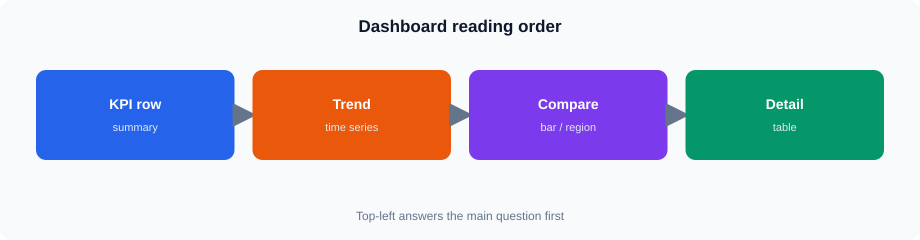

# Session 12 — Advanced Grafana Dashboards

## Session Overview

<!-- training-diagrams:v1 -->



This session turns a working variables dashboard into a clearer reporting layout: KPI stats, trends, comparisons, a limited detail table, formatting, one transformation, and simple drill-down navigation.

```text
Summary KPIs
      |
      v
 Trends / comparisons
      |
      v
 Detail table + navigation
```

## Topics

* Dashboard layout and organization
* Time-series panels
* Tables
* Bar charts
* Stat panels
* Thresholds
* Units and formatting
* Legends
* Field configuration
* Transformations
* Calculated values
* Field organization
* Panel links
* Dashboard links
* Drill-down
* Annotations
* Dashboard usability
* Query performance

## Practical Work

Participants will:

* Open Grafana (`student` / `StudentLab!2026`)
* Use provisioned **ClickHouse** (uid `clickhouse`); Infinity is Stretch only
* Build **`Session 12 - Advanced Dashboard Lab`** (copy from Session 10 variables dashboard if available)
* Reuse `region` / `status` variables with ClickHouse patterns: `region_id IN (${region})`, `status IN (${status:sqlstring})`
* Add Stat, Time series, Bar chart, and Table panels on `training.v_lab_orders`
* Apply thresholds, field formatting, one transformation, and a calculated value
* Add a link to **`Session 12 - Regional Detail`**
* Confirm Region 2 + Completed is empty; keep `LIMIT 100` on detail queries

## Timing (PAX ~2×)

TOC: **3 hours**.

**Core (~90–120 min):** login → absolute time **2023-01-01→2025-06-18** → layout → 2 Stats + time series + bar + table → thresholds/formatting → transformation → calculated value → dashboard link → Region 2 empty check → performance checklist.

**Stretch:** annotations (instructor if needed), Infinity REST/OData panel, extra drill-down.

Seed: Completed regions **1 / 3 / 5**; dates **2023-01-01** … **2025-06-18**; reporting view **`training.v_lab_orders`**.

## Files

| File | Purpose |
| ---- | ------- |
| `README.md` | Session overview |
| `notes.md` | Concepts and patterns |
| `lab.md` | Guided advanced dashboard lab |
| `assets/` | Supporting files, if required |
