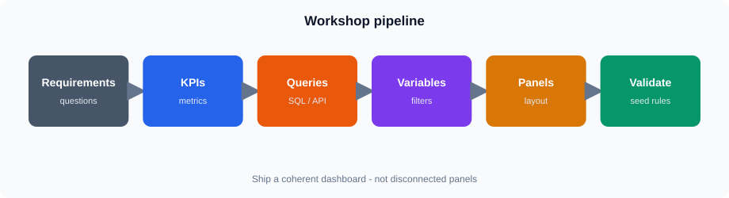

# Session 13 — End-to-End Reporting Dashboard Workshop

**Duration:** 4 hours

## Overview

Build one complete reporting dashboard: requirements → KPIs → queries → variables → panels → validation.

Dashboard name: **`Session 13 - Reporting Workshop`**

## Topics

* KPI design from reporting requirements
* ClickHouse queries on `training.v_lab_orders`
* Variables, panels, filtering, validation

## What you will do

* Sign in (`student` / `StudentLab!2026`)
* Use provisioned ClickHouse
* Absolute time **2023-01-01** → **2025-06-18**
* Build Core KPIs (orders, revenue, high-value lines) plus region/plant views
* Filters: Region, Plant, Status (default Completed)

**Core:** compact dashboard with the panels above + variables 

**Stretch:** Infinity panel, extra drill-down, more transformations, `/cmf/plants`

**Seed:** Completed regions **1 / 3 / 5**; Region 2 + Completed empty; `sales_amount >= 2000` for high-value lines

## Files

| File | Purpose |
|------|---------|
| `notes.md` | Concepts |
| `lab.md` | Guided workshop |
| `assets/` | Diagrams |
