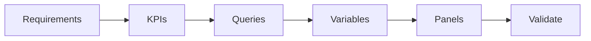
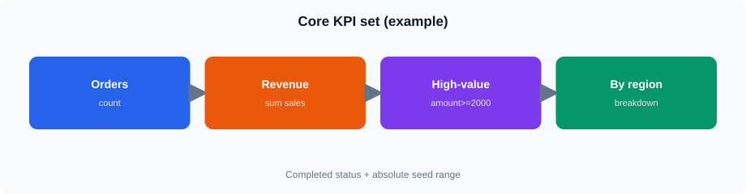
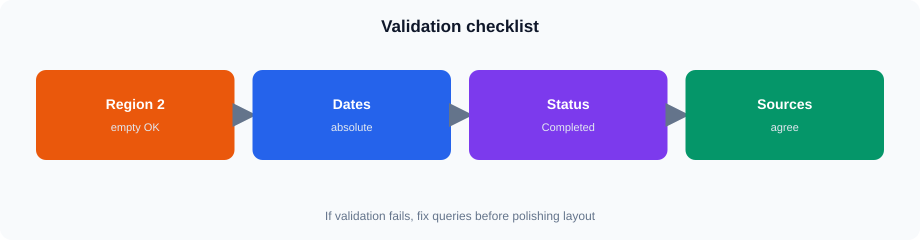

# Session 13 — End-to-End Reporting Dashboard Workshop

## 1. Reporting Requirements → Dashboard Design

<!-- training-diagrams:v1 -->


Same idea in Mermaid (GitHub theme colors):




A reporting dashboard should start with the questions the report needs to answer.

For this workshop, the reporting questions are:

- How many Completed orders are present?
- What is the Completed revenue?
- How many high-value lines have `sales_amount >= 2000`?
- How is sales distributed across regions?
- How is sales distributed across plants?
- Can the user filter the report by region, plant, and status?
- Can the same dashboard support both Q1 2023 analysis and the complete seed range?

A useful dashboard does not expose every available field. Select fields that directly support the reporting requirement.

### Trainer Tip

Ask students to identify the **business question first**, then decide:

1. KPI
2. Dimension
3. Filter
4. Data source
5. Visualization

Avoid starting with the Grafana visualization type.

---

## 2. Choosing the Reporting Data Source

For the Core dashboard, use:

```text
training.v_lab_orders
```

This is the reporting view for sales, quantity, region, and Completed analytics.

The normalized `training.orders` table should not be treated as if it contains reporting columns such as:

```text
quantity
sales_amount
region_id
```

Those reporting fields are available through the reporting view.

### Trainer Tip

Keep the workshop focused on the reporting view. Students do not need to reconstruct the underlying joins during this session.

---

## 3. KPI Design

<!-- training-diagrams:v1 -->



The three Core KPIs represent different measures.

### Completed Orders

Count distinct orders:

```sql
uniqExact(order_id)
```

This avoids counting individual order lines as separate orders.

### Completed Revenue

Use:

```sql
sum(sales_amount)
```

This measures revenue at the reporting-row level.

### High-Value Lines

Use the agreed workshop threshold:

```sql
sales_amount >= 2000
```

A high-value line count can therefore be calculated as:

```sql
countIf(sales_amount >= 2000)
```

### Trainer Tip

Explain the difference between:

- **rows**
- **orders**
- **revenue**

A single order can contain multiple reporting rows. Therefore, `count()` and `uniqExact(order_id)` answer different questions.

---

## 4. Status Handling

The workshop uses:

```text
Completed
```

as the reporting status.

The lab data intentionally has:

- Completed regions: `1`, `3`, `5`
- Region `2` + Completed: empty

This makes Region 2 useful for demonstrating validation and filter behavior.

### Trainer Tip

If a student selects Region 2 and receives an empty panel, this is not automatically a query error.

First check:

1. Status is `Completed`
2. Region is `2`
3. Dashboard time range is within the seed range

The expected result is no Completed data.

---

## 5. Dashboard Time Range

The seed covers:

```text
2023-01-01 → 2025-06-18
```

Use this as the primary absolute dashboard range.

For the Q1 2023 requirement, the relevant period is:

```text
2023-01-01 → 2023-04-01
```

when using an exclusive upper boundary in a query.

### Trainer Tip

Do not use Grafana's relative `Last 30 days` range as the primary workshop range.

The current date is later than the seed data, so a relative range based on the current date can produce an empty dashboard.

---

## 6. ClickHouse Query Pattern

A basic reporting query can filter the reporting view directly:

```sql
SELECT
    order_id,
    order_date,
    region_id,
    plant_id,
    status,
    sales_amount
FROM training.v_lab_orders
WHERE status = 'Completed'
```

For aggregated reporting, group by the dimension being displayed.

For example, region-level reporting follows this pattern:

```sql
SELECT
    region_id,
    sum(sales_amount) AS revenue
FROM training.v_lab_orders
WHERE status = 'Completed'
GROUP BY region_id
ORDER BY region_id
```

### Why Aggregate in ClickHouse?

The database can perform the aggregation before Grafana receives the result.

This generally means:

- less data transferred to Grafana
- fewer rows for the visualization
- simpler dashboard transformations
- clearer query intent

---

## 7. Variable Design

Variables make one dashboard reusable across different reporting views.

The workshop uses:

- Region
- Plant
- Status

The status variable should default to:

```text
Completed
```

The region variable must support the actual Completed regions:

```text
1
3
5
```

If Region 2 is deliberately included for validation, selecting it with Completed should produce an empty result.

### Trainer Tip

Do not create a variable option that the Core lab later asks students to use but cannot actually be selected.

Variable values and Core validation scenarios must agree.

---

## 8. Variable Filtering in ClickHouse

For ClickHouse panels, multi-value variables can use the Grafana SQL pattern:

```sql
IN (${region})
```

For a multi-value status variable (Session 10 pattern):

```sql
status IN (${status:sqlstring})
```

For example:

```sql
WHERE region_id IN (${region})
  AND plant_id IN (${plant})
  AND status IN (${status:sqlstring})
```

Do **not** write `status = ${status:sqlstring}` when Multi-value is on.

When the workshop includes a Plant filter, cascade it on Region:

```sql
SELECT DISTINCT plant_id
FROM training.v_lab_orders
WHERE region_id IN (${region})
ORDER BY plant_id
```

The exact query should match the variable type and panel requirement.

### Important

This syntax is specific to the ClickHouse SQL datasource.

Do not copy it into OData `$filter` expressions.

---

## 9. OData Filtering

OData uses OData expressions rather than ClickHouse SQL.

For example, a multi-region filter can be written as:

```text
RegionId eq 1 or RegionId eq 3
```

A string comparison requires quotes:

```text
Status eq 'Completed'
```

A date range can use:

```text
OrderDate ge 2023-01-01 and OrderDate lt 2023-04-01
```

For example:

```text
Status eq 'Completed' and (RegionId eq 1 or RegionId eq 3)
```

### Trainer Tip

Do not demonstrate:

```text
IN (${region})
```

as an OData filter.

That is ClickHouse SQL syntax, not valid OData `$filter` syntax.

Multi-value OData filtering is Stretch for this workshop.

---

## 10. KPI Panel Design

KPI panels should answer one question clearly.

Examples:

| KPI | Question |
|---|---|
| Completed Orders | How many distinct Completed orders are there? |
| Completed Revenue | What is the Completed revenue? |
| High-Value Lines | How many lines meet the ≥2000 threshold? |

Avoid putting multiple unrelated metrics into one KPI unless the comparison itself is useful.

### Trainer Tip

Use meaningful panel titles rather than technical names such as:

```text
Query A
CH Panel 1
Test Panel
```

For example:

```text
Completed Orders
Completed Revenue
High-Value Lines
```

---

## 11. Dimension Panels

A dimension panel explains how a measure is distributed.

For example:

```text
Revenue by Region
```

requires:

- Region as the dimension
- Revenue as the measure

A typical query structure is:

```sql
SELECT
    region_id,
    sum(sales_amount) AS revenue
FROM training.v_lab_orders
WHERE status = 'Completed'
GROUP BY region_id
ORDER BY region_id
```

A plant report follows the same analytical pattern:

```text
Plant → Revenue
```

or:

```text
Plant → Order Count
```

### Trainer Tip

Keep the number of dimensions limited. The workshop is about building a usable report, not exposing every field in the dataset.

---

## 12. Transformations

Grafana transformations can reshape or combine query results after the datasource returns them.

Common uses include:

- Organizing fields
- Renaming fields
- Joining compatible query results
- Reducing data
- Calculating derived values

Use transformations when they make the visualization easier to consume.

Do not use a transformation to compensate for a query that could be more efficiently aggregated in ClickHouse.

### Trainer Tip

A good rule is:

**Database for data processing; Grafana for presentation and light reshaping.**

---

## 13. Drill-Down and Navigation

A dashboard can provide a progression from summary to detail:

```text
KPI
 ↓
Region
 ↓
Plant
 ↓
Detailed reporting
```

The workshop introduces this concept without requiring a large multi-dashboard implementation.

Useful navigation should answer:

> What should the user look at next?

Avoid adding navigation simply because Grafana provides the capability.

---

## 14. Validation

<!-- training-diagrams:v1 -->



Validation should compare the dashboard with known seed facts.

Important checks:

| Validation | Expected |
|---|---|
| Completed rows | ≈ 300000 |
| Distinct Completed orders | ≈ 125000 |
| Completed regions | 1, 3, 5 |
| Region 2 + Completed | Empty |
| Seed start | 2023-01-01 |
| Seed end | 2025-06-18 |

The exact number displayed by a panel depends on its filters and time range.

For example, a Q1 2023 panel should not be expected to equal the full-seed count.

### Trainer Tip

Validate the underlying query before troubleshooting the visualization.

A useful troubleshooting sequence is:

```text
Query result
    ↓
Datasource
    ↓
Variable value
    ↓
Dashboard filter
    ↓
Time range
    ↓
Visualization
```

---

## 15. Query Performance

A reporting dashboard may contain several panels that execute independently.

Performance considerations include:

- Select only required columns
- Aggregate at the database
- Avoid unnecessarily large result sets
- Filter by status and dimensions where appropriate
- Avoid repeating expensive queries unnecessarily
- Use a sensible visualization for the returned data

For example, returning thousands of detailed rows merely to display revenue by region is unnecessary.

Instead, aggregate:

```sql
GROUP BY region_id
```

before returning the result to Grafana.

### Trainer Tip

Do not turn this session into a ClickHouse performance-tuning session. Introduce practical dashboard-level habits only.

---

## 16. Usability Review

A finished dashboard should be checked from the user's perspective.

Ask:

- Can the main KPIs be understood immediately?
- Are filters clearly named?
- Is the default status `Completed`?
- Does the dashboard work with the full seed range?
- Does changing Region change the relevant panels?
- Is an empty result distinguishable from a broken query?
- Are panel titles meaningful?
- Is the dashboard too crowded?

A technically correct dashboard can still be difficult to use if the layout and filtering are unclear.

---

## 17. Core Classroom Pattern

The recommended build sequence is:

```text
1. Define the reporting questions
2. Identify KPIs
3. Validate the source view
4. Build KPI queries
5. Create variables
6. Build dimension panels
7. Apply variables
8. Set absolute time range
9. Validate results
10. Review usability and performance
```

Keep the Core implementation compact. Additional API/OData panels and advanced navigation are Stretch activities rather than prerequisites for completing the workshop.
