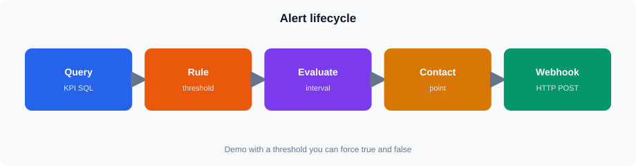

# Session 14 — Grafana Alerting and Generic Webhooks

## Session Overview

<!-- training-diagrams:v1 -->

This session introduces Grafana alerting for operational and business reporting scenarios. The focus is on the complete alerting flow:

**Query → Alert Rule → Evaluation → Contact Point → Notification Policy → Webhook**

The session uses ClickHouse data from `training.v_lab_orders` and focuses on practical KPI and data-availability scenarios.

## Topics

- Grafana alerting concepts and alert rules
- Query-based alerting
- Conditions, expressions, and thresholds
- Evaluation intervals
- Pending state
- No-data handling
- Error handling
- Contact points
- Notification policies
- Generic webhooks
- Webhook payload structure
- Testing and troubleshooting alerts

## Practical Work

### Core — All Students

Students will:

- Review the Grafana alerting interface and alert lifecycle
- Observe the instructor create a KPI-based alert using ClickHouse
- Follow the query → condition → evaluation flow
- Examine pending, no-data, and error states
- Inspect contact points and notification policies
- Review a generic webhook configuration and payload
- Discuss how alerting can be applied to KPI, sales, volume, and data-availability scenarios

### Instructor Demo

The instructor will use the Grafana administrator account to demonstrate:

- Creating an alert rule
- Defining a threshold
- Configuring evaluation behavior
- Handling no-data and query errors
- Creating a generic webhook contact point
- Creating a notification policy
- Testing the alerting flow

The webhook destination is either an instructor-provided endpoint or a clearly identified demonstration endpoint. No student-owned webhook service is required.

### Stretch

Students whose Grafana account has sufficient alerting permissions may:

- Recreate a simplified KPI alert
- Configure the evaluation condition
- Review or configure a contact point where permitted
- Test the rule using the available lab data

Student permissions may not allow saving alert rules or contact points. This is not a Core requirement.

## Timing

**Published duration:** 4 hours

**Core in-class path:** approximately 2–2.5 hours

1. Alerting concepts and lifecycle — 30 min
2. Watch instructor create a ClickHouse KPI alert — 35 min
3. Conditions, thresholds, evaluation, pending and no-data behavior — 30 min
4. Contact points, notification policies and webhook flow — 30 min
5. Alert testing and troubleshooting discussion — 20 min

**Stretch / additional discussion:** remaining time, including student recreation of a simplified alert where permissions allow.

## Seed and Lab Reminders

- Analytics use `training.v_lab_orders`.
- Student-facing status is `Completed`.
- Completed data covers regions `1`, `3`, and `5`.
- Region `2` with `Completed` returns no completed data and is useful when discussing no-data behavior.
- Seed dates are `2023-01-01` through `2025-06-18`.
- Grafana demonstrations use the absolute time range **2023-01-01 → 2025-06-18**.
- Use the provisioned **ClickHouse** Grafana datasource; students do not recreate the datasource.
- Grafana student login: `student` / `StudentLab!2026`.
- Instructor Grafana administration: `admin` / `GrafanaLab!2026`.

## Student Entry Points

- Grafana: https://vmclickhouse.canadacentral.cloudapp.azure.com/grafana/
- Lab home: https://vmclickhouse.canadacentral.cloudapp.azure.com/

## Files

Diagrams live under `assets/` (SVG heroes) and as Mermaid blocks in the Markdown.

- `README.md` — Session overview, topics, practical work and timing
- `notes.md` — Alerting concepts and teaching notes
- `lab.md` — Guided Core and instructor demonstration steps
