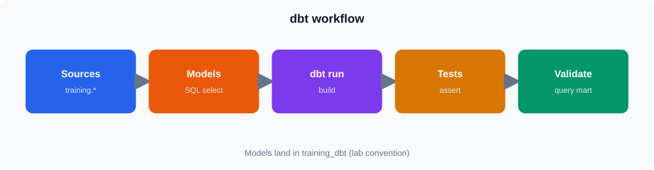
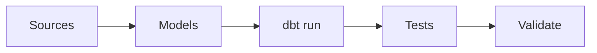
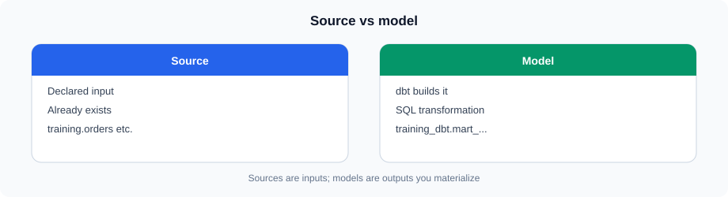
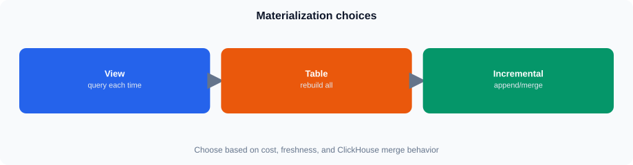
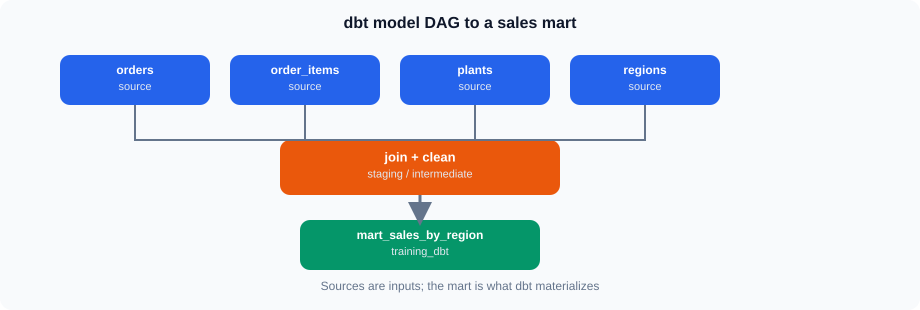
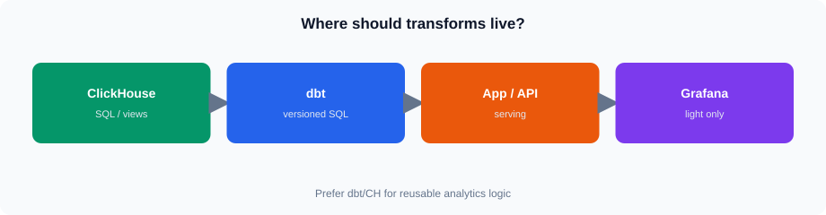

# Session 15 — dbt for ClickHouse

## 1. dbt and Analytics Engineering



Same idea in Mermaid (GitHub theme colors):




dbt is used to manage SQL-based data transformations as a development workflow.

Instead of putting transformation logic directly into an application, reporting tool, or manually maintained SQL scripts, dbt organizes the logic into:

- Sources
- Models
- Tests
- Documentation
- Project configuration

The database still performs the actual SQL transformation. dbt manages how that transformation is defined, executed, tested, and maintained.

### Why dbt matters

A typical analytics workflow can contain many SQL transformations. Without a structured approach, it becomes difficult to answer:

- Where did this dataset come from?
- Which SQL created it?
- What depends on it?
- Has its structure been tested?
- Can another developer understand and reproduce the transformation?

dbt addresses these questions by treating SQL transformations as maintainable project artifacts.

**Tip:** Keep the distinction clear: **dbt is not the database and it is not an ETL engine that replaces ClickHouse.** dbt orchestrates SQL transformations that are executed by the target database.

---

## 2. dbt with ClickHouse

The session uses ClickHouse as the target database.

The existing project uses:

- Project: `training_dbt`
- Target schema: `training_dbt`
- ClickHouse sources in the `training` database
- `training_rw` for the dbt connection

The important architecture is:

```text
training
   |
   +-- orders
   +-- order_items
   +-- plants
   +-- regions
          |
          v
       dbt models
          |
          v
     training_dbt
```

The source tables remain in `training`. The transformed dbt models are intended to be created in `training_dbt`.

This separation is useful because transformation outputs can be developed and managed without modifying source tables in `training`.

---

## 3. dbt Project Structure

The existing project is under:

```text
the course dbt project/
```

Important project files include:

```text
the course dbt project/
├── dbt_project.yml
├── profiles.yml
└── models/
    ├── sources.yml
    └── mart_sales_by_region.sql
```

The exact project may contain additional files. The files above are the important ones for this session.

### `dbt_project.yml`

This is the main project configuration file.

It identifies the dbt project and contains project-level configuration such as:

- Project name
- Model configuration
- Directory locations
- Materialization-related configuration

The project name for this lab is:

```text
training_dbt
```

### `profiles.yml`

The profile contains connection information used by dbt.

For this lab, the profile is:

```text
training_dbt
```

The configured target uses ClickHouse HTTP and the `training_rw` user.

**Tip:** Explain the difference between the two similarly named concepts:

- `dbt_project.yml` describes the dbt project.
- `profiles.yml` describes how dbt connects to the target environment.

Do not create a new warehouse profile during the Core walkthrough.

---

## 4. Sources




A dbt source represents data that already exists outside the dbt models.

The existing project declares these ClickHouse source tables:

```text
training.orders
training.order_items
training.plants
training.regions
```

Conceptually:

```text
source()
    |
    v
existing ClickHouse table
```

A source definition gives dbt a known starting point for transformation logic.

It also makes dependencies more understandable than hard-coding every table reference throughout the project.

### Source vs model

| Source | Model |
|---|---|
| Existing input data | Transformation created by dbt |
| Normally already exists | Generated from SQL |
| Located in `training` | Intended to land in `training_dbt` |
| Starting point | Transformation result |

**Tip:** declaring a source does not copy the source table. It describes an existing database object that the dbt model can read.

---

## 5. Models

A dbt model is normally a SQL file containing a transformation.

The existing example is:

```text
models/mart_sales_by_region.sql
```

The model uses the training source tables and produces a reporting-oriented result.

Conceptually:

```text
orders
   +
order_items
   +
plants
   +
regions
   |
   v
mart_sales_by_region
```

The SQL describes **what the result should look like**. dbt determines how that model is materialized according to the project configuration.

This separates transformation logic from the process used to execute it.

---

## 6. Model Materialization




A dbt model can be materialized in different ways.

Common concepts include:

- View
- Table
- Incremental model

### View

A view stores the SQL definition rather than storing a separate copy of the transformed data.

Useful when:

- The transformation is relatively simple.
- Query-time computation is acceptable.
- A physical table is not required.

### Table

A table materializes the transformation result.

Useful when:

- The result is queried frequently.
- Recomputing a complex transformation for every query is undesirable.
- A persistent reporting structure is useful.

### Incremental

An incremental model updates only part of the target rather than rebuilding the entire result each time.

This becomes useful for larger datasets and recurring pipelines, but it introduces additional design considerations.

**Tip:** Do not turn this into a detailed incremental-model implementation exercise. The session is focused on understanding the dbt workflow.

---

## 7. ClickHouse Considerations

ClickHouse is a column-oriented analytical database.

When designing dbt models for ClickHouse, database-specific choices still matter.

For example, a physical ClickHouse table can use an appropriate `ORDER BY` definition.

The dbt layer does not remove the need to understand ClickHouse table design.

A useful mental model is:

```text
dbt
  = transformation workflow

ClickHouse
  = analytical execution and storage engine
```

dbt defines and manages the transformation workflow; ClickHouse executes the SQL and stores the resulting objects.

---

## 8. Transformation Example




The existing `mart_sales_by_region.sql` demonstrates a reporting transformation using the available source tables.

A simplified conceptual flow is:

```text
orders
    |
    +---- order_items
    |
    +---- plants
    |
    +---- regions
             |
             v
      sales by region
```

The transformation can combine operational data and reference data to create a structure more suitable for reporting.

This is an example of a **mart**: a dataset shaped for a particular analytical use case.

**Tip:** Focus on reading the existing SQL rather than rewriting it. The purpose of the Core walkthrough is to understand how the model fits into the dbt workflow.

---

## 9. dbt Workflow

A typical dbt workflow is:

```text
Define source
     |
     v
Create model
     |
     v
Run model
     |
     v
Test result
     |
     v
Validate in database
     |
     v
Document
```

Each stage has a different purpose.

### Define

Identify where the input data comes from.

### Model

Write the SQL transformation.

### Run

Ask dbt to execute the model against the target database.

### Test

Check assumptions about the resulting data.

### Validate

Inspect the resulting database object and confirm that it contains the expected data.

### Document

Make the transformation understandable to other developers.

---

## 10. Tests

dbt tests provide automated checks around data assumptions.

A test can help answer questions such as:

- Is a column populated?
- Is a value unique where it should be?
- Does a relationship remain valid?
- Does the result satisfy a defined business rule?

Tests are different from SQL transformation logic.

```text
Model
  |
  +--> creates/transforms data

Test
  |
  +--> checks an assumption about data
```

A successful model run does not automatically mean the resulting data is correct.

**Note:** the `the course dbt project/` project currently has **no** test YAML. Learn the concepts above; do not invent project tests for Core. The optional Stretch may show `dbt test` with nothing configured.

**Tip:** Explain this distinction carefully. `dbt run` answers whether the transformation executed successfully. `dbt test` checks defined data-quality expectations.

---

## 11. Documentation

dbt can also document the data transformation workflow.

Useful documentation can explain:

- What a source represents
- What a model represents
- What a column means
- How datasets relate to one another
- Which transformation produced a model

For analytics teams, this improves maintainability because SQL alone does not always explain the business meaning of a dataset.

---

## 12. dbt and Application-Layer Transformation

Transformation can happen at several points in a modern application architecture.

For example:

```text
Database
   |
   v
Application
   |
   v
API
   |
   v
Dashboard
```

An application may transform data before returning it through an API.

This can be appropriate when the transformation is specifically part of application behavior.

However, analytical transformations often need to be reused by:

- BI tools
- Reporting applications
- Data analysts
- Other analytical processes

In such cases, putting reusable analytical transformations into a database-oriented transformation layer can reduce duplication.

---

## 13. dbt vs REST/OData/Grafana Transformation

The three approaches solve different problems.

| Layer | Typical purpose |
|---|---|
| dbt | Reusable analytical data transformation |
| REST/OData | Expose data to applications and consumers |
| Grafana | Query, visualize, filter and present data |

A useful architecture is:

```text
Raw / operational data
          |
          v
       ClickHouse
          |
          v
         dbt
          |
          v
   Analytical models
          |
     +----+----+
     |         |
     v         v
   REST      OData
     |         |
     +----+----+
          |
          v
       Grafana
```

This is not a rule that every system must follow. Transformation location should depend on reuse, performance, ownership, freshness, and operational requirements.

---

## 14. Where Should Transformation Happen?




A transformation can be placed in different layers.

### Database / dbt

Useful when:

- SQL transformation is substantial.
- Multiple consumers need the same result.
- The transformation is analytical rather than application-specific.

### Application

Useful when:

- Logic is tightly coupled to application behavior.
- The transformation depends on application state or business logic.
- The output is specifically designed for one application workflow.

### API

Useful when:

- The API needs to shape or filter the response.
- Consumers require a stable API contract.

### Grafana

Useful for:

- Query-time filtering
- Variables
- Aggregation required specifically for visualization
- Presentation-oriented transformations

**Tip:** Avoid presenting these as mutually exclusive choices. Real systems often use more than one layer.

---

## 15. Core vs Stretch

### Core

You should understand:

- What dbt is
- Why analytics engineering uses dbt
- dbt project structure
- Sources
- Models
- Tests
- Documentation
- ClickHouse as the execution and storage platform
- The existing `training_dbt` project
- How `mart_sales_by_region.sql` fits into the workflow
- dbt vs application/API/Grafana transformation

### Stretch

The optional Stretch may demonstrate:

```text
dbt run
dbt test
```

from the existing `lab-dbt` container when the configured profile is available.

You do not need server login for the Core session.
