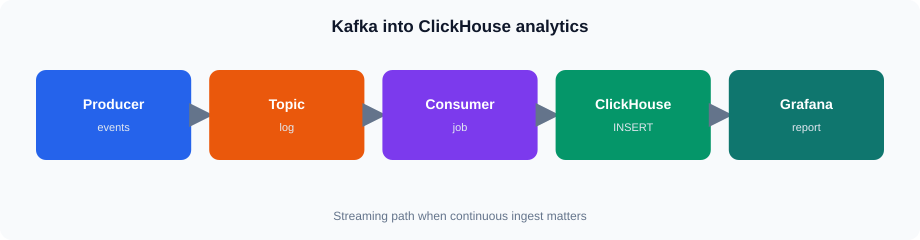

# Session 16 — Kafka Concepts and Kafka Jobs

## Session Overview

<!-- training-diagrams:v1 -->

This session introduces Kafka as an event-streaming and data-movement platform and explains where it fits in an analytics architecture.

The focus is on understanding Kafka concepts and the typical Kafka → ClickHouse flow rather than operating a Kafka cluster. Students work through event-flow examples, topic and partition behavior, consumer groups, and Kafka job concepts.

## Topics

- Why Kafka and where it fits in a data architecture
- Kafka architecture
- Topics and partitions
- Producers and consumers
- Consumer groups
- Events and messages
- JSON event structure
- Kafka for data movement
- Kafka and ClickHouse
- Kafka jobs and processing concepts
- Typical Kafka → ClickHouse flow
- When Kafka is required and when it is not

## Practical Work

### Core

- Walk through a JSON order event from producer to Kafka topic
- Trace topic and partition behavior
- Understand how consumers and consumer groups process events
- Work through a Kafka → ClickHouse data-flow example
- Identify where Kafka fits relative to ClickHouse and Grafana
- Discuss situations where Kafka is useful and where it is unnecessary

### Stretch

- Optional walkthrough of the Redpanda lab environment
- Review broker/container status when the Kafka profile is available
- Discuss example topic and consumer-group observations

A dedicated student produce/consume exercise is **not required**.

## Timing

| Activity | Target |
|---|---:|
| Kafka concepts and architecture | ~45 min |
| Topics, partitions, producers, consumers and groups | ~35 min |
| Kafka → ClickHouse flow and Kafka jobs | ~30 min |
| Architecture walkthrough and discussion | ~10 min |
| **Core guided work** | **~2 hours** |
| Optional Stretch walkthrough | Remaining time |

## Lab / Environment Reminder

The optional lab environment uses **Redpanda**, a Kafka-compatible broker, through the `kafka` Docker Compose profile on the Data stack.

- Container: `lab-kafka`
- Internal broker port: `9092`
- Student-facing Kafka URL: **none**
- Stretch only: `docker compose --profile kafka up -d redpanda` (shared demo)

Kafka is an architecture / data-movement topic. Reporting still reads ClickHouse (`training.v_lab_orders`); Grafana does not query Kafka in the Core path. The lab data is **not** presented as live Kafka output.

Per course TOC: a dedicated Kafka produce/consume hands-on lab is **not** part of this course.

## Files

Diagrams live under `assets/` (SVG heroes) and as Mermaid blocks in the Markdown.

- `README.md` — Session overview and timing
- `notes.md` — Kafka concepts, architecture and teaching notes
- `lab.md` — Guided architecture walkthrough and optional Stretch walkthrough
