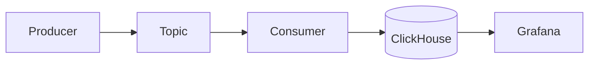
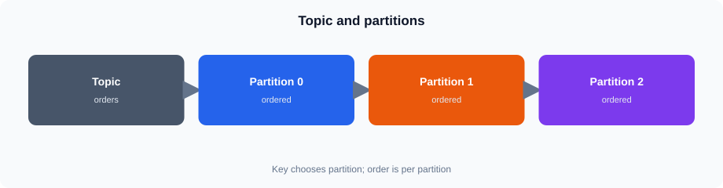
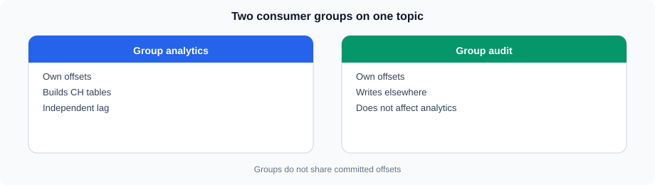
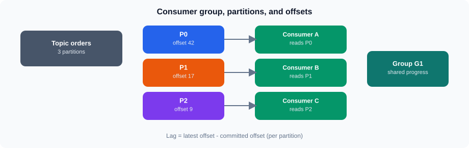
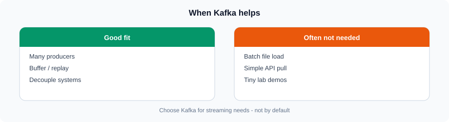

# Session 16 — Kafka Concepts and Kafka Jobs

## 1. Why Kafka?


Same idea in Mermaid (GitHub theme colors):




Kafka is used when applications need to move a continuous stream of events between systems.

A typical example is an application producing order events:

```text
Application
    |
    | JSON events
    v
  Kafka
    |
    +---- Consumer A
    |
    +---- Consumer B
    |
    v
Analytics / Data Platform
```

Kafka is useful when:

- Events are generated continuously.
- Multiple downstream systems need the same events.
- Producers and consumers should operate independently.
- Consumers need to process events asynchronously.
- The volume of events is high enough that direct point-to-point integration becomes difficult to manage.

Kafka is not automatically required for every analytics system. If data is already available in a database and periodic batch loading is sufficient, introducing Kafka can add unnecessary operational complexity.

---

## 2. Kafka Architecture

The main Kafka concepts are:

| Component | Purpose |
|---|---|
| Producer | Publishes events |
| Topic | Logical stream of events |
| Partition | Ordered portion of a topic |
| Consumer | Reads events |
| Consumer group | Coordinates multiple consumers |
| Broker | Kafka server that stores and serves events |

A simplified architecture is:

```text
                 Kafka Cluster
        +---------------------------+

Producer ---> Topic: orders         |
             +---------+---------+  |
             | Part 0  | Part 1  |  |
             +---------+---------+  |
                  |         |        |
              Consumer  Consumer     |
        +---------------------------+
```

For this course, the important idea is the **flow of events**, not operating a production Kafka cluster.

---

## 3. Topics

A topic is a named stream of events.

For example:

```text
orders
```

could contain events such as:

```json
{
  "order_id": 10001,
  "customer_id": 501,
  "region_id": 3,
  "status": "Completed",
  "sales_amount": 2450.50
}
```

Another event might represent a different order:

```json
{
  "order_id": 10002,
  "customer_id": 502,
  "region_id": 1,
  "status": "Completed",
  "sales_amount": 1250.00
}
```

The topic provides a logical boundary between different event streams.

Possible topic design might include:

```text
orders
customers
inventory
```

Topic names should reflect the event stream and its ownership or business meaning.

---

## 4. Partitions




A topic can contain multiple partitions.

```text
orders
  |
  +-- Partition 0
  +-- Partition 1
  +-- Partition 2
```

Partitions provide parallelism.

Events within a partition have an order:

```text
Partition 0

Event 1 -> Event 2 -> Event 3 -> Event 4
```

Kafka does not provide one global ordering across all partitions.

### Partition key

A producer can use a key when publishing an event.

For example:

```text
order_id = 10001
```

The key can determine which partition receives the event.

This is important when related events need consistent ordering.

A common design question is:

> What should determine the partition?

The answer depends on the processing requirement.

For example, if events for the same order must remain ordered, `order_id` can be considered as a partition-key candidate.

---

## 5. Producers

A producer publishes events to Kafka.

```text
Order Application
       |
       | produce event
       v
    orders topic
```

The producer does not need to know which downstream applications will consume the event.

For example, an application may publish:

```json
{
  "order_id": 10001,
  "region_id": 3,
  "status": "Completed",
  "sales_amount": 2450.50
}
```

The same event could later be consumed by multiple independent applications.

---

## 6. Consumers

A consumer reads events from Kafka.

```text
orders topic
     |
     v
  Consumer
     |
     v
Processing
```

A consumer may:

- Validate the event
- Transform the event
- Enrich the event
- Store the event
- Send the event to another system

For this course, the important example is a consumer that moves or processes order events before they reach ClickHouse.

---

## 7. Consumer Groups







A consumer group allows multiple consumers to work together.

```text
             orders
          /    |    \
         /     |     \
        v      v      v
       C1     C2     C3
        \      |     /
         \     |    /
        Consumer Group
```

Within a consumer group, partitions are distributed among consumers.

For example:

```text
Topic: orders

Partition 0 ---> Consumer 1
Partition 1 ---> Consumer 2
Partition 2 ---> Consumer 3
```

This allows processing to scale horizontally.

A second consumer group can independently consume the same topic:

```text
                 orders
                /      \
               v        v
          Group A      Group B

          Analytics     Monitoring
```

The two groups can process the same event stream for different purposes.

---

**Kafka concepts**
https://vmreact.eastus2.cloudapp.azure.com:18094/a/ch-grafana-s16-kafka-basics

Use the login ID your trainer provided.

## 8. Events and Messages

Kafka transports events or messages.

An event should contain enough information for the consumer to understand what happened.

Example:

```json
{
  "event_type": "order_completed",
  "order_id": 10001,
  "customer_id": 501,
  "region_id": 3,
  "order_date": "2025-06-18",
  "sales_amount": 2450.50
}
```

The exact event contract depends on the application.

Important design considerations include:

- Event name or type
- Business identifier
- Event timestamp
- Relevant attributes
- Schema/version information where required

Avoid putting unrelated application data into every event simply because Kafka can transport it.

---

## 9. Kafka for Data Movement

Kafka is often used as an intermediate layer between applications and analytical platforms.

Without Kafka:

```text
Application
     |
     v
ClickHouse
```

With Kafka:

```text
Application
     |
     v
  Kafka
     |
     v
Processing / Consumer
     |
     v
ClickHouse
```

The Kafka layer can decouple the producer from the downstream processing system.

This is particularly useful when producers and consumers operate at different speeds or when multiple consumers need the same events.

---

## 10. Kafka and ClickHouse

In this course, ClickHouse remains the analytics platform.

A conceptual flow is:

```text
Order Application
       |
       | JSON order event
       v
   Kafka Topic
       |
       | consumer / processing
       v
    ClickHouse
       |
       v
training.v_lab_orders
       |
       v
    Grafana
```

The important distinction is:

**Kafka moves events; ClickHouse stores and analyzes reporting data; Grafana visualizes the data.**

Grafana does not need to query Kafka for the reporting exercises in this course.

---

## 11. Typical Kafka → ClickHouse Flow

Consider a completed order.

### Step 1 — Application creates an event

```json
{
  "event_type": "order_completed",
  "order_id": 10001,
  "region_id": 3,
  "sales_amount": 2450.50
}
```

### Step 2 — Producer publishes the event

```text
Application
    |
    v
orders topic
```

### Step 3 — Kafka stores the event

The event is placed into a topic partition.

```text
orders
 |
 +-- Partition 0
      |
      +-- Event
```

### Step 4 — Consumer reads the event

```text
Kafka
  |
  v
Consumer
```

### Step 5 — Processing occurs

The consumer may validate, transform or enrich the event.

```text
Consumer
   |
   v
Processing
```

### Step 6 — Data reaches ClickHouse

```text
Processing
    |
    v
ClickHouse
```

### Step 7 — Reporting reads ClickHouse

```text
ClickHouse
    |
    v
Grafana
```

---

**Kafka vs ClickHouse reporting**
https://vmreact.eastus2.cloudapp.azure.com:18094/a/ch-grafana-s16-kafka-vs-reporting

Use the login ID your trainer provided.

## 12. Kafka Jobs / Processing Concepts

A Kafka job is a processing workload that consumes events and performs some operation.

Conceptually:

```text
Kafka Topic
     |
     v
Kafka Job
     |
     +-- Validate
     +-- Transform
     +-- Enrich
     +-- Filter
     |
     v
Destination
```

For example:

```text
orders
  |
  v
Order Processing Job
  |
  +-- validate order
  +-- calculate derived values
  +-- filter invalid events
  |
  v
ClickHouse
```

The job may run continuously rather than being started manually for every event.

### Typical processing concerns

A real Kafka processing design must consider:

- Error handling
- Retry behavior
- Duplicate events
- Ordering
- Consumer lag
- Schema changes
- Monitoring
- Scaling

These are architecture topics in this session rather than production implementation exercises.

---

## 13. Kafka Processing vs Batch Processing

Kafka is particularly useful for continuous event processing.

```text
Continuous

Application
    |
    v
 Kafka
    |
    v
 Processing
    |
    v
 Analytics
```

A batch process might instead work like:

```text
Database
    |
    | scheduled extraction
    v
ETL / ELT
    |
    v
ClickHouse
```

The choice depends on the business requirement.

If reports only need data refreshed once per day, Kafka may not provide enough additional value to justify its complexity.

---

## 14. Where Kafka Fits in This Course

The course architecture can be viewed as:

```text
                    Operational Systems
                           |
                           v
                     Applications
                           |
                           v
                    +-------------+
                    |    Kafka    |
                    |  Event Flow |
                    +-------------+
                           |
                           v
                    Data Processing
                           |
                           v
                     +-----------+
                     | ClickHouse|
                     +-----------+
                           |
                           v
                       Grafana
```

The reporting layer still works with ClickHouse.

For the existing lab:

```text
ClickHouse
   |
   v
training.v_lab_orders
   |
   v
Grafana
```

Kafka is discussed as a possible upstream event-ingestion mechanism.

---

**Architecture wrap**
https://vmreact.eastus2.cloudapp.azure.com:18094/a/ch-grafana-s16-wrap

Use the login ID your trainer provided.

## 15. When Kafka Is Required




Kafka becomes relevant when requirements include several of the following:

- Continuous event streams
- High event volume
- Multiple independent consumers
- Decoupling producers and consumers
- Asynchronous processing
- Event-driven architectures
- Replayable event streams
- Horizontal processing through partitions and consumer groups

The architecture should be driven by these requirements rather than by the popularity of Kafka.

---

## 16. When Not to Use Kafka

Kafka is not automatically the right solution for every data pipeline.

Examples where Kafka may not be necessary:

### Small periodic data loads

```text
Database
   |
   v
Scheduled ETL
   |
   v
ClickHouse
```

If hourly or daily refresh is sufficient, a batch process may be simpler.

### Simple application-to-database integration

If one application writes directly to a database and there are no independent consumers, Kafka may introduce an unnecessary intermediate layer.

### Low-volume reporting

If the reporting platform receives a small amount of data and does not require streaming, simpler ingestion mechanisms may be appropriate.

### Existing reliable batch architecture

If an existing batch pipeline meets the business requirements, replacing it with Kafka should have a clear technical or business justification.

The key question is:

> What requirement does Kafka solve?

---

## 17. Tips

- Keep the focus on architecture rather than Kafka administration.
- Grafana continues to query ClickHouse; Kafka sits upstream of the reporting layer.
- Partition ordering is per partition — not one global order across all partitions.
